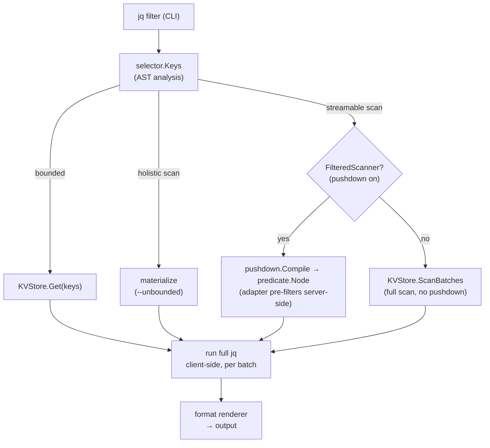
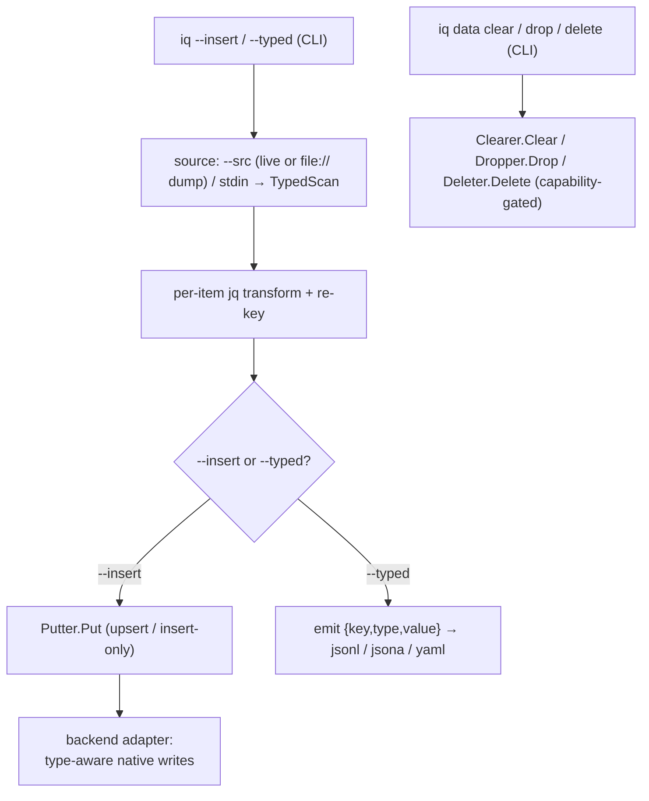

# iq

A Go command-line tool that runs [jq](https://jqlang.github.io/jq/) filters against NoSQL
databases. The backend is chosen by the URL scheme, and the query core is driver-agnostic
so further backends slot in behind the same port.

The filter is both the transform and the key selector: its top-level paths name the keys to
fetch, so the store only ever reads a bounded set of keys — never a full keyspace scan, unless
you ask for one explicitly. Fetched values are normalized to JSON and the filter then runs
entirely client-side, so its semantics are identical for every backend.

`iq` is inspired by [sq](https://github.com/neilotoole/sq): much of its command surface — the
`<source>.<collection>` addressing along with many subcommands and flags — deliberately follows
sq's to make the tool feel familiar.

> [!WARNING]
> **Not production-ready.** `iq` has potential rough edges — don't rely on it for critical work
> yet.

## Install

`iq` ships as a single static binary (no runtime dependencies, no CGO).

### Linux

```sh
curl -fsSL https://raw.githubusercontent.com/zsltg/iq/main/install.sh | sh
```

The script downloads the release for your OS/arch, verifies its SHA-256 against the release
checksums, and installs the binary; `IQ_VERSION` pins a version and `IQ_INSTALL_DIR` picks the
target directory. Or grab a `.deb`, `.rpm`, or `.apk` from the
[releases](https://github.com/zsltg/iq/releases).

### macOS

```sh
brew install zsltg/tap/iq
```

The Linux `curl … | sh` one-liner works on macOS too.

### Windows

```powershell
scoop bucket add zsltg https://github.com/zsltg/scoop-bucket
scoop install iq
```

### Go

```sh
go install github.com/zsltg/iq@latest
```

### From source

```sh
git clone https://github.com/zsltg/iq
cd iq && make build
```

### Shell completions

The `.deb`, `.rpm` and `.apk` packages install bash, zsh and fish completions for you. For a
brew, scoop, go-install or source build, `iq completion <shell>` prints a script to install by
hand:

```sh
# bash — load in the current session, or drop it on the completion path
eval "$(iq completion bash)"
iq completion bash | sudo tee /usr/share/bash-completion/completions/iq >/dev/null

# zsh — write to a directory on your $fpath, then restart the shell
iq completion zsh > ~/.zsh/completions/_iq

# fish
iq completion fish > ~/.config/fish/completions/iq.fish

# powershell — append to your profile
iq completion powershell >> $PROFILE
```

Completions cover the commands, their sub-subcommands and flags, and — read live from your
config — your saved source handles, groups, and config-option keys, so `iq --src <TAB>` offers
the sources `iq ls` lists. The jq filter itself is a program, not a completable value, so `iq`
offers no candidates there (and never falls back to filenames).

### Man page

The packages also install an `iq(1)` manual page, so `man iq` works after a package install. For
a non-package install, pipe it into your man path:

```sh
iq man | sudo tee /usr/share/man/man1/iq.1 >/dev/null
```

## Usage

The default action is a jq filter. Its top-level paths name the keys to fetch; the result is
printed as pretty JSON by default (see [Output formats](#output-formats) to change it; these run
against the active source — see [Sources](#sources)):

```bash
./iq '.greeting'                          # fetch key "greeting"
./iq '.["book:1"]'                        # a key containing a colon needs bracket-quoting
./iq '.["book:1"].title'                  # fetch book:1, extract one field
./iq '[ .["book:1"].title, .["book:2"].title ]'   # fetch both keys, project a field from each
./iq '.["book:2"].price | tonumber + 5'   # values are strings; convert before arithmetic
```

Always wrap the filter in single quotes. jq syntax is full of characters the shell would
otherwise expand or split — brackets (`[ ]`), whitespace, `|`, `*`, `$` — and bracket-quoting a
colon key like `.["book:1"]` reads as a glob to zsh (`no matches found`) or bash unless quoted.

### Bounded reads, streaming scans, and materialized scans

`iq` fetches exactly the keys your filter names, so a normal query's cost is bounded by the keys
you asked for, never by the size of the database. A filter that needs the whole keyspace is a
**scan**, and scans come in two kinds:

- **Streaming** — a filter rooted at `.[]` (`.[]`, `.[] | select(...)`, `.[].title`) processes
  each value independently, so `iq` walks the keyspace in pages and runs the filter page by page,
  emitting as it goes. Memory stays constant and results appear progressively (interrupt with
  Ctrl-C or bound with `--timeout`). These run **without a flag**:

  ```bash
  ./iq '.[] | objects | select((.year|tonumber) > 2015) | .title'   # streamed discovery
  ```

- **Materialized** — a filter that collapses the collection into one value (`.`, `keys`, `length`,
  `map(...)`, `group_by`, `sort_by`, aggregates) must load the whole dataset into memory. It runs
  only with `--unbounded`:

  ```bash
  ./iq 'keys'                 # error: requires materializing the whole dataset
  ./iq --unbounded 'keys'     # list every key
  ./iq --unbounded '.'        # the whole dataset as one JSON object
  ```

`--unbounded` means "permit loading the whole dataset into memory." Passing it on a streaming
filter is allowed too: it switches that filter from batched streaming to a single materialized
pass, giving key-sorted output and a consistent snapshot instead of scan order.

Streamed output is **best-effort**: values arrive in scan order (not key-sorted), and an element
may repeat if the keyspace is resized mid-scan — the price of never holding more than one page.
Use `--unbounded` when you need sorted, exactly-once output.

The flag names the cost property (loading everything), not any one store's mechanism, so it will
mean the same thing for future backends (a Cassandra full scan, a CouchDB `_all_docs`).

A scan has no reliable upfront total (Redis `SCAN`, Mongo cursor), so while one runs `iq` shows an
animated spinner with a running `N scanned` count on **stderr** — a sparse `.[] | select(...)` over
a large keyspace is never silent. When a backend can supply a cheap approximate total (MongoDB's
`estimatedDocumentCount` for an unfiltered whole-collection scan, Redis's `DBSIZE` for its
whole-keyspace `MATCH *` scan), the count is shown against it as
`N scanned (~M est)`; the tilde marks it a hint — it comes from cached metadata and drifts under
concurrent writes, so the scan may exceed it and it never becomes a percentage bar. No total is
shown for a pushed-down filtered scan (it walks a subset) or for a cross-source scan (a per-source
estimate would mislead the aggregate). The
spinner appears only after a short delay, so a fast query never flashes one, and only when stderr
is a terminal: piped or redirected output is never touched, and result rows streamed to stdout are
never garbled by it. Disable it with `--no-progress`.

## Drivers

`iq` picks the backend from a source's URL scheme, and the query core is driver-agnostic, so
further backends slot in behind the same port. Each driver below documents its keyspace mapping,
value encoding, predicate pushdown, and raw-command escape hatch.

| Name | Database | Versions |
| ---- | ----------- | -------- |
| `cassandra` | [Apache Cassandra](https://cassandra.apache.org/doc/) | 3.11+ |
| `couchbase` | [Couchbase](https://docs.couchbase.com/) | 7.x, 8.x (Community or Enterprise) |
| `couchdb` | [Apache CouchDB](https://docs.couchdb.org/) | 2.x, 3.x |
| `dynamodb` | [Amazon DynamoDB](https://docs.aws.amazon.com/dynamodb/) | AWS (managed) |
| `elasticsearch` | [Elasticsearch](https://www.elastic.co/docs/) | 8.x |
| `file` | Local dump file, read-only | — |
| `hbase` | [Apache HBase](https://hbase.apache.org/book.html) | 1.0+ |
| `mongo` | [MongoDB](https://www.mongodb.com/docs/) | 4.2+ |
| `neo4j` | [Neo4j](https://neo4j.com/docs/) | 5.x |
| `opensearch` | [OpenSearch](https://opensearch.org/docs/) | 2.x, 3.x |
| `redis` | [Redis](https://redis.io/docs/) | 7.0+ |

### File dump formats

```
  jsonl                  iq typed JSON Lines / array
  yaml                   iq typed YAML
  mongoexport            mongoexport Extended JSON
  bson                   mongodump BSON
  rdb                    Redis RDB snapshot
  ?format=dynamodb-json  DynamoDB S3 export / scan JSON
  ?format=cassandra-csv  cqlsh COPY TO CSV
  ?format=neo4j-json     Neo4j APOC JSON export
```

A bare name auto-detects (`file:///<file_path>`), the `?format=` form must be passed
(`file:///<file_path>?format=<source_format>`).

### What every driver guarantees

The per-driver blocks below differ in encoding and pushdown detail, but every backend honors the
same contract:

- **One URL, native nouns.** The URL scheme picks the driver; the keyspace rides in the URL as the
  backend's own noun (`?collection=`, `?table=`, `?database=`, `?label=`/`?rel=`, `?index=`), and a
  query overrides it per run with the dotted `handle.<keyspace>` suffix (see [Sources](#sources)).
- **One jq surface.** A bounded filter fetches exactly the named keys — a missing key reads as
  `null`, never an error; a `.[]`-rooted filter streams the keyspace in bounded pages; a holistic
  filter materializes only behind `--unbounded` (see
  [Bounded reads, streaming scans, and materialized scans](#bounded-reads-streaming-scans-and-materialized-scans)).
- **Pushdown never changes results.** A pushed predicate is only ever a conservative pre-filter —
  server-side where the backend can filter, or a client-side raw-byte prefilter that drops a provable
  non-match before decode where it cannot (Redis, on RedisJSON values; Elasticsearch/OpenSearch and
  Couchbase, over the residual their server-side query could not narrow). The full jq always re-runs
  client-side, so
  output is identical with or without it, and [`--explain`](#query-plan---explain--v) shows exactly
  what was pushed.
- **Capabilities are explicit.** Filtered scans, count estimates, writes, clear, drop, and per-key
  delete are opt-in ports: a backend implements what its model supports, and a command against a
  missing capability fails with a clear message instead of emulating it (Redis, whose DB index cannot
  be removed, simply has no `drop`; the read-only file dump has no per-key `delete`).
- **Values round-trip.** Every value normalizes to JSON under a frozen per-backend encoding
  contract, and a `--typed` dump restores through `--insert` losslessly (see
  [Moving data](#moving-data---insert---typed)).
- **Bounded and redacted.** Every backend call is bounded by `--timeout`, and a URL's password is
  redacted from every listing, log line, and error.
- **A native escape hatch.** `iq exec` speaks the backend's own language — verbatim where one exists
  (Redis commands, Mongo command documents, CQL, PartiQL, Cypher, Mango, the Elasticsearch DSL), a small
  fixed verb set where none does (HBase) — see each driver's Raw commands section.

## Architecture

The core read path: a jq filter is classified by the **selector**, a scan is optionally **decomposed**
into a native predicate, and each backend maps that predicate its own way — MongoDB pushes it
server-side, Cassandra pushes equality as a CQL `WHERE` (with `ALLOW FILTERING` when it is not the
partition key), DynamoDB pushes equality and existence as a `Scan` `FilterExpression`, HBase pushes
column equality as a `SingleColumnValueFilter`, CouchDB pushes equality, ranges, existence, a
byte-safe regex, and length as a
Mango `_find` selector, Couchbase pushes equality, ranges, and existence as a SQL++ `WHERE`, Neo4j pushes equality and existence as a Cypher `WHERE` clause, Elasticsearch
and OpenSearch push equality and existence as a `bool` query, Redis scans
and filters client-side. Either way the
full jq re-runs client-side, so
the pushed predicate is only ever a conservative pre-filter and results are identical with or without it.

Query / read path:



A scan emits per-page progress (`RunOptions.OnPage`) to a stderr spinner — CLI only, off unless
attached to a terminal — and an unfiltered scan can fetch a cheap up-front total
(`RunOptions.OnEstimate`, answered from backend metadata where the backend keeps one — a collection
estimate like Mongo's `estimatedDocumentCount`, table metadata, an index count) so progress reads
as ~N.

Data movement & lifecycle / write path:



The query core is driver-agnostic and lives behind two ports a backend adapter implements:

- `internal/selector` — pure static analysis. `Keys` walks a parsed jq AST and classifies the
  filter: a **bounded** set of named keys, or a **scan** — and, for a scan, whether it is
  **streamable** (`.[]`-rooted, distributes over the keyspace page by page) or holistic. It
  depends only on the jq library, never on a driver.
- `internal/query` — the use cases. `JQEngine` parses and classifies the filter, then routes:
  bounded → `Get` the named keys; streamable scan → run the filter over each `ScanBatches` page and
  emit; holistic scan → merge the pages and run once (only when the caller permits it). `Runner`
  is the native-command use case behind the `Store` port (surfaced as `iq exec`); `Combiner` runs a cross-source `--combine`
  program over the reduced per-source results bound as variables, and `CrossEngine` runs a
  `source()`-driven filter over a null input — both reach other sources through the `SourceOpener`
  port and hold no primary store.
- The **write path** mirrors the read path through optional capability ports in `internal/query`,
  the same idiom as `FilteredScanner`/`Estimator`: `Putter` (write a batch of typed records),
  `TypedReader` (`TypedScan`, read `{key, type, value}` batches so a copy preserves each item's
  native type), `Clearer` (empty a container), `Dropper` (remove one), and `Deleter` (remove a
  named set of keys by canonical key). A backend implements
  only the capabilities its model supports, and a command type-asserts and rejects cleanly when one
  is absent — so a new backend never edits the commands, and Redis, whose DB index cannot be
  removed, simply omits `Dropper`, while a keyless store like InfluxDB omits `Deleter`. `Copier` streams `TypedScan → optional --filter transform →
  Put` in bounded pages; the type tag is what makes a Redis round-trip lossless, since a hash and a
  document both normalize to a JSON object. The default command's `--insert` (write items into a
  source) and `--typed` (emit a re-importable `{key,type,value}` dump) drive this — sq-style, with
  the jq filter as the transform, a source/`file://`/piped-stdin read side, and cross-driver
  included — while `iq data clear`/`drop` drive the lifecycle ports. `iq exec` remains the untyped
  escape hatch for anything the typed path does not cover.
- `drivers/file` — a read-only adapter over a local dump file (or a buffered piped stdin). Its
  `*Store` satisfies the read ports (`Get`/`ScanBatches`) and `TypedReader` (so a dump restores
  through `--insert` and a piped dump is queryable), detecting the
  format from content or a `?format=` hint (Redis RDB via `hdt3213/rdb`, mongodump BSON and
  mongoexport Extended JSON via the Mongo driver, DynamoDB export/scan JSON via the DynamoDB driver,
  cqlsh COPY CSV via the Cassandra driver, APOC JSON export reusing the Neo4j envelope, or iq's own
  typed JSONL; gzip is unwrapped transparently)
  and decoding each item to the **same** JSON shape the
  live adapter produces, so a query or restore is identical to the live backend. It implements no
  writer, so a `file://` endpoint is never a copy destination, and `Query` returns a sentinel that
  makes `exec`/`inspect` degrade cleanly. It streams; whole-dataset materialization stays the core's,
  gated by `--unbounded`. Behind the read ports it keeps an optional **decode cache** (`iq cache`,
  CBOR under `<user cache dir>/iq/dumps`): a full scan of a large dump tees its normalized records
  to disk, and later scans read them back instead of re-decoding — transparent to the ports, so the
  data-flow above is unchanged, and never authoritative (a miss just re-decodes). It also satisfies
  `FilteredScanner` with a **client-side raw-byte prefilter** (`internal/rawpred`, the same trick as
  the Redis/Elasticsearch/Couchbase prefilters): on a streaming scan of an uncached typed-JSONL dump
  it tests each record's raw `value` bytes against the compiled predicate and drops a provable
  non-match before decode, duplicating the core's array-tolerant JSONL scan loop driver-side (the
  core `JSONSource` has no pre-decode seam); every other format and any fresh-cache scan fall back to
  the plain full-decode path, and a prefiltered scan does not populate the cache.
- `drivers/redis`, `drivers/mongo`, `drivers/cassandra`, `drivers/dynamodb`, `drivers/hbase`, `drivers/couchdb`, `drivers/couchbase`, `drivers/neo4j`, `drivers/elasticsearch` — the
  adapters. Each has one `*Store`
  satisfying the read ports
  (`Query` for exec, `Get`/`ScanBatches` for jq) and the write ports (`Put`/`Clear`/`TypedScan`,
  plus `Drop` for Mongo, Cassandra, DynamoDB, HBase, CouchDB, Couchbase, and Elasticsearch, and `Delete`
  for every live backend except Couchbase — all but the read-only file dump and Couchbase, whose
  per-key delete is a v1 follow-up), with a type-to-JSON normalization frozen as
  that backend's
  encoding contract (Redis types; BSON → `ObjectID`-hex, dates, nested docs; CQL types → uuid-string,
  RFC 3339, base64 blob, collections; DynamoDB `S`/`N`/`B`/`BOOL`/`M`/`L`/sets; HBase raw cell bytes →
  honest UTF-8-or-base64, or an exact `Bytes`-layout value for a `?types=`-declared column; CouchDB
  documents are already JSON, decoded with exact-integer precision, `_id`/`_rev` kept; Couchbase
  documents are already JSON, decoded with exact-integer precision, the document ID kept as KV
  metadata (never injected), a non-JSON document surfaced as a string on a KV get; Neo4j node
  properties with exact integers, base64 bytes, and ISO temporal/spatial strings, `_id`/`_labels`
  kept; Elasticsearch `_source` documents are already JSON, decoded with exact-integer precision, the
  hit `_id` injected) and its
  inverse for
  writes
  (Mongo `bulkWrite`, chunked `deleteMany({_id:{$in}})` per-key delete; Redis pipelined
  `SET`/`HSET`/`RPUSH`/`SADD`/`ZADD`/`XADD`/`JSON.SET` by
  type, chunked `DEL` per-key delete; Cassandra parameterized `INSERT`, `TRUNCATE`, `DROP TABLE`,
  per-key `DELETE … WHERE pk = ?` (pre-read for the present/absent count); DynamoDB `PutItem`, `Scan` +
  `BatchWriteItem` delete-all, `DeleteTable`, per-key `BatchWriteItem` delete (pre-read for the count);
  HBase `Put` / `CheckAndPut` insert-only, a key-only
  `Scan` + per-row `Delete` for clear, per-key whole-row `Delete` (exists-only pre-read), and
  `DisableTable` + `DeleteTable` for drop; CouchDB
  `_bulk_docs` upsert/insert reading current `_rev`s first, `_bulk_docs {_deleted:true}` clear and
  per-key delete, `DELETE /{db}` drop; Couchbase KV bulk `Upsert`/`Insert` (a bulk get pre-read for
  the overwrite count), `DELETE FROM <keyspace>` clear, `DropCollection` drop (the default collection
  refuses, pointing at clear); Neo4j `UNWIND … MERGE (n:Label {key}) SET n += props`
  upsert/insert-only,
  paged `MATCH … DETACH DELETE` clear, per-key resolve + `DETACH DELETE` delete, no drop;
  Elasticsearch refreshing `_bulk` index/create by
  `_id`, `_delete_by_query {match_all}` clear, `_bulk {delete:{_id}}` per-key delete, `DELETE /{index}`
  drop). Redis maps a key
  to a Redis key;
  Mongo maps a key to a document `_id` within the collection it owns from the URL's `?collection=`
  (or a dotted `handle.collection` override); Cassandra maps a key to a row's full primary key within
  the table from the URL's `?table=` (or a `handle.table` override), reading the table schema once at
  connect to encode and reverse it; DynamoDB maps a key to an item's partition (and optional sort) key
  within the table from the URL's `?table=` (region as the host, credentials from the AWS default
  chain), reading the key schema once at connect; HBase maps a key to a row key and the row to a
  nested `{family: {qualifier: value}}` object, with the ZooKeeper quorum as the host and the
  `namespace:table` from the URL's `?table=` (or a `handle.table` override); CouchDB maps a key to a
  document `_id` within the database it owns from the URL's `?database=` (host as the server, or a
  dotted `handle.database` override); Couchbase maps a key to a document ID within the
  bucket.scope.collection it owns from the URL's `?bucket=` and `?collection=` (cluster as the host, or
  a dotted `handle.[scope.]collection` override); Neo4j maps a key to a node — the `?key=` property's value or
  the elementId — within the label it owns from the URL's `?label=` (bolt host as the server, or a
  dotted `handle.label` override) inside the `?database=` (default `neo4j`), or to a relationship
  within a `?rel=` type (or a `handle.:TYPE` override), read-only, whose value carries the endpoint
  elementIds; Elasticsearch maps a key to a document `_id` within the index it owns from the URL's
  `?index=` (host as the server, or a dotted `handle.index` override), reading the index mapping once
  at connect so a term is pushed only onto an exactly-matchable field. Cassandra pushes
  equality/`IN` as a CQL `WHERE`
  (`FilteredScanner`) but has no cheap count, so it omits `Estimator`; DynamoDB pushes
  equality/existence as a `Scan` `FilterExpression` (`FilteredScanner`) and answers `Estimator` from
  its table metadata; HBase pushes column equality as a `SingleColumnValueFilter` (`FilteredScanner`)
  but has no cheap count, so it omits `Estimator`; CouchDB pushes equality, ranges, existence, a
  byte-safe regex, and a polymorphic length as a Mango `_find`
  selector (`FilteredScanner`, falling back to a plain `_all_docs` scan for the exact-negation
  operators and a case-insensitive or non-byte-safe regex) and answers `Estimator` from its `doc_count`; Couchbase pushes equality, ranges,
  and existence as a SQL++ `WHERE` (`FilteredScanner`, falling back to a plain keyset scan for the
  exact-negation operators, regex, and length) but has no cheap metadata count, so it omits
  `Estimator` (like Cassandra and HBase); Neo4j pushes equality and
  existence as a Cypher `WHERE` clause (`FilteredScanner`, falling back to a plain label scan for
  ranges — Cypher's cross-type comparison is not jq's — and the other operators) and answers
  `Estimator` from the label's count store; Elasticsearch pushes equality and existence as a `bool`
  query (`FilteredScanner`, falling back to a plain point-in-time scan for ranges and the other
  operators) and answers `Estimator` from `_count`. An `opensearch://` source is the **same
  `drivers/elasticsearch` adapter** behind a small transport port (`esClient`): the URL scheme picks
  the [opensearch-go](https://github.com/opensearch-project/opensearch-go) client (Elasticsearch's
  own client refuses non-Elasticsearch servers) and its `_search/point_in_time` endpoint and `_id`
  keyset sort; the keyspace model, normalization, pushdown, writes, `exec`, and `inspect` are all
  shared. DynamoDB's connectionless
  client verifies reachability at open (a
  bounded `ListTables` probe), HBase's likewise (a bounded `ClusterStatus` probe, since gohbase
  connects lazily), CouchDB pings at open, Couchbase waits for the cluster and bucket to become ready
  at open, Neo4j verifies connectivity at open, and Elasticsearch
  and OpenSearch probe with an info request at open, so `ping`/`add` need no second round-trip. Each
  also contributes pure, connection-free `--explain` describers
  (`ExplainWrite`/`ExplainClear`/`ExplainDrop`) alongside `ExplainPlan`.
- `internal/diff` — a driver-agnostic structural diff over the normalized JSON values every adapter
  produces. `Tree` diffs two values and `Keyed` aligns two keyed item sets; arrays are aligned by a
  hand-rolled longest-common-subsequence walk (a bounded positional fallback past ~1e6 DP cells), so
  one insertion is one delta rather than a cascade. `TreeOpt`/`KeyedOpt` take an `Options` carrier
  whose `SetArrays` switches arrays to order-insensitive multiset comparison. `Patch` renders the same
  two values as an RFC 6902 JSON Patch via `github.com/wI2L/jsondiff` (the only place that dependency
  is used; the third-party patch type never crosses the package boundary). It holds no I/O: `iq diff`
  reads each side through the ports and hands the materialized values here.
- `internal/shape` — driver-agnostic schema inference (heuristics adapted from quicktype, Apache-2.0;
  no code copied). `Infer` reduces a sample to a typed shape tree; `Comparable` projects a stable
  field/type map that feeds `diff.Tree`, so `diff --schema` compares logical shape and works
  cross-driver, `JSONSchema` projects a draft 2020-12 document for `iq schema`, and `ODCSSchemaObject`
  projects the same tree into an Open Data Contract Standard v3.1.0 schema object (`iq schema --format
  odcs`), demoting to ODCS's nine logical types (no binary/decimal). Presence is
  parent-relative (`required`/`optional`), numbers split integer from number, strings tag
  date-time/date/uuid, id-keyed sub-objects collapse to maps, and arrays unify their element shape.
  Like `diff`, it holds no I/O — the CLI samples through the ports and hands it the values.
- `internal/parquetout` — the Apache Parquet export surface (`--format parquet`). It buffers the
  first sample of result values, infers their shape with `internal/shape`, projects that shape onto
  an Apache Arrow schema (int64/float64/bool/utf8, `timestamp[ns, UTC]`, `date32`, struct/list/map,
  and an `arrow.json` utf8 fallback for a heterogeneous or null-only column), and streams one Parquet
  record batch per page with `pqarrow`. It consumes only the normalized value stream, so the Arrow
  dependency stays contained here and out of the driver-agnostic query core; parent-relative presence
  rides in field metadata, since Arrow validity bitmaps cannot represent missing-vs-null.
- `internal/config` — the saved sources and stored options. A small TOML store (named connections
  keyed by handle, plus the active source and group, plus a base **options** table and a per-source
  one) the CLI reads to resolve a query's connection and its default flags. It stays driver-agnostic
  and dumb: the backend is inferred from a source's URL scheme and the persistable-option allowlist
  and value validation both live in `cmd`, not here. It records only that a source is keyring-backed;
  the password itself never enters this store.
- `internal/secret` — the credential port. A `Keyring` interface over the OS secret store, so a
  keyring-backed source keeps its password out of the config file; `cmd` splices it back into the
  URL at connect time.
- `cmd` — the CLI adapter and composition root. It holds the driver registry (`cmd/driver.go`): one
  self-describing entry per backend (name, description, schemes, docs, opener, and the connection-free
  `--explain` describers) that `openStore`, `supportedScheme`, every driver label, and `iq driver ls`
  all derive from, so adding a backend is
  one entry. It resolves the selected source (`--src` or the active source) to a URL and an opaque
  address (the dotted `handle.collection` suffix, which the driver interprets),
  picks the adapter by URL scheme through that registry (`openStore`), runs the jq action (routing a
  `source()`-driven filter to the cross-source engine), the `exec` escape hatch, the `data`
  movement/lifecycle group (`copy`/`clear`/`drop`), a source or config command
  (`add`/`ls`/`rm`/`mv`/`src`/`group`/`ping`/`inspect`/`diff`/`driver`/`config`), or a `--from`/`--combine` cross-source query —
  resolving every source name through the same registry — and formats output (a format-flag-selected
  renderer for the jq path — `--json`, `--jsonl`, `--jsona`, `--raw`, `--yaml`, `--gron`/`--grona`, or
  the binary `--format parquet` columnar export, also selectable by
  name with `--format`, and with `--format.decimal` governing how decimals normalize; per-backend for `exec` —
  redis-cli style for Redis, JSON for Mongo), keeping the core free of any output format. The
  diagnostics surface (verbose output, file logging, error rendering, `--debug.pprof`) also lives
  here: it is set up once per invocation and emits from the CLI boundary, so the query core imports
  no logger and produces no diagnostics of its own. Before any of that, one pre-run step merges the
  stored option defaults into the flags — an unset flag falls back to the selected source's option,
  then the base option, then its built-in default — so persisted defaults reach the whole run
  (`iq config` manages the store; `--config` redirects the file).

A bounded filter runs client-side over just the named keys, so its cost is `O(keys requested)`; a
streamable scan runs in `O(page)` memory. The jq semantics are identical for any future backend
behind `KVStore`. jq is provided by
[gojq](https://github.com/itchyny/gojq) (pure Go, no cgo), which keeps `iq` a single static
binary and exposes the AST the key selector walks.

## Common commands

```bash
go build -o iq .          # build the binary
make build                # build with version metadata embedded
iq version                # print version, commit, build date, and Go version
iq completion bash        # print a shell completion script (bash|zsh|fish|powershell); see Install
iq man                    # print the iq(1) man page in roff (iq man | sudo tee /usr/share/man/man1/iq.1)
IQ_VERSION=v1.2.3 IQ_INSTALL_DIR=~/.local/bin sh install.sh   # pin the installed version and target dir
iq config set format yaml # persist a default flag value (add --src <name> to scope it to a source)
iq config ls -v           # list every persistable option: value, default, and help
iq --config ./iq.toml ls  # run against an alternate config file (overrides IQ_CONFIG)
iq --src books --insert books2 # copy a source into another (handle → handle, cross-driver ok; jq filter transforms each item)
iq --src cache --typed -o dump.jsonl   # dump a source to a re-importable typed JSONL file (Redis-lossless)
iq add file:///backups/prod.rdb -n snap   # register a dump file as a read-only source
iq --src snap '.[] | select(.active)'     # query a dump offline (RDB, BSON, mongoexport, DynamoDB JSON, Cassandra CSV, Neo4j APOC JSON, JSONL)
iq --src snap --insert prod               # restore a dump into a live source (both registered with iq add)
iq data clear books       # empty a container (drop removes it; both prompt unless --force)
iq schema prod.orders     # infer a draft 2020-12 JSON Schema from a sampled source (--sample; describes values, not keys)
iq schema prod.orders > s.json && quicktype -s schema s.json -l go  # generate typed models (a schema is field names/types, a few hundred bytes — not a dump of documents)
iq schema prod.orders --format odcs > orders.odcs.yaml  # emit an Open Data Contract Standard v3.1.0 contract (YAML)
iq --src prod '.[]' --format parquet -o orders.parquet   # export results as an Apache Parquet file (typed columns from the shape sample; binary, refused to a terminal — redirect or -o)
go test -short ./...      # fast unit tests, no external services
go test ./...             # full suite; starts ephemeral Redis + MongoDB + Cassandra + DynamoDB Local + CouchDB + Couchbase + Neo4j + Elasticsearch + OpenSearch via testcontainers-go (HBase needs IQ_HBASE_URL)
docker compose up -d --wait   # optional: local Redis + MongoDB + Cassandra + DynamoDB Local + HBase + CouchDB + Couchbase + Neo4j + Elasticsearch + OpenSearch for manual exploration (:6379, :27017, :9042, :8000, :2181, :5984, :8091-8096/:11210, :7687, :9200, :9201)
bash scripts/seed-redis.sh    # load example data into the running Redis
bash scripts/seed-mongo.sh    # load example documents into the running MongoDB
bash scripts/seed-cassandra.sh    # load example rows into the running Cassandra
bash scripts/seed-dynamodb.sh    # load example items into the running DynamoDB Local
bash scripts/seed-hbase.sh    # load example rows into the running HBase
bash scripts/seed-couchdb.sh    # load example documents into the running CouchDB
bash scripts/seed-couchbase.sh    # provision + load example documents into the running Couchbase
bash scripts/seed-neo4j.sh    # load an example graph into the running Neo4j
bash scripts/seed-elasticsearch.sh    # load example documents into the running Elasticsearch
bash scripts/seed-opensearch.sh    # load example documents into the running OpenSearch (:9201)
docker compose down       # stop the local services
gofumpt -w . && goimports -w .   # format
go vet ./... && golangci-lint run   # vet and lint
govulncheck ./...         # dependency vulnerability scan
bash scripts/mutation-gate.sh   # mutation gate, scoped to the branch diff vs origin/main and enumerating only the changed packages (fails on any escaped mutant not in the baseline, and on any errored/timed-out one; IQ_MUTATION_TIMEOUT_COEFFICIENT, default 5); set IQ_*_URL to a pre-started stack
make check                # fast offline gate: format, vet, build, lint, dead code, unit tests + coverage report
make cover                # full suite + coverage floor (IQ_COVER_MIN, default 80); IQ_COVER_SHORT=1 for a fast report-only run
make security             # supply-chain + secrets sweep (govulncheck, osv-scanner, gitleaks) + SBOMs to dist/
make sbom                 # write SPDX + CycloneDX SBOMs of the module to dist/
make e2e                  # black-box smoke tests that build and drive the iq binary (+ live Redis/Mongo round-trips when IQ_REDIS_URL/IQ_MONGO_URL are set)
make bench                # JSON decode + pre-filter benchmarks (no containers); pair two runs with benchstat: make bench | tee new.txt; benchstat old.txt new.txt
make docs                 # build the documentation site (Zensical) into docs/site/ (needs uv; README is source of truth, site pages are seeded copies)
make docs-serve           # serve the documentation site on 0.0.0.0:8000, reachable over the LAN (needs uv)
make mutation             # mutation gate over the branch diff vs origin/main (part of make ci)
make ci                   # full pre-merge gate: check + cover + security + mutation (needs Docker + network)
make tools                # install release tools (svu, git-chglog) into GOPATH/bin
make tools-dev            # install the quality/security toolchain (mutago, deadcode, govulncheck, osv-scanner, gitleaks, syft)
make man                  # regenerate the committed iq(1) man page into docs/man/iq.1 (deterministic; run after CLI text changes)
make completions          # regenerate the committed shell completion scripts into docs/completions/
make version              # print the version the next release would take
bash scripts/release.sh --dry-run   # preview the next release without changing anything
make release              # bump version, regenerate CHANGELOG.md, commit, and tag
make release-check        # validate .goreleaser.yaml without building or publishing (via go run)
make release-snapshot     # build the full cross-platform release into dist/ locally, no publish
```

Integration tests skip under `go test -short`. The full `go test ./...` needs Docker: it starts
an ephemeral Redis, MongoDB, Cassandra, DynamoDB Local, CouchDB, Couchbase, Neo4j, Elasticsearch, and OpenSearch via
[testcontainers-go](https://github.com/testcontainers/testcontainers-go) on random ports and
tears them down afterwards — no manual `docker compose up` (Cassandra takes ~1 minute to become
ready; Couchbase is the slowest, ~30-60 s). Set `IQ_REDIS_URL` / `IQ_MONGO_URL` / `IQ_CASSANDRA_URL` / `IQ_DYNAMODB_URL` / `IQ_COUCHDB_URL` / `IQ_COUCHBASE_URL` / `IQ_NEO4J_URL` / `IQ_ELASTICSEARCH_URL` / `IQ_OPENSEARCH_URL`
to point at an already-running server (for example the `docker compose` stack) to skip container
startup; the mutation gate, which reruns the suite per mutant, wants this to avoid churn. Against
a shared Redis the suites operate on reserved databases so no run flushes another's data — 15 and 14
are the `cmd` integration scratch pair, 13 is the Redis driver's private DB, and 12 is the black-box
e2e round-trip's — so data seeded into DB 0 by `scripts/seed-redis.sh` survives a test run. The live
e2e flows (`e2e/live_test.go`) drive the built binary against a real backend and run only when
`IQ_REDIS_URL` / `IQ_MONGO_URL` are set, with no localhost fallback, so the offline suite never needs
a server. **HBase is the exception**: its native RPC
needs a fixed-hostname cluster (testcontainers' random ports would break the region server's
advertised name), so its integration tests run only when `IQ_HBASE_URL` points at a running cluster
(`docker compose up -d --wait hbase`); without it they skip. The compose HBase service uses host
networking so a host-side client reaches the region server, and takes ~1–2 minutes to become ready.
The compose stack runs under a fixed project name (`iq`) on a pinned `10.100.0.0/24` bridge, so
`docker compose` behaves the same from any worktree and the auto-assigned bridge subnet can't
collide with a LAN host.

The mutation gate runs [mutago](https://github.com/quality-gates/mutago) and scopes to the current
branch's diff against `origin/main` by default (`--git-diff-lines`), so it only mutates the lines a
change touched. A diff-scoped run also narrows its *targets* to the packages holding changed `.go`
files rather than enumerating `./...`: changed lines are a subset of changed files, which are a
subset of changed packages, so the mutant set is provably identical while the enumeration pass — the
memory peak of a run, since mutago loads and instruments every target package — shrinks to what the
branch touched. A derivation that resolves to nothing (no Go changes) falls back to `./...`, so a run
never starts with no targets. The wrapper provisions the pinned mutago itself (`go install ...@v2.7.7` into a
throwaway GOBIN, run directly), so the gate needs no mutago on `PATH` and does not touch `go.mod`;
`make tools-dev` still installs mutago for ad-hoc use. Stable, invocation-independent policy lives in
the committed `.mutago.yml` (passed via `--config`); the per-run and load-bearing flags stay on the
command line. The base is handed to mutago as the merge-base commit with `HEAD`, so it works from
a linked git worktree and tolerates a local base ref that has drifted from the remote. The gate is
`--fail-on-escaped`: a covered mutant that survives (asserts nothing) fails it, while `--coverage`
keeps uncovered lines out of the escaped set — the zero-survivor-on-covered-code contract. An
errored mutant — usually one that timed out — fails the gate as well. mutago does not gate these
itself (its MSI arithmetic scores an error as a kill), so a hung mutant would pass silently; the
wrapper therefore reads `report.json` after a gate run and fails on `stats.errorCount > 0`, naming
each errored mutant's file, line and mutator. An errored mutant is unverified, not killed. That check
is what allows a tight `--timeout-coefficient` (5, a multiplier of the instrumented baseline): raise
it with `IQ_MUTATION_TIMEOUT_COEFFICIENT` (a positive integer) when a package's suite is legitimately
slow, rather than letting a slow mutant vanish into an ungated bucket. The check is skipped in the
non-gating modes (`IQ_MUTATION_UPDATE_BASELINE=1`, `IQ_MUTATION_MUTANT=<id>`). A genuine equivalent mutant that cannot be killed is accepted into
`mutago-baseline.json` (committed) with `IQ_MUTATION_UPDATE_BASELINE=1`, after which only *new*
escapes fail — the baseline uses line-number-independent IDs so it survives refactors. Override the
base ref with `IQ_MUTATION_BASE` (set it empty for a full-module scan), or pass a package path (e.g.
`bash scripts/mutation-gate.sh ./cmd`) for a full scan of that package (a path drops the diff-scoping
flags). Every run also writes `mutago-agentic.json` (gitignored) with LLM-consumable data for each
escaped mutant; `IQ_MUTATION_MUTANT=<id>` re-runs a single mutant by that stable id (a fast
diagnostic to re-verify one survivor or probe an order-dependent escape for flakiness — point it at
the mutant's package). Accepted baseline entries carry a one-line equivalence justification in the
committed `mutago-baseline.notes.md`. `IQ_MUTATION_DRYRUN=1` is a mutant-count preview whose cost
depends on the form: a package-arg dry run is an instant count that runs no tests, while a
diff-scoped or `./...` dry run first runs the `--coverage` instrumented test pass (whole-target,
memory-heavy) before counting. Scope dry runs to one package and never run one alongside a live gate.

Quality gates are local and layered — the project uses no CI service. `make check` is the fast,
offline pre-commit gate (format, `go vet`, `go build`, `golangci-lint`, dead code via
`deadcode`, and `go test -short` with a coverage report). `make cover` runs the full
container-backed suite and enforces a coverage floor (`IQ_COVER_MIN`, default 80;
`IQ_COVER_SHORT=1` for a fast report-only run). `make security` sweeps dependencies and secrets
(`govulncheck`, `osv-scanner`, `gitleaks`) and writes SBOMs to `dist/`; gosec runs as the Go SAST
inside `golangci-lint run`. `bash scripts/mutation-gate.sh` (also `make mutation`) is the mutation
gate. `make ci` runs check, cover, security, and the mutation gate together — the full pre-merge
gate. Because mutago reruns the suite per mutant, `make ci` is the slowest target; start a shared
stack (`docker compose up -d --wait`) first so the containers are reused. Install the toolchain once
with `make tools-dev`.

## Comparison

How `iq` relates to other query tools. Its niche is narrow: a single static binary that gives
NoSQL stores one jq-based query surface, the filter running client-side over normalized JSON so
semantics are identical across backends.

The tools it resembles fall into five groups:

- Multi-backend SQL (`sq`, Trino, Drill, OctoSQL, usql) unifies databases under one SQL-ish
  language, but targets relational stores; where it reaches NoSQL it runs as a server or engine.
- SQL over files (DuckDB, dsq, trdsql, and others) queries CSV/JSON/Parquet locally, not live
  databases.
- Relational + NoSQL languages (PartiQL, SQL++, JSONiq, GraphQL) span nested and tabular data,
  but are language specs or tied to a specific engine, not a portable CLI.
- Data virtualization / federation platforms (Denodo, Dremio, MindsDB) run as a server that
  translates SQL into each backend's native query, spanning relational, NoSQL, and files without
  migrating data — broad reach, but the unification lives in a heavyweight service, not a binary
  you run locally.
- Universal database clients (DBeaver, DBX, LazySQL) put one GUI or TUI in front of many
  backends, but each connection still speaks that backend's native query language — a shared
  shell, not a shared language.

`sq` — the tool `iq`'s command surface is modelled on — belongs to the first group: it unifies
relational databases and files, and never reaches NoSQL.

Apache Calcite doesn't fit any group above: it's the SQL parsing/optimization framework several
multi-backend engines (Drill, Dremio) embed, not a standalone tool. It's listed because its
adapter model — translating SQL onto MongoDB, Cassandra, Elasticsearch, and others — is the
template most SQL-over-NoSQL tools follow.

Legend: ● primary, ◐ partial, — none. Model is the shape the query language speaks; footprint is
what you run.

| Tool | Query language | Relational | NoSQL | Files | Data model | Footprint |
|---|---|:---:|:---:|:---:|---|---|
| **iq** | **jq** | — | **●** | **◐** | **document** | **single binary** |
| [sq](https://sq.io) | SLQ / SQL | ● | — | ● | tabular | single binary |
| [Apache Calcite](https://calcite.apache.org) | SQL | ● | ◐ | ◐ | relational (via adapters) | library / embedded |
| [Apache Drill](https://drill.apache.org) | SQL | ● | ● | ● | schema-free (both) | server / engine |
| [DBeaver](https://dbeaver.io) | native per-backend | ● | ◐ | ◐ | client-side, per backend | desktop app (JVM) |
| [DBX](https://github.com/t8y2/dbx) | native per-backend | ● | ◐ | ◐ | client-side, per backend | desktop app / CLI |
| [Denodo](https://www.denodo.com) | SQL | ● | ● | ◐ | virtual relational | server (commercial) |
| [Dremio](https://www.dremio.com) | SQL | ● | ◐ | ● | tabular (Arrow) | server / cluster |
| [dsq](https://github.com/multiprocessio/dsq) | SQL | — | — | ● | tabular | single binary |
| [DuckDB](https://duckdb.org) | SQL | ◐ | — | ● | tabular | in-process / CLI |
| [GraphQL federation](https://graphql.org/learn/federation/) | GraphQL | ● | ● | — | typed graph (both) | server |
| [JSONiq](https://www.jsoniq.org) | JSONiq | — | ● | ● | document | library / engine |
| [LazySQL](https://github.com/jorgerojas26/lazysql) | native SQL | ● | — | — | tabular | single binary (TUI) |
| [MindsDB](https://mindsdb.com) | SQL | ● | ● | ◐ | virtual relational | server |
| [OctoSQL](https://github.com/cube2222/octosql) | SQL | ● | ◐ | ● | tabular | single binary |
| [PartiQL](https://partiql.org) | PartiQL | ● | ● | ◐ | nested (both) | spec / embedded |
| [SQL++](https://asterixdb.apache.org/docs/0.9.9/sqlpp/manual.html) / [N1QL](https://www.couchbase.com/products/n1ql/) | SQL++ | ◐ | ● | — | document | DB engine |
| [Trino](https://trino.io) / [Presto](https://prestodb.io) | SQL | ● | ● | ● | tabular (◐ JSON) | server / engine |
| [usql](https://github.com/xo/usql) | native SQL | ● | ◐ | — | tabular | single binary (multiplexer) |

Placement is by each tool's primary targets; several (Trino, Drill, OctoSQL, DuckDB, Calcite)
partially reach neighbouring columns via connectors, adapters, or extensions, and `iq` reaches
Files the same way — a read-only `file://` source over database dumps, not arbitrary files. The
takeaway is the
NoSQL column paired with footprint: `iq` is the only tool pairing a unified query language across
NoSQL backends with a single lightweight binary. Data virtualization platforms (Denodo, Dremio,
MindsDB) get the unified language but need a server. Universal clients (DBeaver, DBX, LazySQL)
get a lightweight footprint but no unified language — each connection still speaks that backend's
native dialect.

## See also

- [awesome-jq](https://github.com/jqlang/awesome-jq) — the curated list of jq tools, guides, and
  resources. `iq` uses jq as its filter language, so most of what applies to jq carries over.
