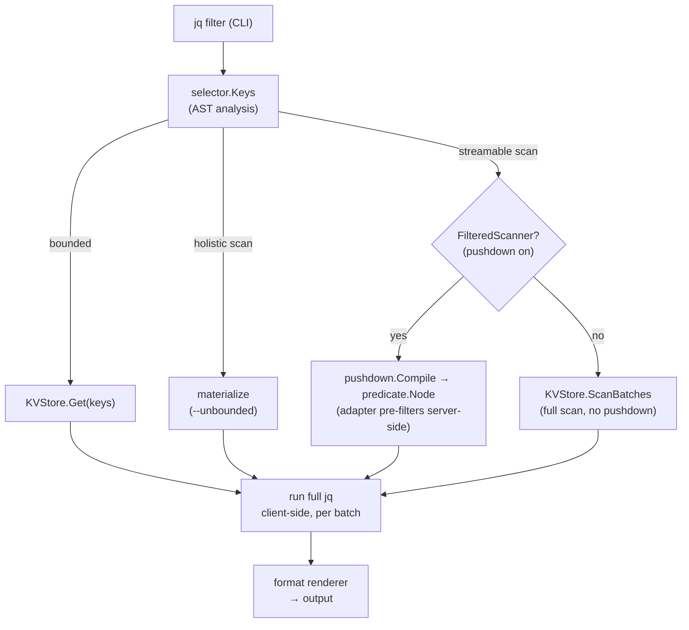
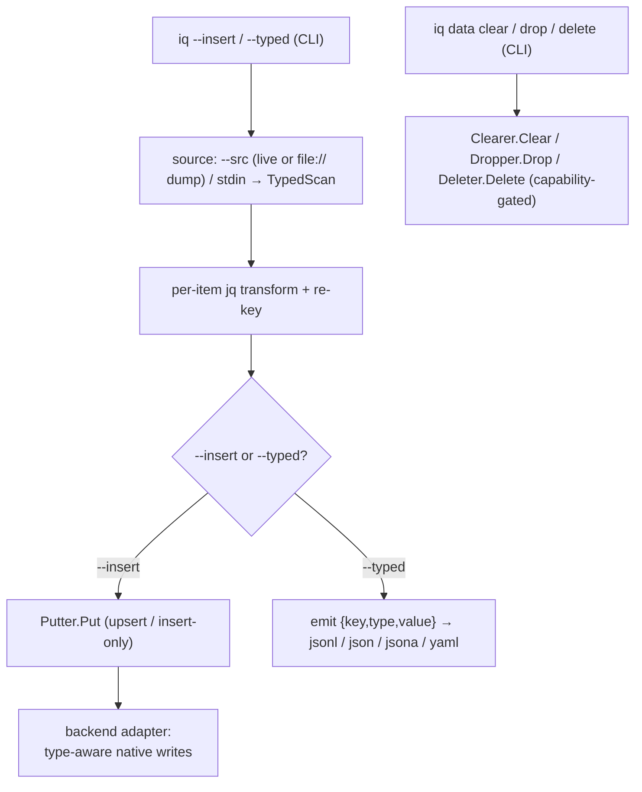

<p align="center">
  <picture>
    <source media="(prefers-color-scheme: dark)" srcset="docs/docs/assets/iq-logo-white.svg">
    
  </picture>
</p>

<p align="center">
  <!-- Three clusters, not a list. One: proof it works, escalating from "it builds" to
  "the tests assert something". Two: third-party assessment (the Best Practices placeholder joins it once
  go-public-checklist.md step 5 yields their IDs). Three: furniture. A badge earns a slot
  only by showing a number that could be bad and that a stranger reads in one second. -->
  <a href="https://github.com/zsltg/iq/actions/workflows/ci.yml"></a>
  <a href="https://codecov.io/gh/zsltg/iq"></a>
  <!-- The mutation badge stays hidden until the weekly scan can publish a real value. The scan
  must first run as shards, and every package must be green on the current mutago version.
  <a href="https://github.com/zsltg/iq/blob/main/CONTRIBUTING.md#mutation-gate-scriptsmutation-gatesh"></a>
  -->
  &nbsp;
  <a href="https://scorecard.dev/viewer/?uri=github.com/zsltg/iq"></a>
  <!-- Fill in the project ID after registering on bestpractices.dev:
  <a href="https://www.bestpractices.dev/projects/<ID>">/badge" alt="OpenSSF Best Practices"></a>
  -->
  <a href="https://codescene.io/projects/85289"></a>
  &nbsp;
  <a href="https://github.com/zsltg/iq/releases"></a>
  <a href="https://pkg.go.dev/github.com/zsltg/iq"></a>
  
  <a href="https://github.com/zsltg/iq/blob/main/LICENSE"></a>
</p>

# iq

`iq` runs [jq](https://jqlang.github.io/jq/) filters to query, dump, copy, diff and write data
across NoSQL databases, and their dump files, from a single static binary. See
[Drivers](#drivers) for supported databases.

<p align="center"></p>

`iq` normalizes fetched values to JSON. The filter runs entirely client-side,
so one filter means the same thing everywhere.

The filter is also the key selector. Its top-level paths name the keys to fetch. As a result, a
query reads only what it asks for (see [Architecture](#architecture)).

Typed dumps carry native types across stores. As a result, a copy, a restore or a
migration is one command instead of an export plus a conversion script.

`iq` is inspired by [sq](https://github.com/neilotoole/sq), whose command set it
deliberately follows to make the tool feel familiar.

> [!NOTE]
> `iq` is built with AI assistance, every change passes the full test suite,
> container-backed integration tests for every backend and a mutation gate before it lands
> (see [CONTRIBUTING.md](CONTRIBUTING.md)).
>
> Queries are read-only. `--insert`, `--replace`, `iq data clear`, `iq data drop` and
> `iq data delete` write to the target. `iq exec` forwards a native command to the database,
> so it can write too. Use `--explain` to see the query plan or `--dry-run` to report the
> effect of a write, without changing anything. `iq exec` has no dry run.
>
> Feedback and bug reports are very welcome.

## Install

`iq` ships as a single static binary (no runtime dependencies, no CGO), prebuilt for Linux,
macOS, and Windows on amd64 and arm64.

### Linux

```sh
curl -fsSL https://raw.githubusercontent.com/zsltg/iq/main/install.sh | sh
```

The script downloads the release for your OS/arch, verifies its SHA-256 against the release
checksums, and installs the binary. `IQ_VERSION` pins a version and `IQ_INSTALL_DIR` picks the
target directory. Or grab a `.deb`, `.rpm`, `.apk`, or Arch `.pkg.tar.zst` from the
[releases](https://github.com/zsltg/iq/releases).

### macOS

```sh
brew install zsltg/tap/iq
```

The Linux `curl … | sh` one-liner works on macOS too.

### Windows

```powershell
scoop bucket add zsltg https://github.com/zsltg/scoop-bucket
scoop install iq
```

### Go

```sh
go install github.com/zsltg/iq@latest
```

### From source

```sh
git clone https://github.com/zsltg/iq
cd iq && make build
```

### Agent Skill

`iq` ships an [Agent Skill](https://agentskills.io), a single Markdown file
([`skills/iq/SKILL.md`](skills/iq/SKILL.md)) that any agent reading the Agent Skills format
can load. It covers these topics:

- Finding a source
- `--explain` before every scan
- `--dry-run` before every write
- The machine-readable output flags and the JSON error shape
- The rules around destructive commands.

```sh
npx skills add zsltg/iq
```

### Agent MCP

For an agent that speaks [MCP](https://modelcontextprotocol.io), `iq mcp`
serves the same core over stdio.

It is read-only by default. `--allow writes|exec|destructive` opens the rest.
A tool that is not allowed is never registered. Every result is capped, every
error is redacted, and every destructive call is confirmed.

Claude Code:
```sh
claude mcp add iq -- iq mcp --timeout 30s
```

Codex CLI:
```sh
codex mcp add iq -- iq mcp --timeout 30s
```

Gemini CLI:
```sh
gemini mcp add iq iq mcp -- --timeout 30s
```

Cursor, Cline and Antigravity:
```json
{
  "mcpServers": {
    "iq": {
      "command": "iq",
      "args": ["mcp", "--timeout", "30s"]
    }
  }
}
```

Copilot in VS Code, which names the map `servers` and wants the transport spelled out:
```json
{
  "servers": {
    "iq": {
      "type": "stdio",
      "command": "iq",
      "args": ["mcp", "--timeout", "30s"]
    }
  }
}
```

OpenCode, which names it `mcp` and takes the command as one array:
```json
{
  "mcp": {
    "iq": {
      "type": "local",
      "command": ["iq", "mcp", "--timeout", "30s"],
      "enabled": true
    }
  }
}
```

Check [AI agents](https://zsltg.github.io/iq/agents/#client-configuration) for each client's
config file and the key it wants around the block.

<details>
<summary><strong>Shell completions</strong></summary>

The `.deb`, `.rpm`, `.apk` and `.pkg.tar.zst` packages install bash, zsh and fish completions
for you. For a brew, scoop, go-install or source build, `iq completion <shell>` prints a script to install by
hand:

```sh
# bash: load in the current session, or drop it on the completion path
eval "$(iq completion bash)"
iq completion bash | sudo tee /usr/share/bash-completion/completions/iq >/dev/null

# zsh: write to a directory on your $fpath, then restart the shell
iq completion zsh > ~/.zsh/completions/_iq

# fish
iq completion fish > ~/.config/fish/completions/iq.fish

# powershell: append to your profile
iq completion powershell >> $PROFILE
```

Completions cover the commands, their sub-subcommands and flags. They also cover your saved
source handles, groups, and config-option keys, which they read live from your config. As a
result, `iq --src <TAB>` offers the sources `iq ls` lists.

A flag that takes a closed set completes its values (`--format`, `--from-format`,
`--format.decimal`, `--log.level`, `--log.format`, `--error.format`, `--debug.pprof`,
`iq add --driver/--store`, `iq schema --format`). `iq config set <option> <TAB>` offers that
option's own values. `iq inspect --only <TAB>` and `iq diff --section <TAB>` offer the
introspection subcommands of the selected source's backend, worked out from its saved URI.

The jq filter itself is a program, not a completable value. As a result, `iq` offers no
candidates there (and never falls back to filenames). `iq` also offers no candidates for the
backend verb of `iq exec` and its operands.

Every completion is offline. It reads your config file and nothing else. As a result, a `<TAB>`
never opens a connection, never reads the OS keyring, and cannot hang. That is why a collection
suffix does not complete. `iq --src shop.<TAB>` offers nothing, because listing collections
needs a connection.

</details>

<details>
<summary><strong>Man page</strong></summary>

The packages also install an `iq(1)` manual page, so `man iq` works after a package install. For
a non-package install, pipe it into your man path:

```sh
iq man | sudo tee /usr/share/man/man1/iq.1 >/dev/null
```

</details>

## Get started

### Sources

Driver list:
```sh
iq driver ls
```

Add a collection named "books" from a MongoDB source and make it active:
```sh
iq add -a 'mongodb://localhost:27017/iq?collection=books'
```

Inspect a source:
```sh
iq inspect books
```

List sources:
```sh
iq ls
```

Check [Sources](https://zsltg.github.io/iq/sources/) for more details.

### Query data

Fetch an item with the ID "2":
```sh
iq '.["2"]'
```

Filter a scan and reshape each item:
```sh
iq '.[] | select(.year > 2015) | {title, price}'
```

Print a formatted query plan:
```sh
iq '.[] | select(.year > 2015) | {title, price}' --explain -v
```

Check [Query data](https://zsltg.github.io/iq/query-data/) for more details.

### Diff

Diff schema of two sources:
```sh
iq diff --schema dev qa
```

Diff the items with the same ID from two sources:
```sh
iq diff 'dev=.["1"]' 'qa=.["1"]'
```

Diff items key by key:
```sh
iq diff dev qa
```

Check [Diff](https://zsltg.github.io/iq/sources/#diff-diff) for more details.

### Write data

Copy one source into another, keys preserved (a cross-driver copy carries values only):
```sh
iq --src books --insert books2
```

Create a lossless (typed) dump:
```sh
iq --src cache --typed -o dump.jsonl
```

Add a dump as a source and restore it to a live source:
```sh
iq add file:///dump.jsonl -n snap
iq --src snap --insert cache
```

Copy only the items a filter selects:
```sh
iq '.[] | select(.year > 2015)' --src books --insert recent
```

Check [Write data](https://zsltg.github.io/iq/write-data/) for more details.

### Cross-source query

Compose across sources:
```sh
iq 'INDEX(source("users"; ".[]"); .id) as $u
    | source("orders"; ".[] | select(.total > 99)")
    | {name: $u[.userId].name, total}'
```

Combine across sources:
```sh
iq combine 'users=.[] | {id, name}' \
           'orders=.[] | select(.total > 99)' \
   --with '($users | INDEX(.id)) as $u | $orders[] | . + {name: $u[.userId].name}'
```

Check [Cross-source queries](https://zsltg.github.io/iq/query-data/#cross-source-queries) for more details.

### Keyspace commands

Delete two items:
```sh
iq data delete cache book:1 book:2
```

Empty a source called "cache":
```sh
iq data clear cache
```

Drop a collection called "orders":
```sh
iq data drop shop.orders
```

Check [Delete](https://zsltg.github.io/iq/write-data/#delete-data-delete),
[Clear](https://zsltg.github.io/iq/write-data/#clear-data-clear) and
[Drop](https://zsltg.github.io/iq/write-data/#drop-data-drop) for more details.

### UNIX pipes

Implicit stdin source:
```sh
cat dump.jsonl | iq '.[]'
```

Check [Insert](https://zsltg.github.io/iq/write-data/#insert-insert) for more details on piped stdin.

## Drivers

`iq` picks the backend from a source's URI scheme. The query core is driver-agnostic, so
further backends slot in behind the same port. The
[Drivers page](https://zsltg.github.io/iq/drivers/) documents these topics for each driver:

- Keyspace mapping
- Value encoding
- Predicate pushdown
- Raw commands.

| Name | Database | Versions |
| ---- | ----------- | -------- |
| `cassandra` | [Apache Cassandra](https://cassandra.apache.org/doc/) | 3.11+ |
| `couchbase` | [Couchbase](https://docs.couchbase.com/) | 7.x, 8.x (Community or Enterprise) |
| `couchdb` | [Apache CouchDB](https://docs.couchdb.org/) | 2.x, 3.x |
| `dynamodb` | [Amazon DynamoDB](https://docs.aws.amazon.com/dynamodb/) | AWS (managed) |
| `elasticsearch` | [Elasticsearch](https://www.elastic.co/docs/) | 8.x |
| `file` | Local dump file, read-only (see [Backups and dumps](#backups-and-dumps)) | — |
| `hbase` | [Apache HBase](https://hbase.apache.org/book.html) | 1.0+ |
| `mongo` | [MongoDB](https://www.mongodb.com/docs/) | 4.2+ |
| `neo4j` | [Neo4j](https://neo4j.com/docs/) | 5.x |
| `opensearch` | [OpenSearch](https://opensearch.org/docs/) | 2.x, 3.x |
| `redis` | [Redis](https://redis.io/docs/) | 7.0+ |

The Versions column lists the range of backend server versions the bundled client library
supports.

### Guarantees

Drivers differ in encoding and pushdown detail, but every backend honors the
same contract:

- **One URI, native nouns.** The URI scheme picks the driver. The keyspace rides in the URI as the
  backend's own noun (`?collection=`, `?table=`, `?database=`, `?label=`/`?rel=`, `?index=`). A
  query overrides it per run with the dotted `handle.<keyspace>` suffix.
- **One jq interface.** A bounded filter fetches exactly the named keys. A missing key reads as
  `null`, never an error. A `.[]`-rooted filter streams the keyspace in bounded pages. A filter
  that collapses the keyspace into one value materializes only behind `--unbounded`.
- **Pushdown never changes results.** A pushed predicate is only ever a conservative pre-filter.
  Where the backend can filter, the pre-filter is server-side. Where the backend cannot, the
  pre-filter is a client-side raw-byte prefilter that drops a provable non-match before decode
  (Redis, on RedisJSON values, Elasticsearch/OpenSearch and Couchbase, over the residual their
  server-side query cannot narrow). The full jq always re-runs client-side. As a result, output is
  identical with or without the pushed predicate, and `--explain` shows exactly what was pushed.
- **Capabilities are explicit.** Filtered scans, count estimates, writes, clear, drop and per-key
  delete are opt-in ports. A backend implements what its model supports. A command against a
  missing capability fails with a clear message instead of emulating it. For example, Redis, whose
  DB index cannot be removed, has no `drop`. The read-only file dump has no per-key `delete`.
- **Values round-trip.** Every value normalizes to JSON under a frozen per-backend encoding
  contract. A `--typed` dump restores through `--insert` losslessly.
- **Bounded and redacted.** `--timeout` bounds every backend call. `iq` redacts a URI's password
  from every listing, log line and error.
- **Native commands.** `iq exec` speaks the backend's own language, verbatim where one exists
  (Redis commands, Mongo command documents, CQL, PartiQL, Cypher, Mango, the Elasticsearch DSL).
  Where none exists, `iq exec` speaks a small fixed verb set (HBase). See each driver's Raw
  commands section on the [Drivers page](https://zsltg.github.io/iq/drivers/). Every `iq` flag
  must come before `exec`. `iq` forwards everything after `exec` to the backend untouched.

## Backups and dumps

A `file://` source reads a database dump straight from disk. As a result, you can do these
operations on a snapshot through the same jq interface, with no running server:

- Query it
- Inspect it for shape
- Diff it against a live source
- Restore it.

A `file://` source is read-only. A `file://` endpoint is never a copy destination. `iq exec` and
`iq inspect`, which need a live server, do not apply.

Register a dump like any other source:
```sh
iq add -n snap file:///backups/prod.rdb
```

Query, diff and restore it with no server running:
```sh
iq --src snap '.["session:42"]'
iq diff snap cache --data
iq --src snap --insert cache
```

| Type | Description |
| ---- | ----------- |
| `jsonl` | iq typed JSON Lines / array |
| `yaml` | iq typed YAML |
| `mongoexport` | mongoexport Extended JSON |
| `bson` | mongodump BSON |
| `rdb` | Redis RDB snapshot |
| `?format=dynamodb-json` | DynamoDB S3 export / scan JSON |
| `?format=cassandra-csv` | cqlsh COPY TO CSV |
| `?format=neo4j-json` | Neo4j APOC JSON export |

A type with a bare name auto-detects (`file:///<file_path>`). For a type in the `?format=` rows,
you must pass the `?format=` form (`file:///<file_path>?format=<source_format>`). The
[Drivers page](https://zsltg.github.io/iq/drivers/#file-dumps) documents what produces each
format, the options some of them need, and the round-trip caveats.

## Architecture

The URI scheme chooses the backend. The query core is driver-agnostic, so further backends
slot in behind the same port.

The filter is both the transform and the key selector. Its top-level paths name the keys to
fetch, so a normal query reads a bounded set of keys. A `.[]`-rooted filter streams the
keyspace in pages. A filter that collapses the keyspace into one value materializes only behind
`--unbounded`. `iq` normalizes fetched values to JSON. The filter then runs entirely
client-side, so its semantics are identical for every backend.

The CLI and `iq mcp` are two thin delivery mechanisms over that one core. The MCP server
exposes the CLI's own operations as tools, resolves the same saved sources, and runs the same
engine. As a result, it adds no port and changes no classification. It adds only its own bounds,
a tool set fixed at startup by `--allow`, per-result item and byte caps, and the CLI's redacted
error shape.

### Query routes

The **selector** classifies a jq filter. `iq` optionally **decomposes** a scan
into a native predicate. Each backend then maps that predicate its own way.

Regardless of pushdown, the full jq re-runs client-side. As a result, the pushed
predicate is only ever a conservative pre-filter, and results are identical with
or without it.



A scan emits per-page progress to a stderr spinner (CLI only, off unless
attached to a terminal). An unfiltered scan can also fetch a cheap up-front total
estimate (where the backend metadata makes it possible).

A bounded filter runs client-side over only the named keys, so its cost is `O(keys requested)`. A
streamable scan runs in `O(page)` memory.

[gojq](https://github.com/itchyny/gojq) (pure Go, no cgo) provides jq and exposes the AST the key
selector walks.

### Write routes

Writes ride the query command. There is no separate copy tool. Items arrive
from `--src` (a live source or a `file://` dump) or piped stdin. `iq` reads
each item as a typed record, so the native type survives the trip.

The `jq` filter transforms each item with its key preserved. This transform is
the one place where a filter runs per item rather than over the whole keyspace.
Iteration is implicit, and you do not write `.[]`.



## See also

Where `iq` sits among other tools, and the jq ecosystem its filter language carries over.

- [jq manual](https://jqlang.org/manual/): the language reference for the filters `iq` runs.
- [awesome-jq](https://github.com/jqlang/awesome-jq): a curated list of jq tools, guides, and resources.
- [sq](https://github.com/neilotoole/sq): jq-style queries over SQL databases and document files.
- [gojq](https://github.com/itchyny/gojq): the pure-Go jq implementation `iq` embeds.
- [jaq](https://github.com/01mf02/jaq): a Rust jq clone focused on speed and stricter semantics.
- [yq](https://github.com/mikefarah/yq): jq-style filters for YAML, TOML, and XML.
- [fq](https://github.com/wader/fq): jq for binary formats.
- [jc](https://github.com/kellyjonbrazil/jc): converts classic CLI output to JSON.
- [jqp](https://github.com/noahgorstein/jqp): a TUI playground that live-previews a filter as you type.
- [ijq](https://github.com/gpanders/ijq): interactive jq with a side-by-side input and output view.
