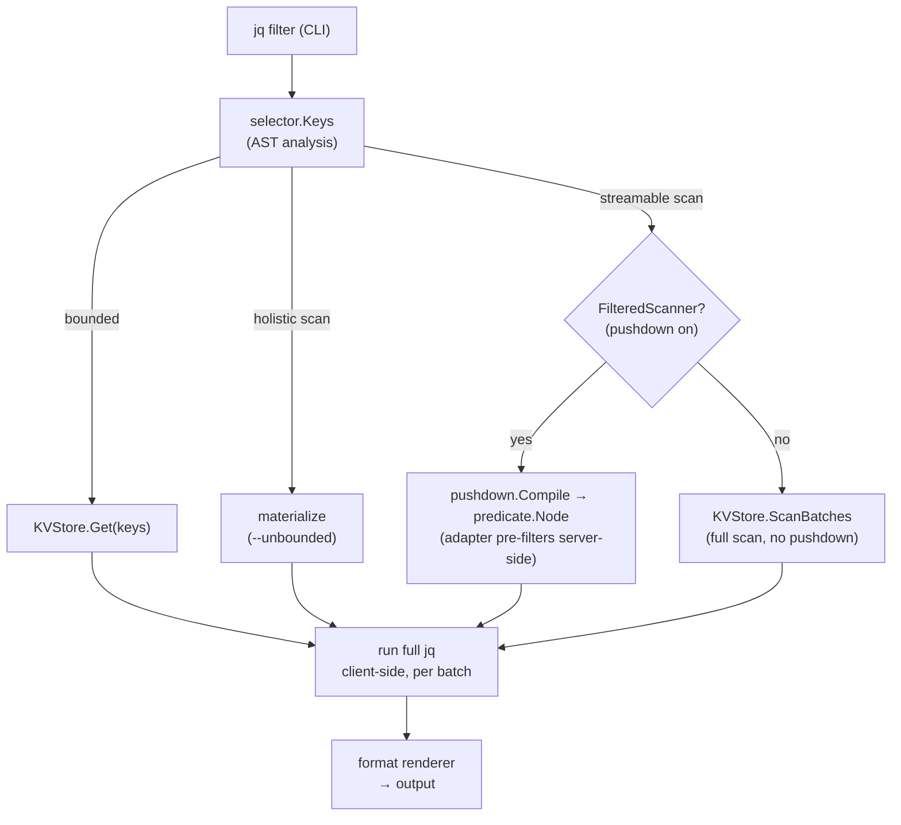
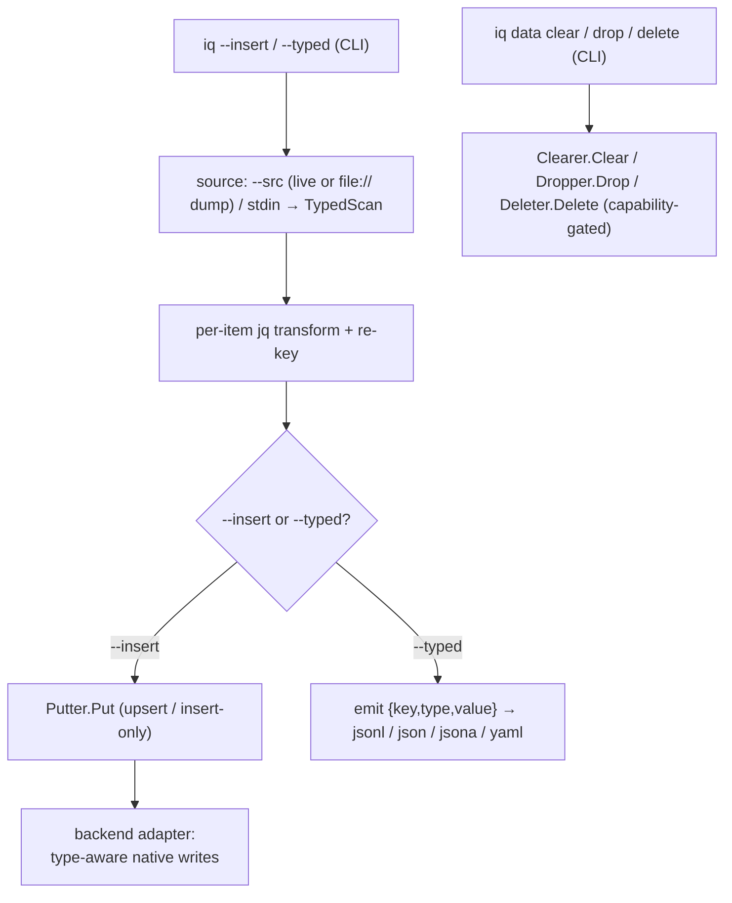

<p align="center">
  <picture>
    <source media="(prefers-color-scheme: dark)" srcset="docs/docs/assets/iq-logo-white.svg">
    
  </picture>
</p>

# iq

A Go command-line tool that runs [jq](https://jqlang.github.io/jq/) filters against NoSQL
databases. The backend is chosen by the URI scheme, and the query core is driver-agnostic
so further backends slot in behind the same port.

The filter is both the transform and the key selector: its top-level paths name the keys to
fetch, so a normal query reads a bounded set of keys; a `.[]`-rooted filter streams the
keyspace in pages, and a filter that collapses it into one value materializes only behind
`--unbounded`. Fetched values are normalized to JSON and the filter then runs entirely
client-side, so its semantics are identical for every backend.

`iq` is inspired by [sq](https://github.com/neilotoole/sq): much of its command surface (the
dotted `<handle>.<keyspace>` addressing, sq's `<source>.<collection>`, along with many
subcommands and flags) deliberately follows sq's to make the tool feel familiar.

> [!WARNING]
> **Pre-1.0.** Flags, output shapes and the config format can still change between releases.
>
> `--insert`, `iq data clear` and `iq data drop` write to live databases, point them at data
> you can afford to lose first.
>
> Use `--explain` to see the query plan without making changes.

## Install

`iq` ships as a single static binary (no runtime dependencies, no CGO), prebuilt for Linux,
macOS, and Windows on amd64 and arm64.

### Linux

```sh
curl -fsSL https://raw.githubusercontent.com/zsltg/iq/main/install.sh | sh
```

The script downloads the release for your OS/arch, verifies its SHA-256 against the release
checksums, and installs the binary; `IQ_VERSION` pins a version and `IQ_INSTALL_DIR` picks the
target directory. Or grab a `.deb`, `.rpm`, or `.apk` from the
[releases](https://github.com/zsltg/iq/releases).

### macOS

```sh
brew install zsltg/tap/iq
```

The Linux `curl … | sh` one-liner works on macOS too.

### Windows

```powershell
scoop bucket add zsltg https://github.com/zsltg/scoop-bucket
scoop install iq
```

### Go

```sh
go install github.com/zsltg/iq@latest
```

### From source

```sh
git clone https://github.com/zsltg/iq
cd iq && make build
```

### Shell completions

The `.deb`, `.rpm` and `.apk` packages install bash, zsh and fish completions for you. For a
brew, scoop, go-install or source build, `iq completion <shell>` prints a script to install by
hand:

```sh
# bash — load in the current session, or drop it on the completion path
eval "$(iq completion bash)"
iq completion bash | sudo tee /usr/share/bash-completion/completions/iq >/dev/null

# zsh — write to a directory on your $fpath, then restart the shell
iq completion zsh > ~/.zsh/completions/_iq

# fish
iq completion fish > ~/.config/fish/completions/iq.fish

# powershell — append to your profile
iq completion powershell >> $PROFILE
```

Completions cover the commands, their sub-subcommands and flags, and — read live from your
config — your saved source handles, groups, and config-option keys, so `iq --src <TAB>` offers
the sources `iq ls` lists. A flag that takes a closed set completes its values (`--format`,
`--from-format`, `--format.decimal`, `--log.level`, `--log.format`, `--error.format`,
`--debug.pprof`, `iq add --driver/--store`, `iq schema --format`), and `iq config set <option>
<TAB>` offers that option's own values. `iq inspect --only <TAB>` and `iq diff --section <TAB>`
offer the introspection subcommands of the selected source's backend, worked out from its saved
URI. The jq filter itself is a program, not a completable value, so `iq` offers no candidates
there (and never falls back to filenames) — nor do `iq exec`'s backend verb and its operands.

Every completion is offline: it reads your config file and nothing else, so a `<TAB>` never
opens a connection, never reads the OS keyring, and cannot hang. That is why a collection
suffix does not complete — `iq --src shop.<TAB>` offers nothing, since listing collections
would mean connecting.

### Man page

The packages also install an `iq(1)` manual page, so `man iq` works after a package install. For
a non-package install, pipe it into your man path:

```sh
iq man | sudo tee /usr/share/man/man1/iq.1 >/dev/null
```

## Getting started

The default action is a jq filter: its top-level paths name the keys to fetch, and the result
prints as pretty JSON. Queries run against the active source.

```bash
./iq '.greeting'                          # fetch key "greeting"
./iq '.["book:1"].title'                  # a colon key needs bracket-quoting; extract one field
./iq '[ .["book:1"].title, .["book:2"].title ]'   # fetch both keys, project a field from each
./iq '.["book:2"].price | tonumber + 5'   # values are strings; convert before arithmetic
```

Always wrap the filter in single quotes — jq syntax is full of characters the shell would
otherwise expand or split (`[ ]`, whitespace, `|`, `*`, `$`).

The commands below are a starter set; every command and flag is documented in full on the
[documentation site](https://zsltg.github.io/iq/).

### Sources

| Command | Description |
| --- | --- |
| `iq add -n cache redis://localhost:6379/0` | Register a source |
| `iq ls` | List sources (`-v` for detail) |
| `iq src cache` | Set the active source |
| `iq add -n snap file:///backups/prod.rdb` | Register a dump file as a read-only source |

### Data

| Command | Description |
| --- | --- |
| `iq --src books --insert books2` | Copy one source into another (cross-driver) |
| `iq --src cache --typed -o dump.jsonl` | Dump a source to a re-importable typed file |
| `iq --src snap --insert prod` | Restore a dump into a live source |
| `iq data clear books` | Empty a container (`iq data drop` removes it) |
| `iq schema prod.orders` | Infer a JSON Schema from a sampled source |
| `iq schema 'prod.orders=.[] \| select(.active)'` | Infer the shape of part of a source |
| `iq diff prod staging` | Compare two sources by data, stats, or inferred schema |
| `iq diff prod staging --filter '.[] \| select(.status == "new")'` | Compare only part of each keyspace |
| `iq combine 'users=.[]' 'orders=.[]' --with '$users + $orders'` | Query several sources and join their results |
| `iq combine … --insert joined --key '.id \| tostring'` | Write the combined results into a destination |
| `iq --src prod '.[]' --format parquet -o out.parquet` | Export results as Apache Parquet |

### Config

| Command | Description |
| --- | --- |
| `iq config set format yaml` | Persist a default flag value |
| `iq config ls -v` | List every persistable option |
| `iq --config ./iq.toml ls` | Use an alternate config file |

## Drivers

`iq` picks the backend from a source's URI scheme, and the query core is driver-agnostic, so
further backends slot in behind the same port. The
[Drivers page](https://zsltg.github.io/iq/drivers/) documents each driver's keyspace mapping,
value encoding, predicate pushdown, and raw-command escape hatch.

| Name | Database | Versions |
| ---- | ----------- | -------- |
| `cassandra` | [Apache Cassandra](https://cassandra.apache.org/doc/) | 3.11+ |
| `couchbase` | [Couchbase](https://docs.couchbase.com/) | 7.x, 8.x (Community or Enterprise) |
| `couchdb` | [Apache CouchDB](https://docs.couchdb.org/) | 2.x, 3.x |
| `dynamodb` | [Amazon DynamoDB](https://docs.aws.amazon.com/dynamodb/) | AWS (managed) |
| `elasticsearch` | [Elasticsearch](https://www.elastic.co/docs/) | 8.x |
| `file` | Local dump file, read-only | — |
| `hbase` | [Apache HBase](https://hbase.apache.org/book.html) | 1.0+ |
| `mongo` | [MongoDB](https://www.mongodb.com/docs/) | 4.2+ |
| `neo4j` | [Neo4j](https://neo4j.com/docs/) | 5.x |
| `opensearch` | [OpenSearch](https://opensearch.org/docs/) | 2.x, 3.x |
| `redis` | [Redis](https://redis.io/docs/) | 7.0+ |

The Versions column lists the range of backend server versions the bundled client library
supports.

### File dump formats

| Type | Description |
| ---- | ----------- |
| `jsonl` | iq typed JSON Lines / array |
| `yaml` | iq typed YAML |
| `mongoexport` | mongoexport Extended JSON |
| `bson` | mongodump BSON |
| `rdb` | Redis RDB snapshot |
| `?format=dynamodb-json` | DynamoDB S3 export / scan JSON |
| `?format=cassandra-csv` | cqlsh COPY TO CSV |
| `?format=neo4j-json` | Neo4j APOC JSON export |

A bare name auto-detects (`file:///<file_path>`), the `?format=` form must be passed
(`file:///<file_path>?format=<source_format>`).

### Guarantees

Drivers differ in encoding and pushdown detail, but every backend honors the
same contract:

- **One URI, native nouns.** The URI scheme picks the driver; the keyspace rides in the URI as the
  backend's own noun (`?collection=`, `?table=`, `?database=`, `?label=`/`?rel=`, `?index=`), and a
  query overrides it per run with the dotted `handle.<keyspace>` suffix.
- **One jq surface.** A bounded filter fetches exactly the named keys — a missing key reads as
  `null`, never an error; a `.[]`-rooted filter streams the keyspace in bounded pages; a holistic
  filter materializes only behind `--unbounded`.
- **Pushdown never changes results.** A pushed predicate is only ever a conservative pre-filter —
  server-side where the backend can filter, or a client-side raw-byte prefilter that drops a provable
  non-match before decode where it cannot (Redis, on RedisJSON values; Elasticsearch/OpenSearch and
  Couchbase, over the residual their server-side query could not narrow). The full jq always re-runs
  client-side, so
  output is identical with or without it, and `--explain` shows exactly
  what was pushed.
- **Capabilities are explicit.** Filtered scans, count estimates, writes, clear, drop, and per-key
  delete are opt-in ports: a backend implements what its model supports, and a command against a
  missing capability fails with a clear message instead of emulating it (Redis, whose DB index cannot
  be removed, simply has no `drop`; the read-only file dump has no per-key `delete`).
- **Values round-trip.** Every value normalizes to JSON under a frozen per-backend encoding
  contract, and a `--typed` dump restores through `--insert` losslessly.
- **Bounded and redacted.** Every backend call is bounded by `--timeout`, and a URI's password is
  redacted from every listing, log line, and error.
- **A native escape hatch.** `iq exec` speaks the backend's own language — verbatim where one exists
  (Redis commands, Mongo command documents, CQL, PartiQL, Cypher, Mango, the Elasticsearch DSL), a small
  fixed verb set where none does (HBase) — see each driver's Raw commands section on the
  [Drivers page](https://zsltg.github.io/iq/drivers/). Every `iq` flag
  must come before `exec`: everything after it is forwarded to the backend untouched.

## Architecture

### Query routes

A jq filter is classified by the **selector**, a scan is optionally
**decomposed** into a native predicate, and each backend maps that predicate
its own way.

Regardless of pushdown, the full jq re-runs client-side, so the pushed
predicate is only ever a conservative pre-filter and results are identical with
or without it.



A scan emits per-page progress to a stderr spinner (CLI only, off unless
attached to a terminal) and an unfiltered scan can fetch a cheap up-front total
estimate (where the backend metadata makes it possible).

### Write routes

Writes ride the query command, there is no separate copy tool. Items arrive
from `--src` (a live source or a `file://` dump) or piped stdin, and each is
read as a typed record, so the native type survives the trip.

The `jq` filter transforms each item with its key preserved, this is the one
place a filter runs per item rather than over the whole keyspace, iteration is
implicit and you do not write `.[]`.



A bounded filter runs client-side over just the named keys, so its cost is `O(keys requested)`; a
streamable scan runs in `O(page)` memory. The jq semantics are identical for any future backend
behind `KVStore`. jq is provided by
[gojq](https://github.com/itchyny/gojq) (pure Go, no cgo), which keeps `iq` a single static
binary and exposes the AST the key selector walks.

## Comparison

How `iq` relates to other query tools. Its niche is narrow: a single static binary that gives
NoSQL stores one jq-based query surface, the filter running client-side over normalized JSON so
semantics are identical across backends.

The tools it resembles fall into five groups:

- Multi-backend SQL (`sq`, Trino, Drill, OctoSQL, usql) unifies databases under one SQL-ish
  language, but targets relational stores; where it reaches NoSQL it runs as a server or engine.
- SQL over files (DuckDB, dsq, trdsql, and others) queries CSV/JSON/Parquet locally, not live
  databases.
- Relational + NoSQL languages (PartiQL, SQL++, JSONiq, GraphQL) span nested and tabular data,
  but are language specs or tied to a specific engine, not a portable CLI.
- Data virtualization / federation platforms (Denodo, Dremio, MindsDB) run as a server that
  translates SQL into each backend's native query, spanning relational, NoSQL, and files without
  migrating data — broad reach, but the unification lives in a heavyweight service, not a binary
  you run locally.
- Universal database clients (DBeaver, DBX, LazySQL) put one GUI or TUI in front of many
  backends, but each connection still speaks that backend's native query language — a shared
  shell, not a shared language.

`sq` — the tool `iq`'s command surface is modelled on — belongs to the first group: it unifies
relational databases and files, and never reaches NoSQL.

Apache Calcite doesn't fit any group above: it's the SQL parsing/optimization framework several
multi-backend engines (Drill, Dremio) embed, not a standalone tool. It's listed because its
adapter model — translating SQL onto MongoDB, Cassandra, Elasticsearch, and others — is the
template most SQL-over-NoSQL tools follow.

Legend: ● primary, ◐ partial, — none. Model is the shape the query language speaks; footprint is
what you run.

| Tool | Query language | Relational | NoSQL | Files | Data model | Footprint |
|---|---|:---:|:---:|:---:|---|---|
| **iq** | **jq** | — | **●** | **◐** | **document** | **single binary** |
| [sq](https://sq.io) | SLQ / SQL | ● | — | ● | tabular | single binary |
| [Apache Calcite](https://calcite.apache.org) | SQL | ● | ◐ | ◐ | relational (via adapters) | library / embedded |
| [Apache Drill](https://drill.apache.org) | SQL | ● | ● | ● | schema-free (both) | server / engine |
| [DBeaver](https://dbeaver.io) | native per-backend | ● | ◐ | ◐ | client-side, per backend | desktop app (JVM) |
| [DBX](https://github.com/t8y2/dbx) | native per-backend | ● | ◐ | ◐ | client-side, per backend | desktop app / CLI |
| [Denodo](https://www.denodo.com) | SQL | ● | ● | ◐ | virtual relational | server (commercial) |
| [Dremio](https://www.dremio.com) | SQL | ● | ◐ | ● | tabular (Arrow) | server / cluster |
| [dsq](https://github.com/multiprocessio/dsq) | SQL | — | — | ● | tabular | single binary |
| [DuckDB](https://duckdb.org) | SQL | ◐ | — | ● | tabular | in-process / CLI |
| [GraphQL federation](https://graphql.org/learn/federation/) | GraphQL | ● | ● | — | typed graph (both) | server |
| [JSONiq](https://www.jsoniq.org) | JSONiq | — | ● | ● | document | library / engine |
| [LazySQL](https://github.com/jorgerojas26/lazysql) | native SQL | ● | — | — | tabular | single binary (TUI) |
| [MindsDB](https://mindsdb.com) | SQL | ● | ● | ◐ | virtual relational | server |
| [OctoSQL](https://github.com/cube2222/octosql) | SQL | ● | ◐ | ● | tabular | single binary |
| [PartiQL](https://partiql.org) | PartiQL | ● | ● | ◐ | nested (both) | spec / embedded |
| [SQL++](https://asterixdb.apache.org/docs/0.9.9/sqlpp/manual.html) / [N1QL](https://www.couchbase.com/products/n1ql/) | SQL++ | ◐ | ● | — | document | DB engine |
| [Trino](https://trino.io) / [Presto](https://prestodb.io) | SQL | ● | ● | ● | tabular (◐ JSON) | server / engine |
| [usql](https://github.com/xo/usql) | native SQL | ● | ◐ | — | tabular | single binary (multiplexer) |

Placement is by each tool's primary targets, several (Trino, Drill, OctoSQL,
DuckDB, Calcite) partially reach neighbouring columns via connectors, adapters
or extensions, and `iq` reaches files the same way, a read-only `file://`
source over database dumps, not arbitrary files.

The takeaway is the NoSQL column paired with footprint, `iq` is the only tool
pairing a unified query language across NoSQL backends with a single
lightweight binary.

Data virtualization platforms (Denodo, Dremio, MindsDB) get the unified
language but need a server.

Universal clients (DBeaver, DBX, LazySQL) get a lightweight footprint but no
unified language, each connection still speaks that backend's native dialect.

## See also

- [awesome-jq](https://github.com/jqlang/awesome-jq) — the curated list of jq tools, guides, and
  resources. `iq` uses jq as its filter language, so most of what applies to jq carries over.

## Contributing

See [CONTRIBUTING.md](CONTRIBUTING.md) for the build, test, quality-gate, and release
workflow.

## License

[MIT](LICENSE).
