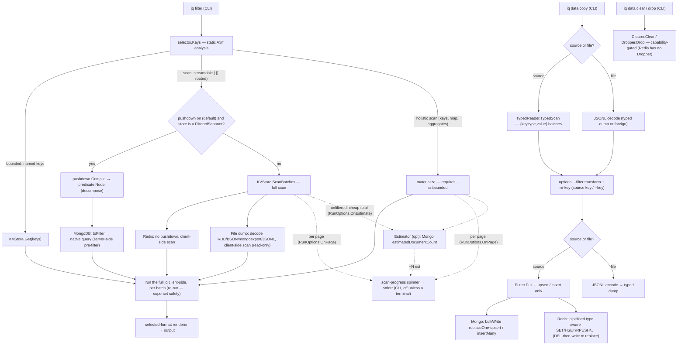

# iq

A Go command-line tool that runs [jq](https://jqlang.github.io/jq/) filters against NoSQL
databases. Redis and MongoDB are supported; the backend is chosen by the URL scheme, and the
query core is driver-agnostic so further backends slot in behind the same port.

The filter is both the transform and the key selector: its top-level paths name the keys to
fetch, so the store only ever reads a bounded set of keys — never a full keyspace scan, unless
you ask for one explicitly. Fetched values are normalized to JSON and the filter then runs
entirely client-side, so its semantics are identical for every backend.

`iq` is inspired by [sq](https://github.com/neilotoole/sq): much of its command surface — the
`<source>.<collection>` addressing along with many subcommands and flags — deliberately follows
sq's so the tool feels familiar.

> [!WARNING]
> **Not production-ready.** `iq` has potential rough edges — don't rely on it for critical work
> yet.

## Requirements

- Go 1.25+
- Docker (for the integration tests, which start ephemeral Redis + MongoDB containers; not needed for `go test -short`)

## Build

```bash
go build -o iq .          # plain build
make build                # build with version metadata embedded
```

`make build` injects the version, commit, and build date via ldflags; a plain `go build` still
reports a version recovered from Go's embedded build info. Check it with `iq version` or
`iq --version`.

## Releasing

Versioning is driven by [Conventional Commits](https://www.conventionalcommits.org/): the release
tooling reads the commit log, computes the next [semantic version](https://semver.org/), and
regenerates `CHANGELOG.md`. It is all-Go and local — no CI service or GitHub required.

```bash
make tools                        # one-time: install svu + git-chglog into GOPATH/bin
bash scripts/release.sh --dry-run # preview the next version and CHANGELOG.md diff, no changes
make release                      # bump, regenerate CHANGELOG.md, commit, and tag
git push --follow-tags            # publish the tag (release.sh never pushes for you)
```

`make release` must run on a clean `main`. `svu` picks the bump from the commit types since the
last tag (`feat` → minor, `fix` → patch, a `!`/`BREAKING CHANGE` → major); with no tags yet the
first release comes out as `v0.1.0`.

## Sources

`iq` connects only through **saved sources**: a named connection you register once, then select
by name or as the default. Register one with `iq add`, then make it active:

```bash
iq add -n cache redis://localhost:6379/0             # register a Redis source as "cache"
iq add mongodb://localhost:27017/books -c items -a   # a Mongo source; handle "books" derived from the db, made active
iq src cache                                          # make "cache" the active source
iq ls                                                 # list sources (the active one marked *)
```

Once a source is active, every query runs against it. Select a different source for a single
command with `--src`/`-s`, without changing the active one:

```bash
iq --src books '.["2"]'      # run this one query against "books"
```

- `iq add <url> [-n <handle>] [-c <collection>] [-a] [-p] [-d <driver>] [--skip-verify] [--store keyring]`
  — register a source, mirroring `sq add`. The URL is the sole positional argument; the backend is
  inferred from its scheme (`redis://`, `rediss://`, `mongodb://`, `mongodb+srv://`). `-n`/`--handle`
  names the source; when omitted a handle is derived from the URL (the MongoDB database name, else
  the driver, disambiguated with a numeric suffix on collision). `-c` stores a MongoDB collection
  with the source. `-a`/`--active` makes the new source active. `-p`/`--password` prompts for the
  URL password (or reads it from stdin) instead of embedding it in the URL. `-d`/`--driver` asserts
  the expected driver (`mongo`, `redis`) and errors if it disagrees with the scheme. The source is
  pinged before it is saved unless `--skip-verify` is set, so a failed add leaves no trace. `--store
  keyring` moves the URL's password into the OS keyring and strips it from the stored URL (default
  `--store inline` keeps it in the config file).
- `iq ls [group]` — list saved sources; the active one is marked `*`. Passwords in URLs are
  redacted. An optional `group` limits the listing to that group. `-v` adds each source's driver;
  `-g` lists groups instead of sources; `--json` emits machine-readable output. `--reveal` prints
  a password stored inline in the config verbatim, and `--expand` resolves a keyring-backed
  source's stored password and inlines it — combine both to print a keyring password verbatim.
- `iq src [<name>]` — show the active source, or set it.
- `iq rm <name>...` — remove one or more sources, or whole groups (a group name removes every
  source under it). Atomic: if any name is unknown, nothing is removed.
- `iq mv <old> <new>` — rename a source, or move it into a group with a group-qualified target
  (`iq mv books prod/books`). When `<old>` is a group, every member is re-prefixed
  (`iq mv prod staging`). The active source and group follow the move.
- `iq ping [<name>...]` — check that sources are reachable, reporting each driver and round-trip
  time (or the error). No arguments pings the active source; a group name pings every member.
  Bounded by `--timeout`; exits non-zero if any source is unreachable.
- `iq inspect [<source>[.<collection>]]` — show a source's native introspection. The positional
  names the source (`iq inspect prod`); with none it uses `--src` or the active source. MongoDB
  sources accept sq-style `<source>.<collection>` addressing (`iq inspect prod.books`) to pick the
  collection; `--collection` still overrides it, and Redis sources take no collection. `--only`
  narrows the output (repeatable or comma-separated): for Redis, `INFO` sections
  (`iq inspect prod --only memory,server`); for MongoDB, the diagnostic commands (`dbStats`,
  `serverStatus`, `listCollections`, `collStats`, `buildInfo`, `hostInfo`) — no `--only` runs them
  all. `--list` prints the subcommands/sections available for the source (Mongo's fixed set;
  Redis's live INFO sections). `--json` for machine-readable output; bounded by `--timeout`. The
  location header is redacted like `iq ls`: `--reveal` un-redacts an inline password, `--expand`
  resolves a keyring-backed one.
- `iq diff <a> <b>` — compare two sources. `--data` (the default) diffs items key by key —
  added / removed / changed, keyed by document `_id` (MongoDB) or key (Redis); it reads both
  keyspaces fully into memory, the deliberate cost of needing both key sets at once, and is allowed
  across drivers (a power tool for verifying a migration, not a schema comparison — the match is
  only as meaningful as the keys lining up). `--stats` diffs native introspection trees and
  `--schema` diffs an inferred, sampled field/type shape (`--sample`); both require the same driver.
  Layers combine; `--json` for a machine-readable delta; `--exit-code` exits non-zero when
  differences exist (otherwise always zero). Bounded by `--timeout`.
- `iq group [<name>] [--clear]` — show, set, or clear the active **group**.
- `iq driver ls` — list the backend drivers iq can dispatch to, each with its description, the URL
  schemes that select it, and its upstream docs. `--json` for machine-readable output. The driver
  name shown here is the same canonical name `iq ls -v`, `ping`, `inspect`, and `diff` report
  (`redis` covers both `redis://` and `rediss://`; `mongo` covers `mongodb://` and `mongodb+srv://`).

**Groups.** A `/` in a name groups sources (`prod/books`, `dev/books`). Set an active group with
`iq group prod`, and an unqualified name resolves inside it — `iq src books` then selects
`prod/books`, falling back to a top-level `books` if the group has none.

Sources live in a TOML file at `<os user config dir>/iq/iq.toml` (e.g. `~/.config/iq/iq.toml`),
written `0600` because a URL may carry a password. Override the path with `IQ_CONFIG`, or per run
with the global `--config <path>` flag (which wins over `IQ_CONFIG`). A source added with
`--store keyring` keeps no password in this file — it lives in the OS keyring (Secret Service on
Linux, Keychain on macOS, Credential Manager on Windows) and is spliced back into the URL only
when connecting.

> `iq add` shadows jq's built-in `add` filter at the top level. To sum with jq, write it inside a
> larger expression, e.g. `iq '[ .a, .b ] | add'`.

### Stored options (`iq config`)

The same file also holds **stored option defaults**: persist a flag's value once so you need not
retype it. Set an option globally, or scope it to one source with `--src`. At query time the
precedence is **explicit flag > per-source option > base option > built-in default**, so a saved
default fills any flag you leave unset, and an explicit flag on the command line always wins.

```bash
iq config set format yaml                 # every query defaults to YAML output
iq config set --src prod timeout 30s      # 30s timeout only when querying "prod"
iq config get --src prod format           # effective value for "prod" (source > base > default)
iq config ls -v                           # every persistable option: value, default, and help
iq '.[]'                                  # renders YAML (the stored default)
iq -f json '.[]'                          # explicit flag overrides the stored default
```

- `iq config location` — print the resolved config file path.
- `iq config get [--src <name>] <option>` — print an option's effective value at that scope.
- `iq config set [--src <name>] <option> <value>` — validate and store a value (base, or per
  source). The value is checked exactly as the flag would check it, so an invalid value is refused.
- `iq config unset [--src <name>] <option>` — remove a stored value.
- `iq config ls [--src <name>]` — list the options set at that scope; `-v` lists every persistable
  option with its effective value, built-in default, and help.
- `iq config edit` — open the config file in `$IQ_EDITOR` (then `$VISUAL`, `$EDITOR`, else `vi`).
- `iq config view [--reveal] [--expand]` — dump the whole config as TOML, source URLs redacted
  like `iq ls`.

Persistable options are the flags whose default you would reasonably persist — output (`format`,
`format.decimal`, `compact`), `timeout`, display (`monochrome`, `color`, `no-progress`), and the
diagnostics family (`verbose`, `log*`, `error*`). Per-invocation flags (`--src`, `--collection`,
`--from`/`--combine`, `--explain`, `--unbounded`, `--no-compile`, `--reveal`/`--expand`,
`--debug.pprof`) are not storable. A `--from`/`--combine` query has no single source, so it uses
the base options only, never a per-source override.

## Usage

The default action is a jq filter. Its top-level paths name the keys to fetch; the result is
printed as pretty JSON by default (see [Output formats](#output-formats) to change it; these run
against the active source — see [Sources](#sources)):

```bash
./iq '.greeting'                          # fetch key "greeting"
./iq '.["book:1"]'                        # a key containing a colon needs bracket-quoting
./iq '.["book:1"].title'                  # fetch book:1, extract one field
./iq '[ .["book:1"].title, .["book:2"].title ]'   # fetch both keys, project a field from each
./iq '.["book:2"].price | tonumber + 5'   # values are strings; convert before arithmetic
```

Always wrap the filter in single quotes. jq syntax is full of characters the shell would
otherwise expand or split — brackets (`[ ]`), whitespace, `|`, `*`, `$` — and bracket-quoting a
colon key like `.["book:1"]` reads as a glob to zsh (`no matches found`) or bash unless quoted.

### Output formats

Results print as pretty JSON by default. A single format flag selects another rendering; the
flags are mutually exclusive and apply to the jq read path and to `--from`/`--combine`, not to
`exec` (which prints the backend's native reply):

| flag | output |
| --- | --- |
| `-j`, `--json` (default) | pretty JSON, one value per result |
| `-J`, `--jsonl` | compact JSON, one value per line (JSON Lines) |
| `-A`, `--json-array` | every result wrapped in one `[ ... ]` document |
| `-r`, `--raw` | scalars unquoted, one per line; objects and arrays fall back to compact JSON |
| `-y`, `--yaml` | YAML documents, separated by `---` |

`-f`, `--format <name>` selects the same renderings by name — `json`, `jsonl`, `json-array`,
`yaml`, `values` (with `raw` as an alias for `values`) — as an alternative to the shorthand
flags above. It is mutually exclusive with them, so `-f json --jsonl` is rejected.

`--compact` collapses the pretty renderings to single-line: `--json` becomes one compact
value per line (equivalent to `--jsonl`) and `--json-array` becomes a single-line `[ ... ]`. It
is a no-op for `--jsonl`, `--raw`, and `--yaml`, which are already condensed.

`-o`, `--output <file>` writes results to `<file>` instead of stdout, truncating an existing
file. It is global — every command honours it (for example `iq inspect -o report.json`) — and is
orthogonal to the format flags. Color is off for a file unless you force it with `-C`, and
progress and errors still go to stderr.

```bash
./iq '.[].title' --raw          # bare titles, one per line, for shell substitution
./iq '.[]' --jsonl              # one compact document per line
./iq '.[]' -f json-array        # a single JSON array of every result (same as --json-array)
./iq '.[]' -A --compact         # the same array on one line
./iq '.[]' --yaml               # YAML, easier to read for deeply nested documents
./iq '.[]' -A -o results.json   # write the results to a file instead of stdout
```

#### Decimal numbers

`--format.decimal <auto|number|string>` chooses how a **non-integer decimal** from the backend
is presented to the filter. Because the jq filter runs client-side over the fetched value, this
choice is made at normalization time — it changes what the filter computes on, not just how the
result prints (unlike `sq`, where jq is not involved).

| value | behavior |
| --- | --- |
| `auto` (default) | each backend keeps its faithful form: MongoDB `Decimal128` is an exact string, a Redis fractional number is a `float64` |
| `number` | decimals become bare numbers (`float64`); convenient for arithmetic but lossy beyond `float64` |
| `string` | decimals become their exact literal as a string; precision-safe — use `tonumber` to compute |

Integers are always exact regardless of the mode: they arrive as an `int`, or a big integer when
they exceed 64 bits, so `.count + 1` stays exact rather than rounding through `float64`. Note
that a backend may round before iq sees the value — RedisJSON, for example, stores an integer
larger than 64 bits as a double, so it arrives already in scientific notation. A big integer
renders as a bare number in the JSON formats but as a quoted string under `--yaml` (a `yaml.v3`
limitation); exactness is kept in preference to YAML's numeric form.

```bash
./iq '.book.price' --format.decimal=string   # "19.99" — exact, precision-safe
./iq '.book.price | tonumber * 1.2'          # compute on the exact decimal
./iq '.[].price' --format.decimal=number     # bare numbers, ready for jq arithmetic
```

### Colored output

Output is syntax-highlighted when `iq` writes to a terminal and left plain when it is piped or
redirected, so captured output stays clean. The `--json`, `--jsonl`, `--json-array`, and
`--yaml` renderings get syntax highlighting; the `--raw` rendering is always plain so it stays
safe for shell capture. The human commands color their signal too: `ping` shows `ok`/`error` in
green/red, `diff` shows additions green, removals red, and changes yellow, and `ls`/`inspect`
highlight the active source and section headers. The raw reply bodies from `exec` and `inspect`
are colored in their native form — JSON syntax highlighting for MongoDB, and redis-cli-style
value tokens for Redis.

Two global flags and the `NO_COLOR` convention control it:

| control | effect |
| --- | --- |
| (default) | color on only when the destination is a terminal |
| `-M`, `--monochrome` | force color off |
| `-C`, `--color` | force color on, even into a pipe or pager |
| `NO_COLOR` env (any value) | color off unless overridden by `-C` |

```bash
./iq '.[]'                # colored on a terminal, plain when piped
./iq -M '.[]'             # never colored
./iq -C '.[]' | less -R   # keep color through a pager
```

### Bounded reads, streaming scans, and materialized scans

`iq` fetches exactly the keys your filter names, so a normal query's cost is bounded by the keys
you asked for, never by the size of the database. A filter that needs the whole keyspace is a
**scan**, and scans come in two kinds:

- **Streaming** — a filter rooted at `.[]` (`.[]`, `.[] | select(...)`, `.[].title`) processes
  each value independently, so `iq` walks the keyspace in pages and runs the filter page by page,
  emitting as it goes. Memory stays constant and results appear progressively (interrupt with
  Ctrl-C or bound with `--timeout`). These run **without a flag**:

  ```bash
  ./iq '.[] | objects | select((.year|tonumber) > 2015) | .title'   # streamed discovery
  ```

- **Materialized** — a filter that collapses the collection into one value (`.`, `keys`, `length`,
  `map(...)`, `group_by`, `sort_by`, aggregates) must load the whole dataset into memory. It runs
  only with `--unbounded`:

  ```bash
  ./iq 'keys'                 # error: requires materializing the whole dataset
  ./iq --unbounded 'keys'     # list every key
  ./iq --unbounded '.'        # the whole dataset as one JSON object
  ```

`--unbounded` means "permit loading the whole dataset into memory." Passing it on a streaming
filter is allowed too: it switches that filter from batched streaming to a single materialized
pass, giving key-sorted output and a consistent snapshot instead of scan order.

Streamed output is **best-effort**: values arrive in scan order (not key-sorted), and an element
may repeat if the keyspace is resized mid-scan — the price of never holding more than one page.
Use `--unbounded` when you need sorted, exactly-once output.

The flag names the cost property (loading everything), not any one store's mechanism, so it will
mean the same thing for future backends (a Cassandra full scan, a CouchDB `_all_docs`).

A scan has no reliable upfront total (Redis `SCAN`, Mongo cursor), so while one runs `iq` shows an
animated spinner with a running `N scanned` count on **stderr** — a sparse `.[] | select(...)` over
a large keyspace is never silent. When a backend can supply a cheap approximate total (MongoDB's
`estimatedDocumentCount` for an unfiltered whole-collection scan), the count is shown against it as
`N scanned (~M est)`; the tilde marks it a hint — it comes from cached metadata and drifts under
concurrent writes, so the scan may exceed it and it never becomes a percentage bar. No total is
shown for a pushed-down filtered scan (it walks a subset), for Redis (no cheap count for a
`MATCH`), or for a cross-source scan (a per-source estimate would mislead the aggregate). The
spinner appears only after a short delay, so a fast query never flashes one, and only when stderr
is a terminal: piped or redirected output is never touched, and result rows streamed to stdout are
never garbled by it. Disable it with `--no-progress`.

### Diagnostics & logging

Global flags (adopted from [sq](https://github.com/neilotoole/sq)) control verbose output, file
logging, error rendering, and profiling. They are cross-cutting concerns handled at the CLI
boundary; query results are never changed by them.

| flag | default | effect |
| --- | --- | --- |
| `-v`, `--verbose` | off | print diagnostics (source resolved, store opened, query complete with scan count and elapsed) to stderr, plus the [query plan](#query-plan---explain--v) and a live backend command trace (disables the progress spinner) |
| `--log` | off | enable logging to a file (also via `IQ_LOG`) |
| `--log.file` | `<user cache dir>/iq/iq.log` | log file path; an empty value disables logging |
| `--log.level` | `DEBUG` | `DEBUG`, `INFO`, `WARN`, or `ERROR` |
| `--log.format` | `text` | `text` or `json` |
| `--error.format` | `text` | error output format: `text` or `json` |
| `--error.stack` | off | append the wrapped error cause chain (may include backend internals; redacted) |
| `--error.format.text.verbose` | on | for a jq syntax error in text format, draw a caret span under the offending token |
| `--debug.pprof` | off | write a runtime profile of the whole run: `cpu`, `mem`, `block`, `mutex`, `goroutine`, `thread`, or `trace` |

The `--log*` flags also read the environment when the flag is not set, precedence
**flag > env > default**: `IQ_LOG`, `IQ_LOG_FILE`, `IQ_LOG_LEVEL`, `IQ_LOG_FORMAT`. `-v` writes a
terse human stream to stderr (INFO and above), tinted when stderr is a terminal and following the
same `-M`/`-C`/`NO_COLOR` decision as [colored output](#colored-output); `--log` writes structured
records to a file (down to the chosen level, always plain — never tinted). A source location is
always redacted before it is logged, so a stored credential never reaches a log file.

```bash
./iq -v '.[]'                                        # verbose diagnostics on stderr
./iq --log --log.file=/tmp/iq.log --log.format=json '.[]'   # structured logs to a file
IQ_LOG=true IQ_LOG_FILE=/tmp/iq.log ./iq '.[]'       # enable logging via the environment
./iq --error.format=json '.bad |'                    # machine-readable errors
./iq --debug.pprof=cpu '.[]' && go tool pprof cpu.pprof
```

### Query plan (`--explain`, `-v`)

`--explain` prints a formatted **query plan** and exits without connecting or executing;
`-v`/`--verbose` prints the same plan to stderr, then runs, tracing each backend command. The plan
shows three things, syntax-highlighted when the destination is a terminal:

- the jq filter, pretty-printed with real line breaks (nested `source("name"; "<jq>")` sub-filters
  and every `--from`/`--combine` fragment are formatted too);
- the backend **access plan** — the concrete calls each source will make, derived from the filter's
  route (bounded keys, streaming scan, or materialize): MongoDB `find(<filter>)` (the pushed-down
  filter, on by default, or `{}` under `--no-compile`) or `find` by `_id`; Redis `SCAN 0 MATCH *
  COUNT n` plus per-key `TYPE`/typed reads, or pipelined typed reads for bounded keys;
- for MongoDB, the compiled server-side filter as JSON — exactly what the store pre-filters with
  (empty under `--no-compile`).

```bash
./iq --src orders --explain '.[] | select(.total > 99) | {id, total}'
./iq --src cache --explain '.[] | select(.active)'   # Redis SCAN + typed reads
./iq --src orders -v '.[] | select(.total > 99)'     # plan + live `mongo> find(...)` trace
./iq -v '.[]' 2>/dev/null                            # trace on stderr; stdout stays pure data
```

Under `-v`, the live trace shows the actual commands (`redis> TYPE …`, `mongo> find …`) as they run;
credentials are never traced (Redis `AUTH` and the MongoDB auth handshake are redacted or skipped).
`--explain` never opens a connection, so it works offline against any saved source.

## Drivers

`iq` picks the backend from a source's URL scheme, and the query core is driver-agnostic, so
further backends slot in behind the same port. Each driver below documents its keyspace mapping,
value encoding, predicate pushdown, and raw-command escape hatch. `iq driver ls` lists the
registered backends — the same canonical names `iq ls -v`, `ping`, `inspect`, and `diff` report:

```bash
$ iq driver ls
DRIVER  DESCRIPTION                                                     SCHEMES               VERSIONS  DOC
mongo   MongoDB document store                                          mongodb, mongodb+srv  4.2+      https://www.mongodb.com/docs/
redis   Redis key-value store                                           redis, rediss         7.0+      https://redis.io/docs/
file    Local dump file, read-only (JSONL, Redis RDB, Mongo BSON/JSON)  file
```

Add `--json` for machine-readable rows (see [Sources](#sources) for the full flag).

> [!NOTE]
> `VERSIONS` is the range of backend server versions the bundled client library supports —
> [`go-redis` v9](https://github.com/redis/go-redis) for Redis, the
> [MongoDB Go driver v2](https://www.mongodb.com/docs/drivers/go/current/) for MongoDB — not a
> matrix `iq` tests against. The integration tests are pinned to `redis:8` and `mongo:8`.

<details>
<summary><b>Redis</b> — value encoding and raw commands</summary>

Register a `redis://` source and the same jq interface works against the Redis keyspace, where **a
key maps directly to a Redis key and the value is whatever that key holds**. The database index
comes from the URL path (`/0`); every value is a string, so numeric comparisons need `tonumber`:

```bash
iq add -n cache redis://localhost:6379/0             # register once, then:
iq --src cache '.greeting'                           # fetch key "greeting"
iq --src cache '.[] | select((.year|tonumber) > 2015) | .title'  # streamed
iq --src cache --unbounded 'keys'                    # every key
```

The `--unbounded` / streaming rules match every backend (`.[]`-rooted filters stream in constant
memory; `keys`/`.`/`map` materialize and require the flag). Predicate pushdown is a no-op on Redis,
which has no server-side filtering; the full jq always runs client-side.

### Value encoding

Each fetched Redis value is normalized to JSON by type:

| Redis type | JSON shape |
| --- | --- |
| string | the string verbatim (numeric strings stay strings; use `tonumber`) |
| hash | object `{field: value}` |
| list | array, in list order |
| set | array, sorted lexically (sets have no native order) |
| sorted set | array of `{"member": ..., "score": ...}`, in ascending score order |
| stream | array of `{"id": ..., "fields": {field: value}}`, in entry order |
| RedisJSON | the stored document, parsed as JSON |
| missing key | `null` |

Other module types (time series, bloom, …) have no frozen encoding yet; a named read of one is
refused with a clear message.

### Raw commands

`iq exec` forwards a command to the database verbatim and prints the reply in redis-cli style —
the escape hatch for writes, administration, and seeding the jq read path does not cover:

```bash
./iq exec SET greeting hello   # "OK"
./iq exec GET greeting         # "hello"
./iq exec INCR counter         # (integer) 1
./iq exec GET missing          # (nil)
```

Its output mirrors redis-cli's cooked style: bulk strings quoted, integers as `(integer) N`, a
missing value as `(nil)`, and arrays as a numbered, indented list. The client uses RESP2 so
aggregate replies match redis-cli's classic flat output. Status replies such as `OK` and `PONG`
appear quoted, a limitation of the underlying client, which does not distinguish them from bulk
strings.

</details>

<details>
<summary><b>MongoDB</b> — collection keyspace, predicate pushdown, and connection</summary>

The backend is chosen by the source's URL scheme. Register a `mongodb://` source and the same jq
interface works against a collection, where **the collection is the keyspace: a document's `_id`
is the key and the document is the value**. The database comes from the URI path; the collection
from the source's `-c` (overridable per run with `--collection`/`-c`):

```bash
iq add -n books mongodb://localhost:27017/iq -c books # register once, then:
iq --src books '.["2"]'                              # fetch document _id "2"
iq --src books '.[] | select(.year > 2015) | .title' # streamed
iq --src books --unbounded 'keys'                    # every _id
```

Because Mongo values are natively typed, numeric comparisons like `.year > 2015` need no
`tonumber` — unlike Redis, where everything is a string. Documents normalize to JSON with the
same rules everywhere: an `ObjectID` becomes its hex string, a date becomes an RFC 3339 string,
numbers stay numbers, nested documents and arrays are preserved. A missing `_id` reads as `null`.
The `--unbounded` / streaming rules are identical to Redis (`.[]`-rooted filters stream a cursor
in constant memory; `keys`/`.`/`map` materialize and require the flag).

### Server-side pre-filtering (predicate pushdown)

By default a `.[] | select(...)` filter's **equality** clauses are translated into a native Mongo
query so the server does the filtering (and can use an index) before the documents ever reach iq:

```bash
iq --src books '.[] | select(.author == "Robert C. Martin") | .title'   # pushed down
iq --src books --no-compile '.[] | select(.author == "Robert C. Martin") | .title'  # forced client-side
```

Pushdown never changes results, only speed: the full jq always re-runs client-side over whatever
comes back, so a pushed filter is only ever a conservative pre-filter. Pass `--no-compile` to skip
it and stream the whole collection, filtering entirely client-side. What it can push:

| `select(...)` clause | Pushed | MongoDB translation | Notes |
| --- | :---: | --- | --- |
| `.a == x` | ✓ | `{a: x}` | number, string, bool, or null literal |
| `.a == 1 or .a == 2` | ✓ | `{a: {$in: [1, 2]}}` | an `or` of equalities on one field |
| `.a > n`, `>=`, `<`, `<=` | ✓ | native op + `$type` guards (an `$or`) | number/string literal; reproduces jq's cross-type order so the match is never a subset |
| `.a \| test("re")` | ✓ | `{a: {$regex: "re", $options: "ims"}}` | portable patterns only (below); `i`/`m`/`s` flags |
| `has("a")`, `.a \| has("k")` | ✓ | `{a: {$exists: true}}` | exact — key presence, like jq's `has()` |
| `.a \| length == n` | ✓ | `{$size: n}` + `$type` guards (an `$or`) | jq `length` is polymorphic (array/string/object/number), so guards keep it a superset |
| `.a \| any(cond)` | ✓ | `{a: {$elemMatch: cond}}` (an `$or` with an object guard) | an array element satisfying a pushable element predicate; `cond` may combine the rows above |
| `.a != x` | ✓ | `{$or: [{a: {$ne: x}}, {a: {$type: "array"}}]}` | exact negation of equality (the guard keeps arrays, which jq never equates to a scalar) |
| `has("a") \| not` | ✓ | `{a: {$exists: false}}` | exact negation of existence |
| `.a \| any(.f == v) \| not` | ✓ | `{a: {$not: {$elemMatch: …}}}` | no array element matches — the element condition must be exact equality |
| `E1 and E2`, `E1 or E2` | ✓ | `$and` / `$or` of the above | an `and` may push only its pushable parts and drop the rest |
| negated range/regex/`size` | — | — | their filters are supersets, and a negated superset is a subset (unrecoverable) |
| `.a > true`, `.a < null` | — | — | a range against bool/null has no clean superset |
| non-portable regex | — | — | engine-specific construct (below) |
| anything else | — | — | runs client-side, as under `--no-compile` |

**Portable regex.** jq uses the Oniguruma engine, MongoDB uses PCRE. A pattern is pushed only when
every construct it uses means the same in both: literals, anchors (`^` `$`), `.`, quantifiers
(`* + ? {n,m}`), alternation (`|`), groups, character classes, and the ASCII `\d` `\w` `\s`
shorthands (and their negations, `\b`, `\B`). A pattern using lookaround (`(?=…)`), backreferences
(`\1`), unicode properties (`\p{…}`), POSIX classes (`[[:…:]]`), or possessive quantifiers is not
portable and stays client-side, so the pushed set always equals jq's.

On Redis, or for any filter with no pushable predicate, pushdown is a harmless no-op.

`iq exec` on MongoDB runs a single JSON command document with `runCommand` and prints the reply as
JSON — the escape hatch for server-side queries, aggregation, and administration:

```bash
iq --src books exec '{"find":"books","filter":{"year":{"$gt":2015}}}'
iq --src books exec '{"aggregate":"books","pipeline":[{"$group":{"_id":null,"avg":{"$avg":"$price"}}}],"cursor":{}}'
```

### Connection

The database is a saved [source](#sources) — a connection URL whose scheme selects the backend,
`redis://[user:pass@]host:port[/db]` (`rediss://` for TLS) or `mongodb://host:port/db`
(`mongodb+srv://` too). A query resolves its source in this order:

1. the `--src` / `-s` flag
2. the active source (`iq src <name>`)

With no source selected the command errors — there is no ambient URL or environment fallback.
`--collection` / `-c` overrides the source's MongoDB collection for one run (ignored for Redis);
`--timeout` (default `5s`) bounds each query.

</details>

<details>
<summary><b>File dumps</b> — query a snapshot offline (read-only)</summary>

A `file://` source reads a database dump straight from disk, so a snapshot is queried, inspected
for shape, diffed, and restored with the same jq interface — **no running server**. It is
read-only: a `file://` endpoint is never a copy *destination*, and `iq exec`/`iq inspect` (which
need a live server) do not apply.

```bash
iq add file:///backups/prod.rdb -n snap      # register a dump like any source
iq --src snap '.["session:42"]'              # bounded read of one key
iq --src snap '.[] | select(.active)'        # streamed scan
iq --src snap 'keys' --unbounded             # whole-dataset filters obey --unbounded
iq data copy snap prod                       # restore the dump into a live source (both are handles)
iq diff snap prod --data                     # diff a dump against a live source
```

The format is detected from the file's content (or forced with a `?format=` query, e.g.
`file:///d.bin?format=bson`):

| Format | Produced by | Notes |
| --- | --- | --- |
| Typed JSONL | `iq data copy <src> <file>` | iq's own dump; lossless round-trip |
| Redis RDB | `redis-cli --rdb`, `SAVE` | values match a live scan; RDB ≤ v12 (Redis ≤ 7.2) |
| Mongo BSON | `mongodump` | single `.bson` file |
| Mongo Extended JSON | `mongoexport` | one document per line, or a `--jsonArray` array |

The whole dump streams; a `file://` source never holds all values in memory (whole-dataset
materialization is the core's, gated by `--unbounded`, exactly as for a live backend). **Restore
fidelity** is the record round-trip: values and native types reconstruct, but TTLs, exact
encodings, stream consumer groups, RDB module types, and Mongo indexes do not carry.

</details>

## Cross-source queries

`--from` and `--combine` run one query across several sources and stitch the results together.
Each `--from name='<jq>'` reduces a source *at the source* — bounded reads, streaming scans, and
predicate pushdown all still apply — and binds its result set to `$name`; `--combine '<jq>'` then
runs over those variables. Nothing copies whole datasets: each source returns only what its jq keeps.

```bash
# join users with orders on a shared id, across two sources
iq --from users='.[] | {id, name}' \
   --from orders='.[] | select(.total > 99)' \
   --combine '($users | INDEX(.id)) as $u | $orders[] | . + {name: $u[.userId].name}'
```

Each `--from` names a saved source (the same handles as `iq ls`, group-namespaced), so it resolves
through the registry exactly like `--src`. The bound variable is the source name with `/`, `.`, or
`-` replaced by `_`, so `prod/books` binds `$prod_books`. `--combine` is a plain jq program, so it
can join, union (`$a + $b`), aggregate, or fan across any number of sources.

**Reduce, then combine.** Each `--from` stage is evaluated independently and its (already reduced)
result is held in memory before `--combine` runs — so keep a stage's output small with
`select`/projection/aggregation. A stage that must materialize its whole source (`keys`, `.`,
`map(...)`) still needs `--unbounded`, exactly like a single-source query; a `.[]`-rooted stage
streams without it. Stages do not see each other's data, so a lookup whose keys depend on another
source's rows is not expressible here — reduce both sources and join them in `--combine`.

### Composing in one filter with `source()`

When a lookup's keys depend on another source's rows — or you just want to compose several sources
in one expression — call `source()` directly inside the filter:

```bash
# join users and orders in a single filter (no active source needed)
iq 'INDEX(source("users"; ".[]"); .id) as $u
    | source("orders"; ".[] | select(.total > 99)")
    | {name: $u[.userId].name, total}'
```

`source("name"; "<jq>")` runs `<jq>` against source `name` (reduced, streamed, and pushed down
like any query) and **yields its results as a stream**; a one-argument `source("name")` yields the
whole source. Both arguments are **strings**, so the sub-filter is quoted — inside the single-quoted
outer filter that means double quotes, `source("orders"; ".[] | select(.x)")`. Because `source()`
yields a stream, collect it before indexing: `INDEX(source(…); .id)` or `[source(…)]`, not
`source(…) | INDEX(.id)`.

A filter that calls `source()` runs over a **null input**: every read is an explicit `source()` call
and there is no implicit primary source, so it needs no active source. Names resolve through the
registry like `--src`, active-group namespacing included.

**Correlated lookups re-run.** A `source()` opened inside a stream runs its sub-filter once per
element (the connection is reused, but the sub-filter re-executes). Hoist a constant lookup into a
binding — `INDEX(source("users"; ".[]"); .id) as $u | …` — and index `$u` per element instead.

### Choosing `--from`/`--combine` vs `source()`

Both reduce per source then combine; pick by what the query needs.

| | `--from` / `--combine` | in-filter `source()` |
| --- | --- | --- |
| Shape | explicit flags: a stage per source, then one combine | a single jq filter |
| Correlated reads (B keyed by A's rows) | ✗ stages are independent | ✓ nest `source()` |
| Quoting | each stage is its own flag value | sub-filter is a quoted string inside the filter |
| Memory | each reduced result held until combine | same, plus a correlated `source()` re-runs per row |

Reach for `--from`/`--combine` for a straightforward join, union, or aggregate across a few sources;
reach for `source()` when a read depends on another source's values, or to keep everything in one
composable filter.

## Moving data (`iq data`)

`iq data` is structured, driver-agnostic data movement and lifecycle — the write-side counterpart to
the read path, and the iq-native take on sq's `tbl copy`/`--insert`/`truncate`/`drop`. (`iq exec`
remains the untyped escape hatch for anything the typed path does not cover.)

`iq data copy <src> [dst]` is one command for all movement. Each positional endpoint is a **saved
source handle** (`name[.coll]`) — never a bare file path, so a handle is never confused with a
like-named file. A dump file is a [`file://` source](#drivers) (register it with `iq add`); file
output goes through `-o`, and stdio through `-`. A dump is typed JSONL
(`{"key":…,"type":…,"value":…}` per line), whose per-record type tag is what makes a Redis
round-trip lossless. Existing keys are overwritten (upsert) unless `--no-overwrite` (insert-only),
and `--replace` empties the destination first (with a confirmation, or `--force`).

```bash
iq data copy books books2                 # source → source, key/_id-preserving
iq data copy books -o dump.jsonl          # dump a source to a typed JSONL file (-o, not a positional)
iq add file:///dump.jsonl -n snap         # a dump file is a source; then:
iq data copy snap books2                  # restore the dump into a source
iq data copy books                        # dump to stdout (dst omitted)
iq data copy cache mongo_books            # cross-driver (Redis → Mongo); verify with `iq diff --data`
iq data copy - books --key-field id < foreign.json   # import foreign JSON piped on stdin
```

`--filter '<jq>'` transforms each item during the copy — this is sq's `--insert`, done portably.
The item's key is threaded past the filter and paired with the output, so a reshaped value still
lands under its own key (Redis gets a real key, Mongo an `_id`):

```bash
iq data copy books recent --filter 'select(.year > 2000)'   # copy only matching items
iq data copy books kv --filter '{t: .title}' --key '.t'     # reshape + re-key
```

A filter that emits more than one value per item needs `--key`/`--key-field` to key each output;
otherwise the copy fails fast rather than guess.

`iq data clear <target>…` empties a container (Mongo `deleteMany({})`, Redis `FLUSHDB`); `iq data
drop <target>…` removes one (Mongo drops the collection). Redis has no droppable container — a DB
index only empties — so `drop` is rejected for a Redis target with a pointer to `clear`. Both are
distinct from `iq rm`, which only *unregisters* a saved source; these destroy stored data, and prompt
for confirmation unless `--force`.

Every `iq data` subcommand takes `--explain` (describe the plan without connecting or changing
anything) and `--dry-run` (report the real effect — actual counts — while changing nothing).

```bash
iq data copy books books2 --explain     # static read + write plan, no connection
iq data clear books --dry-run           # "would clear books.books (~1240 item(s))"
iq data drop cache --explain            # reports the Redis drop as unsupported
```

## Architecture

The core read path: a jq filter is classified by the **selector**, a scan is optionally **decomposed**
into a native predicate, and each backend maps that predicate its own way — MongoDB pushes it
server-side, Redis scans and filters client-side. Either way the full jq re-runs client-side, so the
pushed predicate is only ever a conservative pre-filter and results are identical with or without it.



The query core is driver-agnostic and lives behind two ports a backend adapter implements:

- `internal/selector` — pure static analysis. `Keys` walks a parsed jq AST and classifies the
  filter: a **bounded** set of named keys, or a **scan** — and, for a scan, whether it is
  **streamable** (`.[]`-rooted, distributes over the keyspace page by page) or holistic. It
  depends only on the jq library, never on a driver.
- `internal/query` — the use cases. `JQEngine` parses and classifies the filter, then routes:
  bounded → `Get` the named keys; streamable scan → run the filter over each `ScanBatches` page and
  emit; holistic scan → merge the pages and run once (only when the caller permits it). `Runner`
  is the native-command use case behind the `Store` port (surfaced as `iq exec`); `Combiner` runs a cross-source `--combine`
  program over the reduced per-source results bound as variables, and `CrossEngine` runs a
  `source()`-driven filter over a null input — both reach other sources through the `SourceOpener`
  port and hold no primary store.
- The **write path** mirrors the read path through optional capability ports in `internal/query`,
  the same idiom as `FilteredScanner`/`Estimator`: `Putter` (write a batch of typed records),
  `TypedReader` (`TypedScan`, read `{key, type, value}` batches so a copy preserves each item's
  native type), `Clearer` (empty a container), and `Dropper` (remove one). A backend implements
  only the capabilities its model supports, and a command type-asserts and rejects cleanly when one
  is absent — so a new backend never edits the commands, and Redis, whose DB index cannot be
  removed, simply omits `Dropper`. `Copier` streams `TypedScan → optional --filter transform →
  Put` in bounded pages; the type tag is what makes a Redis round-trip lossless, since a hash and a
  document both normalize to a JSON object. `iq data copy` drives this (source↔source and
  file↔source, cross-driver included; a file endpoint is a typed JSONL dump), and `iq data
  clear`/`drop` drive the lifecycle ports. `iq exec` remains the untyped escape hatch for anything
  the typed path does not cover.
- `drivers/file` — a read-only adapter over a local dump file. Its `*Store` satisfies the read ports
  (`Get`/`ScanBatches`) and `TypedReader` (so a dump restores through `iq data copy`), detecting the
  format from content (Redis RDB via `hdt3213/rdb`, mongodump BSON and mongoexport Extended JSON via
  the Mongo driver, or iq's own typed JSONL) and decoding each item to the **same** JSON shape the
  live adapter produces, so a query or restore is identical to the live backend. It implements no
  writer, so a `file://` endpoint is never a copy destination, and `Query` returns a sentinel that
  makes `exec`/`inspect` degrade cleanly. It streams; whole-dataset materialization stays the core's,
  gated by `--unbounded`.
- `drivers/redis`, `drivers/mongo` — the adapters. Each has one `*Store` satisfying the read ports
  (`Query` for exec, `Get`/`ScanBatches` for jq) and the write ports (`Put`/`Clear`/`TypedScan`,
  plus `Drop` for Mongo), with a type-to-JSON normalization frozen as that backend's encoding
  contract (Redis types; BSON → `ObjectID`-hex, dates, nested docs) and its inverse for writes
  (Mongo `bulkWrite`; Redis pipelined `SET`/`HSET`/`RPUSH`/`SADD`/`ZADD`/`XADD`/`JSON.SET` by
  type). Redis maps a key to a Redis key; Mongo maps a key to a document `_id` within
  `--collection`. Each also contributes pure, connection-free `--explain` describers
  (`ExplainWrite`/`ExplainClear`/`ExplainDrop`) alongside `ExplainPlan`.
- `internal/diff` — a driver-agnostic structural diff over the normalized JSON values every adapter
  produces. `Tree` diffs two values, `Keyed` aligns two keyed item sets, and `Infer` reduces a set
  to a sampled field/type shape that feeds back through `Tree`. It holds no I/O: `iq diff` reads
  each side through the ports and hands the materialized values here.
- `internal/config` — the saved sources and stored options. A small TOML store (named connections
  keyed by handle, plus the active source and group, plus a base **options** table and a per-source
  one) the CLI reads to resolve a query's connection and its default flags. It stays driver-agnostic
  and dumb: the backend is inferred from a source's URL scheme and the persistable-option allowlist
  and value validation both live in `cmd`, not here. It records only that a source is keyring-backed;
  the password itself never enters this store.
- `internal/secret` — the credential port. A `Keyring` interface over the OS secret store, so a
  keyring-backed source keeps its password out of the config file; `cmd` splices it back into the
  URL at connect time.
- `cmd` — the CLI adapter and composition root. It holds the driver registry (`cmd/driver.go`): one
  self-describing entry per backend (name, description, schemes, docs, opener, and the connection-free
  `--explain` describers) that `openStore`, `supportedScheme`, every driver label, and `iq driver ls`
  all derive from, so adding a backend is
  one entry. It resolves the selected source (`--src` or the active source) to a URL and collection,
  picks the adapter by URL scheme through that registry (`openStore`), runs the jq action (routing a
  `source()`-driven filter to the cross-source engine), the `exec` escape hatch, the `data`
  movement/lifecycle group (`copy`/`clear`/`drop`), a source or config command
  (`add`/`ls`/`rm`/`mv`/`src`/`group`/`ping`/`inspect`/`diff`/`driver`/`config`), or a `--from`/`--combine` cross-source query —
  resolving every source name through the same registry — and formats output (a format-flag-selected
  renderer for the jq path — `--json`, `--jsonl`, `--json-array`, `--raw`, or `--yaml`, also selectable by
  name with `--format`, and with `--format.decimal` governing how decimals normalize; per-backend for `exec` —
  redis-cli style for Redis, JSON for Mongo), keeping the core free of any output format. The
  diagnostics surface (verbose output, file logging, error rendering, `--debug.pprof`) also lives
  here: it is set up once per invocation and emits from the CLI boundary, so the query core imports
  no logger and produces no diagnostics of its own. Before any of that, one pre-run step merges the
  stored option defaults into the flags — an unset flag falls back to the selected source's option,
  then the base option, then its built-in default — so persisted defaults reach the whole run
  (`iq config` manages the store; `--config` redirects the file).

A bounded filter runs client-side over just the named keys, so its cost is `O(keys requested)`; a
streamable scan runs in `O(page)` memory. The jq semantics are identical for any future backend
behind `KVStore`. jq is provided by
[gojq](https://github.com/itchyny/gojq) (pure Go, no cgo), which keeps `iq` a single static
binary and exposes the AST the key selector walks.

## Common commands

```bash
go build -o iq .          # build the binary
make build                # build with version metadata embedded
iq version                # print version, commit, build date, and Go version
iq config set format yaml # persist a default flag value (add --src <name> to scope it to a source)
iq config ls -v           # list every persistable option: value, default, and help
iq --config ./iq.toml ls  # run against an alternate config file (overrides IQ_CONFIG)
iq data copy books books2 # copy a source to another (handle → handle, cross-driver ok; --filter to transform)
iq data copy books -o dump.jsonl   # dump a source to a typed JSONL file (restore by registering it as a file:// source)
iq add file:///backups/prod.rdb -n snap   # register a dump file as a read-only source
iq --src snap '.[] | select(.active)'     # query a Redis/Mongo dump offline (RDB, BSON, mongoexport, JSONL)
iq data copy snap prod                    # restore a dump into a live source (both registered with iq add)
iq data clear books       # empty a container (drop removes it; both prompt unless --force)
go test -short ./...      # fast unit tests, no external services
go test ./...             # full suite; starts ephemeral Redis + MongoDB via testcontainers-go
docker compose up -d --wait   # optional: local Redis + MongoDB for manual exploration (:6379, :27017)
bash scripts/seed.sh      # load example data into the running Redis
bash scripts/seed-mongo.sh    # load example documents into the running MongoDB
docker compose down       # stop the local services
gofumpt -w . && goimports -w .   # format
go vet ./... && golangci-lint run   # vet and lint
govulncheck ./...         # dependency vulnerability scan
bash scripts/mutation-gate.sh   # mutation gate, scoped to the branch diff vs main (fails on any survivor/timeout); set IQ_*_URL to a pre-started stack
make tools                # install release tools (svu, git-chglog) into GOPATH/bin
make version              # print the version the next release would take
bash scripts/release.sh --dry-run   # preview the next release without changing anything
make release              # bump version, regenerate CHANGELOG.md, commit, and tag
```

Integration tests skip under `go test -short`. The full `go test ./...` needs Docker: it starts
an ephemeral Redis and MongoDB via
[testcontainers-go](https://github.com/testcontainers/testcontainers-go) on random ports and
tears them down afterwards — no manual `docker compose up`. Set `IQ_REDIS_URL` / `IQ_MONGO_URL`
to point at an already-running server (for example the `docker compose` stack) to skip container
startup; the mutation gate, which reruns the suite per mutant, wants this to avoid churn. Against
a shared Redis the integration tests operate on reserved databases (14 and 15), so data seeded
into DB 0 by `scripts/seed.sh` survives a test run.

The mutation gate scopes to the current branch's diff against `main` by default, so it only
mutates the lines a change touched. Override the base ref with `IQ_MUTATION_BASE` (set it empty
for a full-module scan) or pass a package path (e.g. `bash scripts/mutation-gate.sh ./cmd`).

## Comparison

How `iq` relates to other query tools. Its niche is narrow: a single static binary that gives
NoSQL stores one jq-based query surface, the filter running client-side over normalized JSON so
semantics are identical across backends.

The tools it resembles fall into three groups:

- Multi-backend SQL (`sq`, Trino, Drill, OctoSQL, usql) unifies databases under one SQL-ish
  language, but targets relational stores; where it reaches NoSQL it runs as a server or engine.
- SQL over files (DuckDB, dsq, trdsql, and others) queries CSV/JSON/Parquet locally, not live
  databases.
- Relational + NoSQL languages (PartiQL, SQL++, JSONiq, GraphQL) span nested and tabular data,
  but are language specs or tied to a specific engine, not a portable CLI.

`sq` — the tool `iq`'s command surface is modelled on — belongs to the first group: it unifies
relational databases and files, and never reaches NoSQL.

Legend: ● primary, ◐ partial, — none. Model is the shape the query language speaks; footprint is
what you run.

| Tool | Query language | Relational | NoSQL | Files | Data model | Footprint |
|---|---|:---:|:---:|:---:|---|---|
| **iq** | **jq** | — | **●** | — | **document** | **single binary** |
| [sq](https://sq.io) | SLQ / SQL | ● | — | ● | tabular | single binary |
| [Trino](https://trino.io) / [Presto](https://prestodb.io) | SQL | ● | ● | ● | tabular (◐ JSON) | server / engine |
| [Apache Drill](https://drill.apache.org) | SQL | ● | ● | ● | schema-free (both) | server / engine |
| [OctoSQL](https://github.com/cube2222/octosql) | SQL | ● | ◐ | ● | tabular | single binary |
| [usql](https://github.com/xo/usql) | native SQL | ● | ◐ | — | tabular | single binary (multiplexer) |
| [DuckDB](https://duckdb.org) | SQL | ◐ | — | ● | tabular | in-process / CLI |
| [dsq](https://github.com/multiprocessio/dsq) | SQL | — | — | ● | tabular | single binary |
| [PartiQL](https://partiql.org) | PartiQL | ● | ● | ◐ | nested (both) | spec / embedded |
| [SQL++](https://asterixdb.apache.org/docs/0.9.9/sqlpp/manual.html) / [N1QL](https://www.couchbase.com/products/n1ql/) | SQL++ | ◐ | ● | — | document | DB engine |
| [JSONiq](https://www.jsoniq.org) | JSONiq | — | ● | ● | document | library / engine |
| [GraphQL federation](https://graphql.org/learn/federation/) | GraphQL | ● | ● | — | typed graph (both) | server |

Placement is by each tool's primary targets; several (Trino, Drill, OctoSQL, DuckDB) partially
reach neighbouring columns via connectors or extensions. The takeaway is the NoSQL column: every
other tool that reaches it is a server, an engine, or a language spec — `iq` is the only single
binary there, speaking documents in their native shape rather than projecting them onto rows.

## See also

- [awesome-jq](https://github.com/jqlang/awesome-jq) — the curated list of jq tools, guides, and
  resources. `iq` uses jq as its filter language, so most of what applies to jq carries over.
