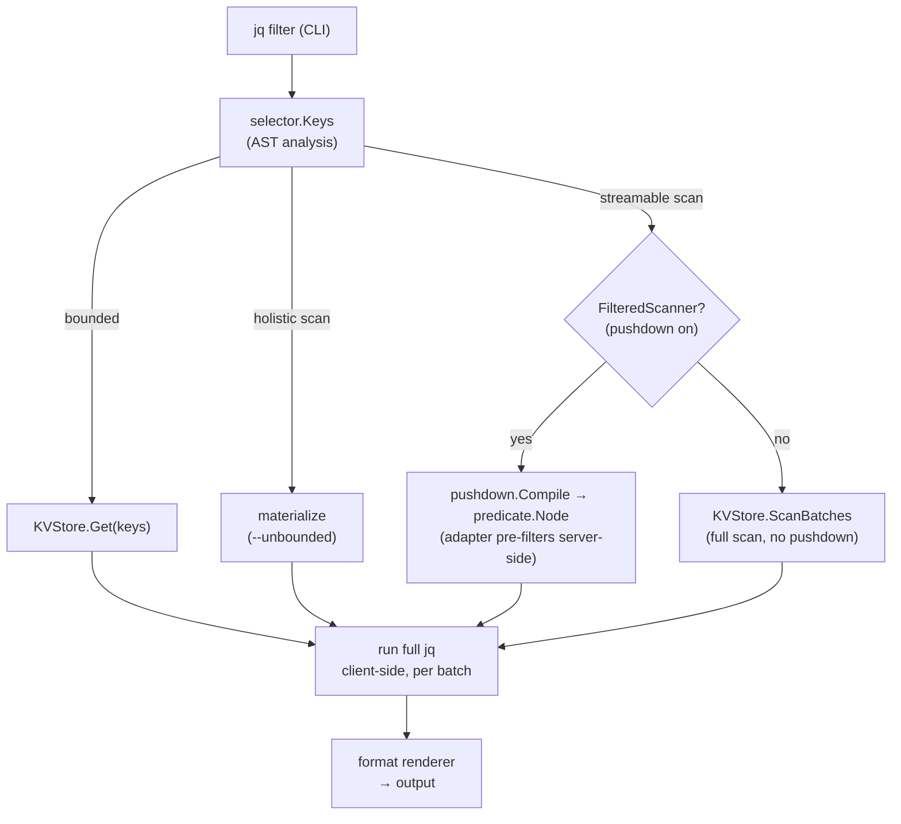
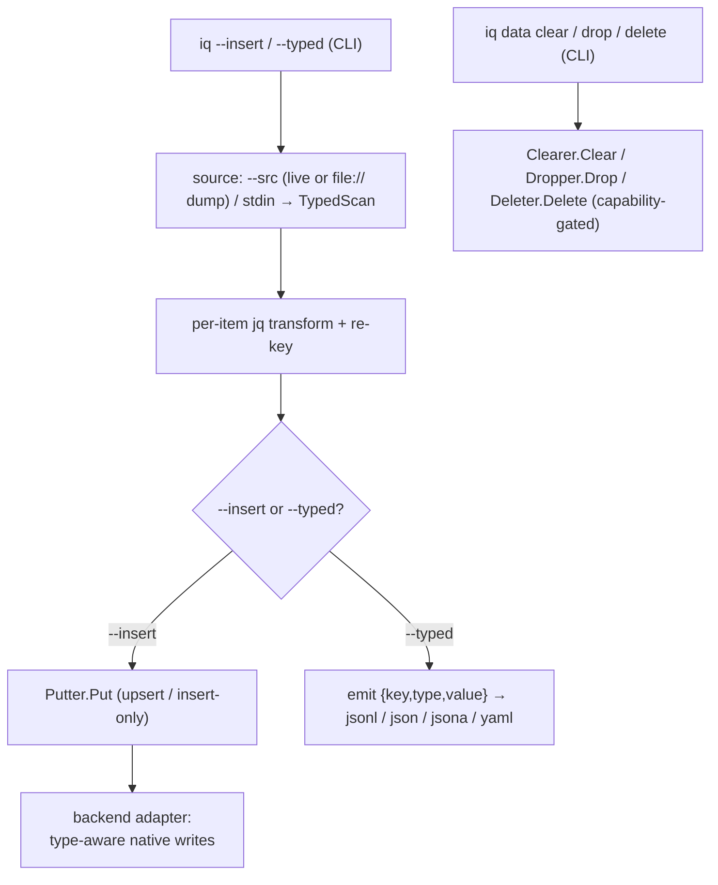

<p align="center">
  <picture>
    <source media="(prefers-color-scheme: dark)" srcset="docs/docs/assets/iq-logo-white.svg">
    
  </picture>
</p>

<p align="center">
  <a href="https://pkg.go.dev/github.com/zsltg/iq"></a>
  <a href="https://github.com/zsltg/iq/actions/workflows/ci.yml"></a>
  <a href="https://scorecard.dev/viewer/?uri=github.com/zsltg/iq"></a>
  <a href="https://coderabbit.ai"></a>
  <!-- Fill in the project IDs after registering on bestpractices.dev and codescene.io:
  <a href="https://www.bestpractices.dev/projects/<ID>">/badge" alt="OpenSSF Best Practices"></a>
  <a href="https://codescene.io/projects/<ID>">/status-badges/code-health" alt="CodeScene Code Health"></a>
  -->
  <a href="https://github.com/zsltg/iq/releases"></a>
  <a href="https://codecov.io/gh/zsltg/iq"></a>
  <a href="https://github.com/zsltg/iq/actions/workflows/ci.yml"></a>
  <a href="https://github.com/zsltg/iq/blob/main/LICENSE"></a>
  
</p>

# iq

`iq` runs [jq](https://jqlang.github.io/jq/) filters to query, dump, copy, diff and write data
across NoSQL databases, and their dump files, from a single static binary. See
[Drivers](#drivers) for supported databases.

<p align="center"></p>

Fetched values are normalized to JSON and the filter runs entirely client-side,
so one filter means the same thing everywhere.

The filter is both the transform and the key selector: its top-level paths name the keys to
fetch, so `iq` reads a bounded set of keys, streams the keyspace in pages, or materializes it,
depending on what the filter asks for.

Typed dumps carry native types across stores, so a copy, a restore or a
migration is one command instead of an export plus a conversion script.

`iq` is inspired by [sq](https://github.com/neilotoole/sq), whose command surface it
deliberately follows to make the tool feel familiar.

> [!NOTE]
> `iq` is built with AI assistance, every change passes the full test suite,
> container-backed integration tests for every backend and a mutation gate before it lands
> (see [CONTRIBUTING.md](CONTRIBUTING.md)).
>
> Queries are read-only. `--insert`, `--replace`, `iq data clear`, `iq data drop` and
> `iq data delete` write to the target. Use `--explain` to see the query plan or `--dry-run`
> to report the effect, without changing anything.
>
> Feedback and bug reports are very welcome.

## Install

`iq` ships as a single static binary (no runtime dependencies, no CGO), prebuilt for Linux,
macOS, and Windows on amd64 and arm64.

### Linux

```sh
curl -fsSL https://raw.githubusercontent.com/zsltg/iq/main/install.sh | sh
```

The script downloads the release for your OS/arch, verifies its SHA-256 against the release
checksums, and installs the binary; `IQ_VERSION` pins a version and `IQ_INSTALL_DIR` picks the
target directory. Or grab a `.deb`, `.rpm`, `.apk`, or Arch `.pkg.tar.zst` from the
[releases](https://github.com/zsltg/iq/releases).

### macOS

```sh
brew install zsltg/tap/iq
```

The Linux `curl … | sh` one-liner works on macOS too.

### Windows

```powershell
scoop bucket add zsltg https://github.com/zsltg/scoop-bucket
scoop install iq
```

### Go

```sh
go install github.com/zsltg/iq@latest
```

### From source

```sh
git clone https://github.com/zsltg/iq
cd iq && make build
```

### Agent Skill

It covers finding a source, `--explain` before every scan, `--dry-run` before
every write, the machine-readable output flags and the JSON error shape and
the rules around destructive commands.

```sh
npx skills add zsltg/iq
```

### Agent MCP

For an agent that speaks [MCP](https://modelcontextprotocol.io), `iq mcp`
serves the same core over stdio.

It is read-only by default, `--allow writes|exec|destructive` opens the rest
and a tool that is not allowed is never registered. Every result is capped,
every error redacted, and every destructive call confirmed.

**[Claude Code](https://claude.com/claude-code)**
```sh
claude mcp add iq -- iq mcp --timeout 30s
```

**[Codex CLI](https://openai.com/codex/)**
```sh
codex mcp add iq -- iq mcp --timeout 30s
```

**[Gemini CLI](https://geminicli.com)**
```sh
gemini mcp add iq iq mcp -- --timeout 30s
```

**[Cursor](https://cursor.com), [Cline](https://cline.bot), [Antigravity](https://antigravity.google), [Copilot](https://github.com/features/copilot)**
```json
{"command": "iq", "args": ["mcp", "--timeout", "30s"]}
```

**[OpenCode](https://opencode.ai)**
```json
{"command": ["iq", "mcp", "--timeout", "30s"]}
```

<details>
<summary><strong>Shell completions</strong></summary>

The `.deb`, `.rpm`, `.apk` and `.pkg.tar.zst` packages install bash, zsh and fish completions for you. For a
brew, scoop, go-install or source build, `iq completion <shell>` prints a script to install by
hand:

```sh
# bash: load in the current session, or drop it on the completion path
eval "$(iq completion bash)"
iq completion bash | sudo tee /usr/share/bash-completion/completions/iq >/dev/null

# zsh: write to a directory on your $fpath, then restart the shell
iq completion zsh > ~/.zsh/completions/_iq

# fish
iq completion fish > ~/.config/fish/completions/iq.fish

# powershell: append to your profile
iq completion powershell >> $PROFILE
```

Completions cover the commands, their sub-subcommands and flags, and, read live from your
config, your saved source handles, groups, and config-option keys, so `iq --src <TAB>` offers
the sources `iq ls` lists. A flag that takes a closed set completes its values (`--format`,
`--from-format`, `--format.decimal`, `--log.level`, `--log.format`, `--error.format`,
`--debug.pprof`, `iq add --driver/--store`, `iq schema --format`), and `iq config set <option>
<TAB>` offers that option's own values. `iq inspect --only <TAB>` and `iq diff --section <TAB>`
offer the introspection subcommands of the selected source's backend, worked out from its saved
URI. The jq filter itself is a program, not a completable value, so `iq` offers no candidates
there (and never falls back to filenames), nor do `iq exec`'s backend verb and its operands.

Every completion is offline: it reads your config file and nothing else, so a `<TAB>` never
opens a connection, never reads the OS keyring, and cannot hang. That is why a collection
suffix does not complete, `iq --src shop.<TAB>` offers nothing, since listing collections
would mean connecting.

</details>

<details>
<summary><strong>Man page</strong></summary>

The packages also install an `iq(1)` manual page, so `man iq` works after a package install. For
a non-package install, pipe it into your man path:

```sh
iq man | sudo tee /usr/share/man/man1/iq.1 >/dev/null
```

</details>

## Get started

### Sources

**Driver list**
```sh
iq driver ls
```

**Add a collection named "books" from a MongoDB source and make it active.**
```sh
iq add -a 'mongodb://localhost:27017/iq?collection=books'
```

**Inspect a source**
```sh
iq inspect books
```

**List sources**
```sh
iq ls
```

### Query data

**Fetch an item with the ID "2"**
```sh
iq '.["2"]'
```

**Fetch items where the key "year" is larger than "2015" and return objects that contain the keys "title" and "price"**
```sh
iq '.[] | select(.year > 2015) | {title, price}'
```

**Print a formatted query plan**
```sh
iq '.[] | select(.year > 2015) | {title, price}' --explain -v
```

### Diff

**Diff schema of two sources**
```sh
iq diff --schema dev qa
```

**Diff the items with the same ID from two sources**
```sh
iq diff 'dev=.["1"]' 'qa=.["1"]'
```

**Diff items key by key**
```sh
iq diff dev qa
```

### Write data

**Insert items from one source to another, key/id preserving (same driver) or object values only (cross-driver)**
```sh
iq --src books --insert books2
```

**Create a lossless (typed) dump**
```sh
iq --src cache --typed -o dump.jsonl
```

**Add a dump as a source and restore it to a live source**
```sh
iq add file:///dump.jsonl -n snap
iq --src snap --insert cache
```

**Insert items from one source to another narrowed down with a query**
```sh
iq '.[] | select(.year > 2015)' --src books --insert recent
```

### Cross-source combine

**Compose across sources**
```sh
iq 'INDEX(source("users"; ".[]"); .id) as $u
    | source("orders"; ".[] | select(.total > 99)")
    | {name: $u[.userId].name, total}'
```

**Combine across sources**
```sh
iq combine 'users=.[] | {id, name}' \
           'orders=.[] | select(.total > 99)' \
   --with '($users | INDEX(.id)) as $u | $orders[] | . + {name: $u[.userId].name}'
```

### Keyspace commands

**Delete two items**
```sh
iq data delete cache book:1 book:2
```

**Empty a source called "cache"**
```sh
iq data clear cache
```

**Drop a collection called "orders"**
```sh
iq data drop shop.orders
```

### UNIX pipes

**Implicit stdin source**
```sh
cat dump.jsonl | iq '.[]'
```

## Drivers

`iq` picks the backend from a source's URI scheme, and the query core is driver-agnostic, so
further backends slot in behind the same port. The
[Drivers page](https://zsltg.github.io/iq/drivers/) documents each driver's keyspace mapping,
value encoding, predicate pushdown, and raw-command escape hatch.

| Name | Database | Versions |
| ---- | ----------- | -------- |
| `cassandra` | [Apache Cassandra](https://cassandra.apache.org/doc/) | 3.11+ |
| `couchbase` | [Couchbase](https://docs.couchbase.com/) | 7.x, 8.x (Community or Enterprise) |
| `couchdb` | [Apache CouchDB](https://docs.couchdb.org/) | 2.x, 3.x |
| `dynamodb` | [Amazon DynamoDB](https://docs.aws.amazon.com/dynamodb/) | AWS (managed) |
| `elasticsearch` | [Elasticsearch](https://www.elastic.co/docs/) | 8.x |
| `file` | Local dump file, read-only (see [Backups and dumps](#backups-and-dumps)) | — |
| `hbase` | [Apache HBase](https://hbase.apache.org/book.html) | 1.0+ |
| `mongo` | [MongoDB](https://www.mongodb.com/docs/) | 4.2+ |
| `neo4j` | [Neo4j](https://neo4j.com/docs/) | 5.x |
| `opensearch` | [OpenSearch](https://opensearch.org/docs/) | 2.x, 3.x |
| `redis` | [Redis](https://redis.io/docs/) | 7.0+ |

The Versions column lists the range of backend server versions the bundled client library
supports.

### Guarantees

Drivers differ in encoding and pushdown detail, but every backend honors the
same contract:

- **One URI, native nouns.** The URI scheme picks the driver; the keyspace rides in the URI as the
  backend's own noun (`?collection=`, `?table=`, `?database=`, `?label=`/`?rel=`, `?index=`), and a
  query overrides it per run with the dotted `handle.<keyspace>` suffix.
- **One jq surface.** A bounded filter fetches exactly the named keys, a missing key reads as
  `null`, never an error; a `.[]`-rooted filter streams the keyspace in bounded pages; a holistic
  filter materializes only behind `--unbounded`.
- **Pushdown never changes results.** A pushed predicate is only ever a conservative pre-filter,
  server-side where the backend can filter, or a client-side raw-byte prefilter that drops a provable
  non-match before decode where it cannot (Redis, on RedisJSON values; Elasticsearch/OpenSearch and
  Couchbase, over the residual their server-side query could not narrow). The full jq always re-runs
  client-side, so
  output is identical with or without it, and `--explain` shows exactly
  what was pushed.
- **Capabilities are explicit.** Filtered scans, count estimates, writes, clear, drop, and per-key
  delete are opt-in ports: a backend implements what its model supports, and a command against a
  missing capability fails with a clear message instead of emulating it (Redis, whose DB index cannot
  be removed, simply has no `drop`; the read-only file dump has no per-key `delete`).
- **Values round-trip.** Every value normalizes to JSON under a frozen per-backend encoding
  contract, and a `--typed` dump restores through `--insert` losslessly.
- **Bounded and redacted.** Every backend call is bounded by `--timeout`, and a URI's password is
  redacted from every listing, log line, and error.
- **A native escape hatch.** `iq exec` speaks the backend's own language, verbatim where one exists
  (Redis commands, Mongo command documents, CQL, PartiQL, Cypher, Mango, the Elasticsearch DSL), a small
  fixed verb set where none does (HBase), see each driver's Raw commands section on the
  [Drivers page](https://zsltg.github.io/iq/drivers/). Every `iq` flag
  must come before `exec`: everything after it is forwarded to the backend untouched.

## Backups and dumps

A `file://` source reads a database dump straight from disk, so a snapshot is queried,
inspected for shape, diffed against a live source, and restored through the same jq
interface, with no running server. It is read-only: a `file://` endpoint is never a copy
destination, and `iq exec` and `iq inspect`, which need a live server, do not apply.

| Type | Description |
| ---- | ----------- |
| `jsonl` | iq typed JSON Lines / array |
| `yaml` | iq typed YAML |
| `mongoexport` | mongoexport Extended JSON |
| `bson` | mongodump BSON |
| `rdb` | Redis RDB snapshot |
| `?format=dynamodb-json` | DynamoDB S3 export / scan JSON |
| `?format=cassandra-csv` | cqlsh COPY TO CSV |
| `?format=neo4j-json` | Neo4j APOC JSON export |

A bare name auto-detects (`file:///<file_path>`), the `?format=` form must be passed
(`file:///<file_path>?format=<source_format>`). The
[Drivers page](https://zsltg.github.io/iq/drivers/#file-dumps) documents what produces each
format, the options some of them need, and the round-trip caveats.

## Architecture

The backend is chosen by the URI scheme, and the query core is driver-agnostic, so further
backends slot in behind the same port.

The filter is both the transform and the key selector: its top-level paths name the keys to
fetch, so a normal query reads a bounded set of keys; a `.[]`-rooted filter streams the
keyspace in pages, and a filter that collapses it into one value materializes only behind
`--unbounded`. Fetched values are normalized to JSON and the filter then runs entirely
client-side, so its semantics are identical for every backend.

The CLI and `iq mcp` are two thin delivery mechanisms over that one core. The MCP server
exposes the CLI's own operations as tools, resolves the same saved sources, and runs the same
engine, so it adds no port and changes no classification; what it adds is its own bounds, a
tool set fixed at startup by `--allow`, per-result item and byte caps, and the CLI's redacted
error shape.

### Query routes

A jq filter is classified by the **selector**, a scan is optionally
**decomposed** into a native predicate, and each backend maps that predicate
its own way.

Regardless of pushdown, the full jq re-runs client-side, so the pushed
predicate is only ever a conservative pre-filter and results are identical with
or without it.



A scan emits per-page progress to a stderr spinner (CLI only, off unless
attached to a terminal) and an unfiltered scan can fetch a cheap up-front total
estimate (where the backend metadata makes it possible).

### Write routes

Writes ride the query command, there is no separate copy tool. Items arrive
from `--src` (a live source or a `file://` dump) or piped stdin, and each is
read as a typed record, so the native type survives the trip.

The `jq` filter transforms each item with its key preserved, this is the one
place a filter runs per item rather than over the whole keyspace, iteration is
implicit and you do not write `.[]`.



A bounded filter runs client-side over just the named keys, so its cost is `O(keys requested)`; a
streamable scan runs in `O(page)` memory. The jq semantics are identical for any future backend
behind `KVStore`. jq is provided by
[gojq](https://github.com/itchyny/gojq) (pure Go, no cgo), which keeps `iq` a single static
binary and exposes the AST the key selector walks.

## Comparison

How `iq` relates to other query tools. Its niche is narrow: a single static binary that gives
NoSQL stores one jq-based query surface, the filter running client-side over normalized JSON so
semantics are identical across backends.

### By job

| Job | What people use today | What `iq` changes |
| --- | --- | --- |
| Query a live store from a shell | `redis-cli`, `mongosh`, `cqlsh`, `aws dynamodb`, `curl` against Elasticsearch, each piped into `jq` | one language and one config over all of them, the filter names the keys, paging and normalization are handled |
| Inspect a backup | `redis-rdb-tools`, `bsondump`, `mongoexport` files, DynamoDB export JSON, `cqlsh COPY` CSV, APOC JSON, each read by its own tool or by hand | one reader over six formats, queryable, diffable, restorable, with no server |
| Copy or migrate between stores | ad-hoc scripts, `mongodump`/`mongorestore` and `elasticdump` for one store at a time, Redpanda Connect or Bento for any-to-any (a YAML pipeline plus the Bloblang mapping language), Airbyte for a platform | one command, a typed round-trip, an inline jq transform, cross-driver |
| Compare environments, watch schema drift | export both sides, then `diff`, `jd` or `jq` by hand | `iq diff` over data, stats, or inferred schema, with `diff(1)` exit codes for CI |
| Give an AI agent database access | one MCP server per backend (MongoDB's own, Google's MCP Toolbox for Databases), each speaking its native dialect behind a server process | one binary and one language for all of them, `--explain` as a dry run, a skill any agent that reads the Agent Skills format can install, and an MCP server, read-only by default (see [AI agents](#ai-agents)) |

### What iq is not

- Not an analytics engine. Pushdown covers equality and existence on every backend, ranges on
  MongoDB, CouchDB and Couchbase, regex on MongoDB and CouchDB, and everything else runs as a
  client-side scan, while an aggregate materializes the keyspace behind `--unbounded`. A heavy
  question belongs in the backend's own language through `iq exec`, or in a query engine.
- Not a replacement for the native shell where the backend's own feature is the point:
  aggregation pipelines, relevance scoring, graph traversals, vector search. `iq exec` forwards
  those verbatim rather than modelling them.

### Tools that unify many databases under one language

Legend: ● primary, ◐ partial, — none. Model is the shape the query language speaks; footprint is
what you run.

| Tool | Query language | Relational | NoSQL | Files | Data model | Footprint |
|---|---|:---:|:---:|:---:|---|---|
| **iq** | **jq** | — | **●** | **◐** | **document** | **single binary** |
| [sq](https://sq.io) | SLQ / SQL | ● | — | ● | tabular | single binary |
| [usql](https://github.com/xo/usql) | native SQL | ● | ◐ | — | tabular | single binary (multiplexer) |
| [OctoSQL](https://github.com/cube2222/octosql) | SQL | ● | ◐ | ● | tabular | single binary |
| [DuckDB](https://duckdb.org) | SQL | ◐ | — | ● | tabular | in-process / CLI |
| SQL over files ([dsq](https://github.com/multiprocessio/dsq), [trdsql](https://github.com/noborus/trdsql)) | SQL | — | — | ● | tabular | single binary |
| [Trino](https://trino.io) / [Presto](https://prestodb.io) | SQL | ● | ● | ● | tabular (◐ JSON) | server / engine |
| [Apache Drill](https://drill.apache.org) | SQL | ● | ● | ● | schema-free (both) | server / engine |
| Data virtualization ([Denodo](https://www.denodo.com), [Dremio](https://www.dremio.com), [MindsDB](https://mindsdb.com)) | SQL | ● | ● | ◐ | virtual relational | server |
| Universal clients ([DBeaver](https://dbeaver.io), [DataGrip](https://www.jetbrains.com/datagrip/), [DBX](https://github.com/t8y2/dbx), [LazySQL](https://github.com/jorgerojas26/lazysql)) | native per-backend | ● | ◐ | ◐ | client-side, per backend | desktop app / TUI |
| [Redpanda Connect](https://github.com/redpanda-data/connect) | Bloblang, a mapping language | ◐ | ● | ◐ | document | single binary (YAML pipeline) |
| [MCP Toolbox for Databases](https://github.com/googleapis/genai-toolbox) | native per-backend, as MCP tools | ● | ● | — | per backend | server |

Placement is by each tool's primary targets, several (Trino, Drill, OctoSQL, DuckDB) partially
reach neighbouring columns via connectors or extensions, and `iq` reaches files the same way, a
read-only `file://` source over database dumps, not arbitrary files.

`sq`, the tool `iq`'s command surface is modelled on, unifies relational databases and files,
and never reaches NoSQL. Language specs and embedded libraries (PartiQL, SQL++ / N1QL, JSONiq,
Apache Calcite, GraphQL federation) span nested and tabular data too, but they are
specifications or components inside an engine, not something anyone runs instead of a CLI.

The takeaway is the NoSQL column paired with footprint: among these tools, `iq` is the only
single binary that gives NoSQL stores one query language. What reaches further runs as a server
(Trino, Drill, the virtualization platforms, the MCP Toolbox), and what is as light either
speaks each backend's own dialect (usql, the universal clients) or targets files and relational
stores instead (sq, DuckDB, dsq). Redpanda Connect is a single binary too, but Bloblang maps
records through a pipeline, it is not a query surface you type at a shell.

## See also

`iq` uses jq as its filter language, so the jq ecosystem carries over.

- The jq language: the [jq manual](https://jqlang.org/manual/), the reference for the filters
  `iq` runs, and [awesome-jq](https://github.com/jqlang/awesome-jq), the curated list of jq
  tools, guides, and resources.
- jq engines: [gojq](https://github.com/itchyny/gojq), the pure-Go jq implementation `iq`
  embeds, so filter semantics here are gojq's, and [jaq](https://github.com/01mf02/jaq), a Rust
  jq clone focused on speed and stricter semantics.
- jq for other data: [yq](https://github.com/mikefarah/yq), jq-style filters for YAML, TOML,
  and XML; [fq](https://github.com/wader/fq), jq for binary formats, inspect a file the way
  `iq` inspects a database; [jc](https://github.com/kellyjonbrazil/jc), converts classic CLI
  output to JSON, so any command becomes jq (or piped `iq`) input.
- Interactive jq: [jqp](https://github.com/noahgorstein/jqp), a TUI playground that
  live-previews a filter as you type, handy for building `iq` filters, and
  [ijq](https://github.com/gpanders/ijq), interactive jq with a side-by-side input and output
  view.
