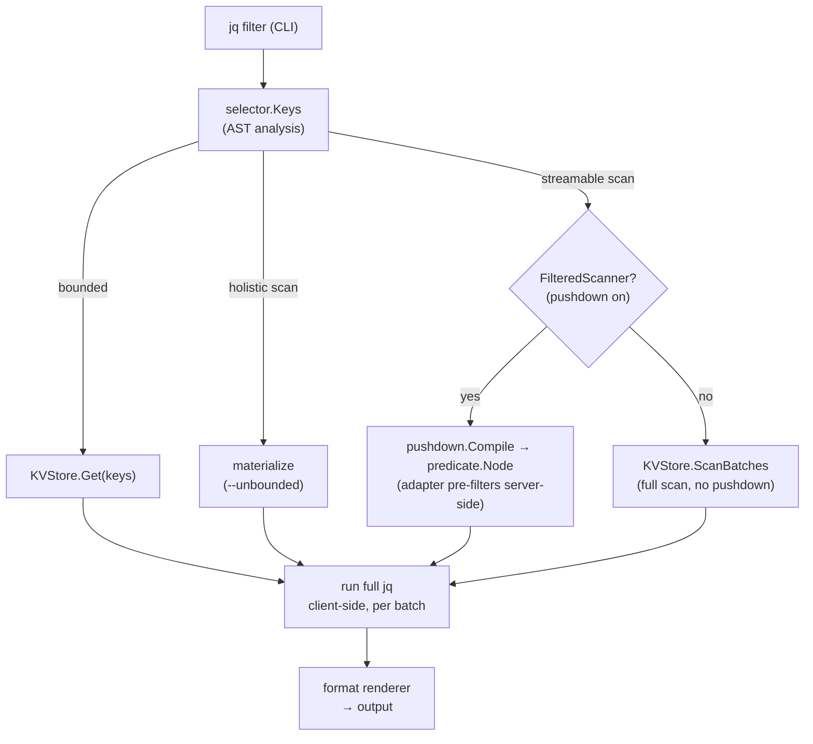
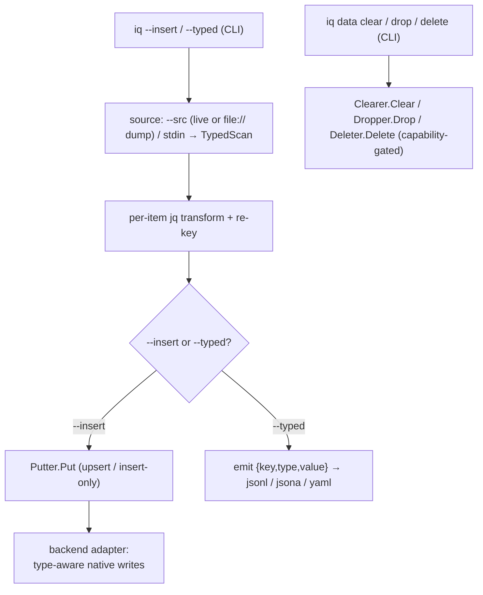

# Architecture

*This page mirrors the project [README](https://github.com/zsltg/iq/blob/main/README.md), which
remains the source of truth until the documentation is fully migrated.*

The core read path: a jq filter is classified by the **selector**, a scan is optionally **decomposed**
into a native predicate, and each backend maps that predicate its own way — MongoDB pushes it
server-side, Cassandra pushes equality as a CQL `WHERE` (with `ALLOW FILTERING` when it is not the
partition key), DynamoDB pushes equality and existence as a `Scan` `FilterExpression`, HBase pushes
column equality as a `SingleColumnValueFilter`, CouchDB pushes equality, ranges, existence, a
byte-safe regex, and length as a
Mango `_find` selector, Couchbase pushes equality, ranges, and existence as a SQL++ `WHERE`, Neo4j pushes equality and existence as a Cypher `WHERE` clause, Elasticsearch
and OpenSearch push equality and existence as a `bool` query, Redis scans
and filters client-side. Either way the
full jq re-runs client-side, so
the pushed predicate is only ever a conservative pre-filter and results are identical with or without it.

Query / read path:



A scan emits per-page progress (`RunOptions.OnPage`) to a stderr spinner — CLI only, off unless
attached to a terminal — and an unfiltered scan can fetch a cheap up-front total
(`RunOptions.OnEstimate`, answered from backend metadata where the backend keeps one — a collection
estimate like Mongo's `estimatedDocumentCount`, table metadata, an index count) so progress reads
as ~N.

Data movement & lifecycle / write path:



The query core is driver-agnostic and lives behind two ports a backend adapter implements:

- `internal/selector` — pure static analysis. `Keys` walks a parsed jq AST and classifies the
  filter: a **bounded** set of named keys, or a **scan** — and, for a scan, whether it is
  **streamable** (`.[]`-rooted, distributes over the keyspace page by page) or holistic. It
  depends only on the jq library, never on a driver.
- `internal/query` — the use cases. `JQEngine` parses and classifies the filter, then routes:
  bounded → `Get` the named keys; streamable scan → run the filter over each `ScanBatches` page and
  emit; holistic scan → merge the pages and run once (only when the caller permits it). `Runner`
  is the native-command use case behind the `Store` port (surfaced as `iq exec`); `Combiner` runs a cross-source `--combine`
  program over the reduced per-source results bound as variables, and `CrossEngine` runs a
  `source()`-driven filter over a null input — both reach other sources through the `SourceOpener`
  port and hold no primary store.
- The **write path** mirrors the read path through optional capability ports in `internal/query`,
  the same idiom as `FilteredScanner`/`Estimator`: `Putter` (write a batch of typed records),
  `TypedReader` (`TypedScan`, read `{key, type, value}` batches so a copy preserves each item's
  native type), `Clearer` (empty a container), `Dropper` (remove one), and `Deleter` (remove a
  named set of keys by canonical key). A backend implements
  only the capabilities its model supports, and a command type-asserts and rejects cleanly when one
  is absent — so a new backend never edits the commands, and Redis, whose DB index cannot be
  removed, simply omits `Dropper`, while a keyless store like InfluxDB omits `Deleter`. `Copier` streams `TypedScan → optional --filter transform →
  Put` in bounded pages; the type tag is what makes a Redis round-trip lossless, since a hash and a
  document both normalize to a JSON object. The default command's `--insert` (write items into a
  source) and `--typed` (emit a re-importable `{key,type,value}` dump) drive this — sq-style, with
  the jq filter as the transform, a source/`file://`/piped-stdin read side, and cross-driver
  included — while `iq data clear`/`drop` drive the lifecycle ports. `iq exec` remains the untyped
  escape hatch for anything the typed path does not cover.
- `drivers/file` — a read-only adapter over a local dump file (or a buffered piped stdin). Its
  `*Store` satisfies the read ports (`Get`/`ScanBatches`) and `TypedReader` (so a dump restores
  through `--insert` and a piped dump is queryable), detecting the
  format from content or a `?format=` hint (Redis RDB via `hdt3213/rdb`, mongodump BSON and
  mongoexport Extended JSON via the Mongo driver, DynamoDB export/scan JSON via the DynamoDB driver,
  cqlsh COPY CSV via the Cassandra driver, APOC JSON export reusing the Neo4j envelope, or iq's own
  typed JSONL; gzip is unwrapped transparently)
  and decoding each item to the **same** JSON shape the
  live adapter produces, so a query or restore is identical to the live backend. It implements no
  writer, so a `file://` endpoint is never a copy destination, and `Query` returns a sentinel that
  makes `exec`/`inspect` degrade cleanly. It streams; whole-dataset materialization stays the core's,
  gated by `--unbounded`. Behind the read ports it keeps an optional **decode cache** (`iq cache`,
  CBOR under `<user cache dir>/iq/dumps`): a full scan of a large dump tees its normalized records
  to disk, and later scans read them back instead of re-decoding — transparent to the ports, so the
  data-flow above is unchanged, and never authoritative (a miss just re-decodes). It also satisfies
  `FilteredScanner` with a **client-side raw-byte prefilter** (`internal/rawpred`, the same trick as
  the Redis/Elasticsearch/Couchbase prefilters): on a streaming scan of an uncached typed-JSONL dump
  it tests each record's raw `value` bytes against the compiled predicate and drops a provable
  non-match before decode, duplicating the core's array-tolerant JSONL scan loop driver-side (the
  core `JSONSource` has no pre-decode seam); every other format and any fresh-cache scan fall back to
  the plain full-decode path, and a prefiltered scan does not populate the cache.
- `drivers/redis`, `drivers/mongo`, `drivers/cassandra`, `drivers/dynamodb`, `drivers/hbase`, `drivers/couchdb`, `drivers/couchbase`, `drivers/neo4j`, `drivers/elasticsearch` — the
  adapters. Each has one `*Store`
  satisfying the read ports
  (`Query` for exec, `Get`/`ScanBatches` for jq) and the write ports (`Put`/`Clear`/`TypedScan`,
  plus `Drop` for Mongo, Cassandra, DynamoDB, HBase, CouchDB, Couchbase, and Elasticsearch, and `Delete`
  for every live backend except Couchbase — all but the read-only file dump and Couchbase, whose
  per-key delete is a v1 follow-up), with a type-to-JSON normalization frozen as
  that backend's
  encoding contract (Redis types; BSON → `ObjectID`-hex, dates, nested docs; CQL types → uuid-string,
  RFC 3339, base64 blob, collections; DynamoDB `S`/`N`/`B`/`BOOL`/`M`/`L`/sets; HBase raw cell bytes →
  honest UTF-8-or-base64, or an exact `Bytes`-layout value for a `?types=`-declared column; CouchDB
  documents are already JSON, decoded with exact-integer precision, `_id`/`_rev` kept; Couchbase
  documents are already JSON, decoded with exact-integer precision, the document ID kept as KV
  metadata (never injected), a non-JSON document surfaced as a string on a KV get; Neo4j node
  properties with exact integers, base64 bytes, and ISO temporal/spatial strings, `_id`/`_labels`
  kept; Elasticsearch `_source` documents are already JSON, decoded with exact-integer precision, the
  hit `_id` injected) and its
  inverse for
  writes
  (Mongo `bulkWrite`, chunked `deleteMany({_id:{$in}})` per-key delete; Redis pipelined
  `SET`/`HSET`/`RPUSH`/`SADD`/`ZADD`/`XADD`/`JSON.SET` by
  type, chunked `DEL` per-key delete; Cassandra parameterized `INSERT`, `TRUNCATE`, `DROP TABLE`,
  per-key `DELETE … WHERE pk = ?` (pre-read for the present/absent count); DynamoDB `PutItem`, `Scan` +
  `BatchWriteItem` delete-all, `DeleteTable`, per-key `BatchWriteItem` delete (pre-read for the count);
  HBase `Put` / `CheckAndPut` insert-only, a key-only
  `Scan` + per-row `Delete` for clear, per-key whole-row `Delete` (exists-only pre-read), and
  `DisableTable` + `DeleteTable` for drop; CouchDB
  `_bulk_docs` upsert/insert reading current `_rev`s first, `_bulk_docs {_deleted:true}` clear and
  per-key delete, `DELETE /{db}` drop; Couchbase KV bulk `Upsert`/`Insert` (a bulk get pre-read for
  the overwrite count), `DELETE FROM <keyspace>` clear, `DropCollection` drop (the default collection
  refuses, pointing at clear); Neo4j `UNWIND … MERGE (n:Label {key}) SET n += props`
  upsert/insert-only,
  paged `MATCH … DETACH DELETE` clear, per-key resolve + `DETACH DELETE` delete, no drop;
  Elasticsearch refreshing `_bulk` index/create by
  `_id`, `_delete_by_query {match_all}` clear, `_bulk {delete:{_id}}` per-key delete, `DELETE /{index}`
  drop). Redis maps a key
  to a Redis key;
  Mongo maps a key to a document `_id` within the collection it owns from the URL's `?collection=`
  (or a dotted `handle.collection` override); Cassandra maps a key to a row's full primary key within
  the table from the URL's `?table=` (or a `handle.table` override), reading the table schema once at
  connect to encode and reverse it; DynamoDB maps a key to an item's partition (and optional sort) key
  within the table from the URL's `?table=` (region as the host, credentials from the AWS default
  chain), reading the key schema once at connect; HBase maps a key to a row key and the row to a
  nested `{family: {qualifier: value}}` object, with the ZooKeeper quorum as the host and the
  `namespace:table` from the URL's `?table=` (or a `handle.table` override); CouchDB maps a key to a
  document `_id` within the database it owns from the URL's `?database=` (host as the server, or a
  dotted `handle.database` override); Couchbase maps a key to a document ID within the
  bucket.scope.collection it owns from the URL's `?bucket=` and `?collection=` (cluster as the host, or
  a dotted `handle.[scope.]collection` override); Neo4j maps a key to a node — the `?key=` property's value or
  the elementId — within the label it owns from the URL's `?label=` (bolt host as the server, or a
  dotted `handle.label` override) inside the `?database=` (default `neo4j`), or to a relationship
  within a `?rel=` type (or a `handle.:TYPE` override), read-only, whose value carries the endpoint
  elementIds; Elasticsearch maps a key to a document `_id` within the index it owns from the URL's
  `?index=` (host as the server, or a dotted `handle.index` override), reading the index mapping once
  at connect so a term is pushed only onto an exactly-matchable field. Cassandra pushes
  equality/`IN` as a CQL `WHERE`
  (`FilteredScanner`) but has no cheap count, so it omits `Estimator`; DynamoDB pushes
  equality/existence as a `Scan` `FilterExpression` (`FilteredScanner`) and answers `Estimator` from
  its table metadata; HBase pushes column equality as a `SingleColumnValueFilter` (`FilteredScanner`)
  but has no cheap count, so it omits `Estimator`; CouchDB pushes equality, ranges, existence, a
  byte-safe regex, and a polymorphic length as a Mango `_find`
  selector (`FilteredScanner`, falling back to a plain `_all_docs` scan for the exact-negation
  operators and a case-insensitive or non-byte-safe regex) and answers `Estimator` from its `doc_count`; Couchbase pushes equality, ranges,
  and existence as a SQL++ `WHERE` (`FilteredScanner`, falling back to a plain keyset scan for the
  exact-negation operators, regex, and length) but has no cheap metadata count, so it omits
  `Estimator` (like Cassandra and HBase); Neo4j pushes equality and
  existence as a Cypher `WHERE` clause (`FilteredScanner`, falling back to a plain label scan for
  ranges — Cypher's cross-type comparison is not jq's — and the other operators) and answers
  `Estimator` from the label's count store; Elasticsearch pushes equality and existence as a `bool`
  query (`FilteredScanner`, falling back to a plain point-in-time scan for ranges and the other
  operators) and answers `Estimator` from `_count`. An `opensearch://` source is the **same
  `drivers/elasticsearch` adapter** behind a small transport port (`esClient`): the URL scheme picks
  the [opensearch-go](https://github.com/opensearch-project/opensearch-go) client (Elasticsearch's
  own client refuses non-Elasticsearch servers) and its `_search/point_in_time` endpoint and `_id`
  keyset sort; the keyspace model, normalization, pushdown, writes, `exec`, and `inspect` are all
  shared. DynamoDB's connectionless
  client verifies reachability at open (a
  bounded `ListTables` probe), HBase's likewise (a bounded `ClusterStatus` probe, since gohbase
  connects lazily), CouchDB pings at open, Couchbase waits for the cluster and bucket to become ready
  at open, Neo4j verifies connectivity at open, and Elasticsearch
  and OpenSearch probe with an info request at open, so `ping`/`add` need no second round-trip. Each
  also contributes pure, connection-free `--explain` describers
  (`ExplainWrite`/`ExplainClear`/`ExplainDrop`) alongside `ExplainPlan`.
- `internal/diff` — a driver-agnostic structural diff over the normalized JSON values every adapter
  produces. `Tree` diffs two values and `Keyed` aligns two keyed item sets; arrays are aligned by a
  hand-rolled longest-common-subsequence walk (a bounded positional fallback past ~1e6 DP cells), so
  one insertion is one delta rather than a cascade. `TreeOpt`/`KeyedOpt` take an `Options` carrier
  whose `SetArrays` switches arrays to order-insensitive multiset comparison. `Patch` renders the same
  two values as an RFC 6902 JSON Patch via `github.com/wI2L/jsondiff` (the only place that dependency
  is used; the third-party patch type never crosses the package boundary). It holds no I/O: `iq diff`
  reads each side through the ports and hands the materialized values here.
- `internal/shape` — driver-agnostic schema inference (heuristics adapted from quicktype, Apache-2.0;
  no code copied). `Infer` reduces a sample to a typed shape tree; `Comparable` projects a stable
  field/type map that feeds `diff.Tree`, so `diff --schema` compares logical shape and works
  cross-driver, `JSONSchema` projects a draft 2020-12 document for `iq schema`, and `ODCSSchemaObject`
  projects the same tree into an Open Data Contract Standard v3.1.0 schema object (`iq schema --format
  odcs`), demoting to ODCS's nine logical types (no binary/decimal). Presence is
  parent-relative (`required`/`optional`), numbers split integer from number, strings tag
  date-time/date/uuid, id-keyed sub-objects collapse to maps, and arrays unify their element shape.
  Like `diff`, it holds no I/O — the CLI samples through the ports and hands it the values.
- `internal/parquetout` — the Apache Parquet export surface (`--format parquet`). It buffers the
  first sample of result values, infers their shape with `internal/shape`, projects that shape onto
  an Apache Arrow schema (int64/float64/bool/utf8, `timestamp[ns, UTC]`, `date32`, struct/list/map,
  and an `arrow.json` utf8 fallback for a heterogeneous or null-only column), and streams one Parquet
  record batch per page with `pqarrow`. It consumes only the normalized value stream, so the Arrow
  dependency stays contained here and out of the driver-agnostic query core; parent-relative presence
  rides in field metadata, since Arrow validity bitmaps cannot represent missing-vs-null.
- `internal/config` — the saved sources and stored options. A small TOML store (named connections
  keyed by handle, plus the active source and group, plus a base **options** table and a per-source
  one) the CLI reads to resolve a query's connection and its default flags. It stays driver-agnostic
  and dumb: the backend is inferred from a source's URL scheme and the persistable-option allowlist
  and value validation both live in `cmd`, not here. It records only that a source is keyring-backed;
  the password itself never enters this store.
- `internal/secret` — the credential port. A `Keyring` interface over the OS secret store, so a
  keyring-backed source keeps its password out of the config file; `cmd` splices it back into the
  URL at connect time.
- `cmd` — the CLI adapter and composition root. It holds the driver registry (`cmd/driver.go`): one
  self-describing entry per backend (name, description, schemes, docs, opener, and the connection-free
  `--explain` describers) that `openStore`, `supportedScheme`, every driver label, and `iq driver ls`
  all derive from, so adding a backend is
  one entry. It resolves the selected source (`--src` or the active source) to a URL and an opaque
  address (the dotted `handle.collection` suffix, which the driver interprets),
  picks the adapter by URL scheme through that registry (`openStore`), runs the jq action (routing a
  `source()`-driven filter to the cross-source engine), the `exec` escape hatch, the `data`
  movement/lifecycle group (`copy`/`clear`/`drop`), a source or config command
  (`add`/`ls`/`rm`/`mv`/`src`/`group`/`ping`/`inspect`/`diff`/`driver`/`config`), or a `--from`/`--combine` cross-source query —
  resolving every source name through the same registry — and formats output (a format-flag-selected
  renderer for the jq path — `--json`, `--jsonl`, `--jsona`, `--raw`, `--yaml`, `--gron`/`--grona`, or
  the binary `--format parquet` columnar export, also selectable by
  name with `--format`, and with `--format.decimal` governing how decimals normalize; per-backend for `exec` —
  redis-cli style for Redis, JSON for Mongo), keeping the core free of any output format. The
  diagnostics surface (verbose output, file logging, error rendering, `--debug.pprof`) also lives
  here: it is set up once per invocation and emits from the CLI boundary, so the query core imports
  no logger and produces no diagnostics of its own. Before any of that, one pre-run step merges the
  stored option defaults into the flags — an unset flag falls back to the selected source's option,
  then the base option, then its built-in default — so persisted defaults reach the whole run
  (`iq config` manages the store; `--config` redirects the file).

A bounded filter runs client-side over just the named keys, so its cost is `O(keys requested)`; a
streamable scan runs in `O(page)` memory. The jq semantics are identical for any future backend
behind `KVStore`. jq is provided by
[gojq](https://github.com/itchyny/gojq) (pure Go, no cgo), which keeps `iq` a single static
binary and exposes the AST the key selector walks.

### Null vs missing

Modern query standards treat an *absent* field and an explicit *null* as distinct values.
[PartiQL](https://partiql.org/) has both `NULL` and `MISSING`, and `MISSING` drops out of a
projection where `NULL` is carried through. [SQL++](https://arxiv.org/abs/1405.3631) makes missing
a first-class value and documents real divergence: the same path returns `null` in AsterixDB,
`missing` in Couchbase, and an error in SQL. [RFC 9535](https://www.rfc-editor.org/rfc/rfc9535)
(JSONPath) models absence as `Nothing`, again distinct from `null`. iq takes a deliberate,
layered position in that vocabulary rather than one blanket rule:

- **The jq surface reads missing as `null`.** gojq evaluates entirely client-side, so `.a` on a
  document without `a` yields `null` — the same on every backend. This is the uniform semantics the
  whole tool promises: a filter behaves identically whether the field is absent, stored as `null`,
  or the source has no such field at all.
- **The schema layer preserves the distinction.** `iq schema` tracks *parent-relative presence* —
  a field observed on some documents but not others is optional, separate from a field that is
  present-and-nullable — so the inferred shape measures logical structure, not the jq surface's
  collapse.
- **Drivers decline pushes whose backend semantics would diverge.** A conjunct is pushed only when
  the backend reproduces jq's answer for every input including missing and null; Elasticsearch
  `== null` (which no single term matches as absent-or-null) is declined and re-filtered client-side
  rather than pushed with the wrong meaning. The per-driver push/not-push tables record each call.

So the collapse is a surface convenience, not a loss: the distinction is kept where it carries
information (schema inference, pushdown safety) and hidden where uniformity matters more (the query
surface).

### Bounded reads, streaming scans, and materialized scans

`iq` fetches exactly the keys your filter names, so a normal query's cost is bounded by the keys
you asked for, never by the size of the database. A filter that needs the whole keyspace is a
**scan**, and scans come in two kinds:

- **Streaming** — a filter rooted at `.[]` (`.[]`, `.[] | select(...)`, `.[].title`) processes
  each value independently, so `iq` walks the keyspace in pages and runs the filter page by page,
  emitting as it goes. Memory stays constant and results appear progressively (interrupt with
  Ctrl-C or bound with `--timeout`). These run **without a flag**:

  ```bash
  iq '.[] | objects | select((.year|tonumber) > 2015) | .title'   # streamed discovery
  ```

- **Materialized** — a filter that collapses the collection into one value (`.`, `keys`, `length`,
  `map(...)`, `group_by`, `sort_by`, aggregates) must load the whole dataset into memory. It runs
  only with `--unbounded`:

  ```bash
  iq 'keys'                 # error: requires materializing the whole dataset
  iq --unbounded 'keys'     # list every key
  iq --unbounded '.'        # the whole dataset as one JSON object
  ```

`--unbounded` means "permit loading the whole dataset into memory." Passing it on a streaming
filter is allowed too: it switches that filter from batched streaming to a single materialized
pass, giving key-sorted output and a consistent snapshot instead of scan order.

Streamed output is **best-effort**: values arrive in scan order (not key-sorted), and an element
may repeat if the keyspace is resized mid-scan — the price of never holding more than one page.
Use `--unbounded` when you need sorted, exactly-once output.

The flag names the cost property (loading everything), not any one store's mechanism, so it will
mean the same thing for future backends (a Cassandra full scan, a CouchDB `_all_docs`).

A scan has no reliable upfront total (Redis `SCAN`, Mongo cursor), so while one runs `iq` shows an
animated spinner with a running `N scanned` count on **stderr** — a sparse `.[] | select(...)` over
a large keyspace is never silent. When a backend can supply a cheap approximate total (MongoDB's
`estimatedDocumentCount` for an unfiltered whole-collection scan, Redis's `DBSIZE` for its
whole-keyspace `MATCH *` scan), the count is shown against it as
`N scanned (~M est)`; the tilde marks it a hint — it comes from cached metadata and drifts under
concurrent writes, so the scan may exceed it and it never becomes a percentage bar. No total is
shown for a pushed-down filtered scan (it walks a subset) or for a cross-source scan (a per-source
estimate would mislead the aggregate). The
spinner appears only after a short delay, so a fast query never flashes one, and only when stderr
is a terminal: piped or redirected output is never touched, and result rows streamed to stdout are
never garbled by it. Disable it with `--no-progress`.

