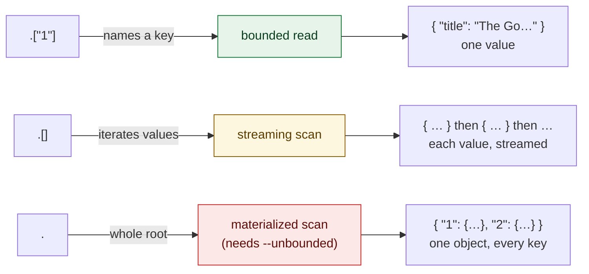
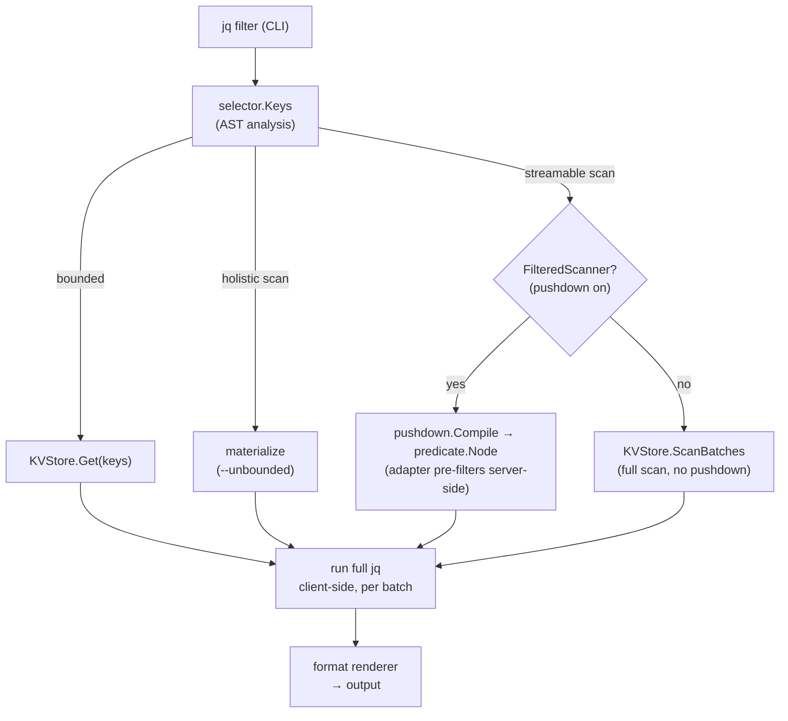
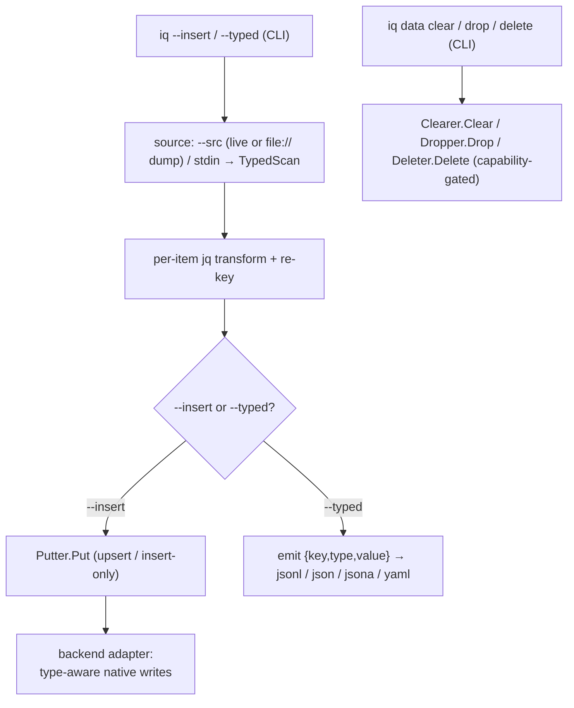

# How it works

A Go command-line tool that runs [jq](https://jqlang.github.io/jq/) filters
against NoSQL databases. The URI scheme chooses the backend, and the query
core is driver-agnostic so further backends slot in behind the same port.

The filter is both the transform and the key selector, its top-level paths
name the keys to fetch, so a normal query reads a bounded set of keys. A
`.[]`-rooted filter streams the keyspace in pages, and a filter that collapses
it into one value materializes only behind `--unbounded`. Fetched values are
normalized to JSON and the filter then runs entirely client-side, so its
semantics are identical for every backend.

The CLI and `iq mcp` are two thin delivery mechanisms over that one core. The
MCP server exposes the CLI's own operations as tools, resolves the same saved
sources, and runs the same engine, so it adds no port and changes no
classification. What it adds is its own bounds, a tool set fixed at startup by
`--allow`, per-result item and byte caps, and the CLI's redacted error shape.

`iq` is inspired by [sq](https://github.com/neilotoole/sq), much of its command
set (the `<source>.<collection>` addressing along with many subcommands and
flags) deliberately follows sq's to make the tool feel familiar.

The `jq` semantics are identical for any future backend.
[gojq](https://github.com/itchyny/gojq) (pure Go, no CGO) provides `jq`, keeps `iq` a
single static binary, and exposes the AST the key selector walks.

## Read strategies

The shape of the filter decides how much `iq` reads, every filter takes one of
three routes.

1. **Bounded reads** (with explicit keys) only read the specified subset of
   items from the source, the keys you asked for bound the cost, never
   the size of the database.
2. **Streaming scans** (a filter rooted at `.[]`, for example `.[]`, `.[] | select()`,
   `.[].title`) process each value independently, walking the keyspace in
   pages and running the filter page by page, emitting as it goes. Memory stays
   constant and results appear progressively.
3. **Materialized scans** (a filter that collapses the collection into one
   value, `.`, `keys`, `length`, `map()`, `group_by`, `sort_by`, aggregates)
   read all items into memory in batches before applying the filter.

On a streaming scan, **pushdown** compiles what it can of the filter's
`select()` into a backend-neutral predicate and hands it to the driver,
shrinking how much data is transferred or decoded.

The predicate is deliberately weaker than the filter, so the engine re-runs the
full filter per page to drop the extra matches it admits.

!!! tip "Check the strategy of a query"

    Use `--explain` to see which strategy will be used for a particular query
    before executing it.

!!! note "Cost"

    A *bounded filter* runs client-side over only the named keys, so its cost is
    `O(keys requested)`.

    A *streamable scan* runs in `O(page)` memory.

!!! note "Unbounded queries"

    `--unbounded` means "permit loading the whole dataset into memory".

    The flag names the cost property (loading everything), not any one store's
    mechanism, so it will mean the same thing for all backends.

    Passing it on a streaming filter is allowed too, it switches that filter
    from batched streaming to a single materialized pass, giving key-sorted
    output and a consistent snapshot instead of scan order.

!!! note "Streaming data"

    Streamed output is *best-effort*, values arrive in scan order (not
    key-sorted), and an element can repeat if the keyspace is resized mid-scan,
    the price of never holding more than one page.

    Use `--unbounded` when you need sorted, exactly-once output.

!!! note "Progress"

    A scan has no reliable upfront total (for example Redis `SCAN`, Mongo cursor), so
    `iq` shows an animated spinner with a running `N scanned` count on
    *stderr*, a sparse `.[] | select()` over a large keyspace is never
    silent.

    When a backend can supply a cheap approximate total (for example MongoDB's
    `estimatedDocumentCount` for an unfiltered whole-collection scan, Redis's
    `DBSIZE` for its whole-keyspace `MATCH *` scan), the count is shown against
    it as `N scanned (~M est)`.

    The tilde marks it a hint, it comes from cached metadata and drifts under
    concurrent writes, so the scan can exceed it and it never becomes a
    percentage bar.

    No total is shown for a pushed-down filtered scan (it walks a subset) or
    for a cross-source scan (a per-source estimate misleads the
    aggregate).

## Query routes

The **selector** classifies a jq filter, a scan is optionally
**decomposed** into a native predicate, and each backend maps that predicate
its own way.

Regardless of pushdown, the full jq re-runs client-side, so the pushed
predicate is only ever a conservative pre-filter and results are identical with
or without it.

A scan emits per-page progress to a stderr spinner (CLI only, off unless
attached to a terminal) and an unfiltered scan can fetch a cheap up-front total
estimate (where the backend metadata makes it possible).

## Write routes

Writes ride the query command, there is no separate copy tool. Items arrive
from `--src` (a live source or a `file://` dump) or piped stdin, and each is
read as a typed record, so the native type survives the trip.

The `jq` filter transforms each item with its key preserved, this is the one
place a filter runs per item rather than over the whole keyspace, iteration is
implicit and you do not write `.[]`.

The transformed stream then takes one of two exits.

- **`--insert <source>`** hands each record to the destination's `Putter`.
  Existing keys are overwritten (upsert) unless `--no-overwrite` makes the run
  insert-only, and `--replace` empties the destination first (with
  confirmation, or `--force`). The backend adapter translates each typed value
  into its native write, so a Redis hash lands as a hash again, not as a JSON
  blob.
- **`--typed`** skips the store and emits the same records as
  `{"key", "type":…, "value":…}` envelopes in the chosen format (`--jsonl`
  by default). The dump re-imports through a `file://` source or a piped
  `--insert`, which closes the loop back into the diagram's source node.

Destructive operations are a separate entry point, not a filter outcome. The
`iq data clear / drop / delete` subcommands call their own capability-gated
ports, so a backend that has no native drop refuses rather than emulating one,
and no query ever deletes as a side effect.

See the full flag tables and key-mapping rules in
[Write data](write-data.md).

## Null vs. Missing

Modern query standards treat an *absent* field and an explicit *null* as
distinct values.

[PartiQL](https://partiql.org/) has both `NULL` and `MISSING`, and `MISSING`
drops out of a projection where `NULL` is carried through.
[SQL++](https://arxiv.org/abs/1405.3631) makes missing a value of its own and
documents real divergence. The same path returns `null` in AsterixDB, `missing`
in Couchbase, and an error in SQL.
[RFC 9535](https://www.rfc-editor.org/rfc/rfc9535) (JSONPath) models absence as
`Nothing`, again distinct from `null`. `iq` takes a deliberate, layered
position in that vocabulary rather than one blanket rule.

- **The jq layer reads missing as `null`.** gojq evaluates entirely
  client-side, so `.a` on a document without `a` yields `null`, the same on
  every backend. This is the uniform semantics the whole tool promises, a
  filter behaves identically whether the field is absent, stored as `null`, or
  the source has no such field at all.
- **The schema layer preserves the distinction.** `iq schema` tracks
  *parent-relative presence*, a field observed on some documents but not others
  is optional, separate from a field that is present-and-nullable, so the
  inferred shape measures logical structure, not the jq layer's collapse.
- **Drivers decline pushes whose backend semantics diverge.** A conjunct
  is pushed only when the backend reproduces `jq`'s answer for every input
  including missing and null. Elasticsearch `== null` (which no single term
  matches as absent-or-null) is declined and re-filtered client-side rather
  than pushed with the wrong meaning. The per-driver push/not-push tables
  record each call.

So the collapse is a query-layer convenience, not a loss, the distinction is kept
where it carries information (schema inference, pushdown safety) and hidden
where uniformity matters more (the query layer).
