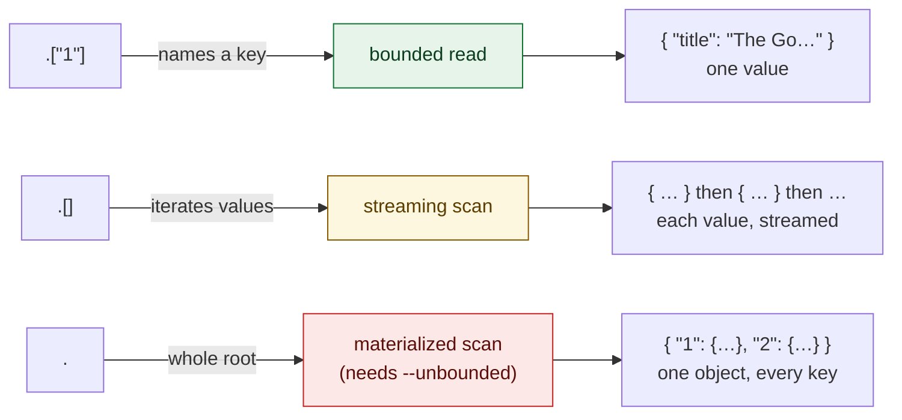

# Get started

`iq` is a Go command-line tool that runs [`jq`](https://jqlang.github.io/jq/)
filters against NoSQL databases (see [Drivers](drivers.md) for supported
backends). The backend is chosen by the URL scheme, and the query core is
driver-agnostic so further backends slot in behind the same port.

The filter is both the transform and the key selector: its top-level paths name the keys to
fetch, so the store only ever reads a bounded set of keys — never a full keyspace scan, unless
you ask for one explicitly. Fetched values are normalized to JSON and the filter then runs
entirely client-side, so its semantics are identical for every backend.

`iq` is inspired by [`sq`](https://github.com/neilotoole/sq), much of its command surface — the
`<source>.<collection>` addressing along with many subcommands and flags — deliberately follows
sq's so the tool feels familiar.

!!! warning "Not production-ready"

    `iq` has potential rough edges — don't rely on it for critical work yet.

## Query routes

The shape of the filter decides how much `iq` reads. Every filter takes one of three routes —
`--explain` shows which:



## Installation

`iq` ships as a single static binary (no runtime dependencies, no CGO).

=== ":fontawesome-brands-linux: Linux"

    ```sh
    curl -fsSL https://raw.githubusercontent.com/zsltg/iq/main/install.sh | sh
    ```

    !!! note

        The script downloads the release for your OS/arch, verifies its SHA-256
        against the release checksums, and installs the binary; `IQ_VERSION`
        pins a version and `IQ_INSTALL_DIR` picks the target directory. Or grab
        a `.deb`, `.rpm`, or `.apk` from the
        [releases](https://github.com/zsltg/iq/releases).

=== ":fontawesome-brands-apple: macOS"

    ```sh
    brew install zsltg/tap/iq
    ```

    The [Linux one-liner](#__tabbed_1_1) works on macOS too.

=== ":fontawesome-brands-windows: Windows"

    ```powershell
    scoop bucket add zsltg https://github.com/zsltg/scoop-bucket
    scoop install iq
    ```

=== ":fontawesome-brands-golang: Go"

    ```sh
    go install github.com/zsltg/iq@latest
    ```

## Building from source

```sh
git clone https://github.com/zsltg/iq
cd iq && make build
```

## Shell completions

The `.deb`, `.rpm` and `.apk` packages install
[Bash](https://tiswww.case.edu/php/chet/bash/bashtop.html),
[Zsh](https://www.zsh.org/) and [fish](https://fishshell.com/) completions for
you.

For a [brew](https://brew.sh/), [scoop](https://scoop.sh/),
[go-install](https://go.dev/ref/mod#go-install) or source build,
`iq completion <shell>` prints a script to install by hand.

=== ":simple-gnubash: Bash"

    ```sh title="load in the current session, or drop it on the completion path"
    eval "$(iq completion bash)"
    iq completion bash | sudo tee /usr/share/bash-completion/completions/iq >/dev/null
    ```

=== ":simple-zsh: Zsh"

    ```sh title="write to a directory on your $fpath, then restart the shell"
    iq completion zsh > ~/.zsh/completions/_iq
    ```

=== ":simple-fishshell: fish"

    ```sh
    iq completion fish > ~/.config/fish/completions/iq.fish
    ```

=== ":material-powershell: PowerShell"

    ```sh title="append to your profile"
    iq completion powershell >> $PROFILE
    ```

Completions cover the commands, their sub-subcommands and flags, and — read live from your
config — your saved source handles, groups, and config-option keys, so `iq --src <TAB>` offers
the sources `iq ls` lists. A flag that takes a closed set completes its values (`--format`,
`--from-format`, `--format.decimal`, `--log.level`, `--log.format`, `--error.format`,
`--debug.pprof`, `iq add --driver/--store`, `iq schema --format`), and `iq config set <option>
<TAB>` offers that option's own values. `iq inspect --only <TAB>` and `iq diff --section <TAB>`
offer the introspection subcommands of the selected source's backend, worked out from its saved
URL. The jq filter itself is a program, not a completable value, so `iq` offers no candidates
there (and never falls back to filenames) — nor do `iq exec`'s backend verb and its operands.

Every completion is offline: it reads your config file and nothing else, so a `<TAB>` never
opens a connection, never reads the OS keyring, and cannot hang. That is why a collection
suffix does not complete — `iq --src shop.<TAB>` offers nothing, since listing collections
would mean connecting.

## Man page

The packages also install an `iq(1)` manual page, so `man iq` works after a package install. For
a non-package install, pipe it into your man path:

```sh
iq man | sudo tee /usr/share/man/man1/iq.1 >/dev/null
```
## Requirements

- Go 1.26+
- Docker (for the integration tests, which start ephemeral Redis + MongoDB + Cassandra + DynamoDB Local + CouchDB + Couchbase + Neo4j + Elasticsearch + OpenSearch containers; not needed for `go test -short`. HBase integration tests run only against a `docker compose` cluster named by `IQ_HBASE_URL`)
- [uv](https://docs.astral.sh/uv/) (optional, docs-only) — builds and serves the documentation site under `docs/` (`make docs` / `make docs-serve`); not needed to build or use `iq` itself

## Build

```bash
go build -o iq .          # plain build
make build                # build with version metadata embedded
```

`make build` injects the version, commit, and build date via ldflags; a plain `go build` still
reports a version recovered from Go's embedded build info. Check it with `iq version` or
`iq --version`.

## Releasing

Versioning is driven by [Conventional Commits](https://www.conventionalcommits.org/): the release
tooling reads the commit log, computes the next [semantic version](https://semver.org/), and
regenerates `CHANGELOG.md`. It is all-Go and local — no CI service or GitHub required.

```bash
make tools                        # one-time: install svu + git-chglog into GOPATH/bin
bash scripts/release.sh --dry-run # preview the next version and CHANGELOG.md diff, no changes
make release                      # bump, regenerate CHANGELOG.md, commit, and tag
git push --follow-tags            # publish the tag (release.sh never pushes for you)
```

`make release` must run on a clean `main`. `svu` picks the bump from the commit types since the
last tag (`feat` → minor, `fix` → patch, a `!`/`BREAKING CHANGE` → major); with no tags yet the
first release comes out as `v0.1.0`.
